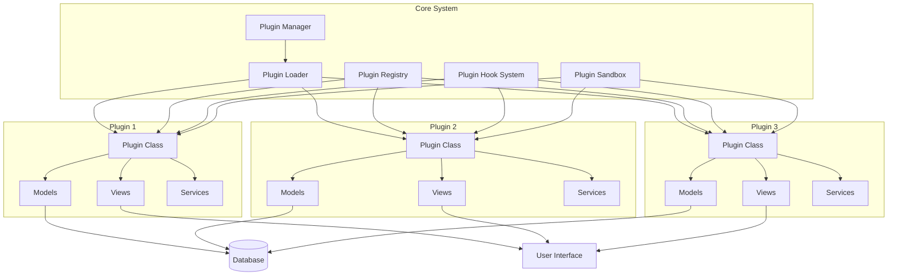

# Gerenciamento de Plugins

## Visão Geral da Arquitetura de Plugins

O sistema de plugins do DevStationPlatform permite extensibilidade modular através de uma arquitetura baseada em hot-reload, isolamento de dependências e sistema de hooks. Plugins podem adicionar funcionalidades, interfaces, modelos de dados e integrações sem modificar o core do sistema.

### Características Principais

- **Hot-reload**: Recarregamento automático em desenvolvimento
- **Isolamento**: Plugins não interferem no core ou entre si
- **Dependências**: Cada plugin gerencia suas próprias dependências
- **Hooks**: Sistema de hooks para extensão do core
- **Sandboxing**: Execução segura de plugins não confiáveis
- **Versionamento**: Suporte a múltiplas versões de plugins
- **Registry**: Repositório central de plugins

## Arquitetura do Sistema de Plugins



## Componentes do Sistema

### BasePlugin (Classe Base)

```python
from abc import ABC, abstractmethod
from typing import Dict, List, Any, Optional
from dataclasses import dataclass
import asyncio

@dataclass
class PluginMetadata:
    """Metadados do plugin"""
    name: str
    version: str
    description: str
    author: str
    license: str
    min_core_version: str
    max_core_version: str
    dependencies: List[str]
    conflicts: List[str]
    tags: List[str]
    icon: Optional[str] = None
    website: Optional[str] = None
    repository: Optional[str] = None


class BasePlugin(ABC):
    """Classe base para todos os plugins"""
    
    def __init__(self):
        self.metadata: PluginMetadata = None
        self.config: Dict[str, Any] = {}
        self.logger = None
        self.is_initialized = False
        self.is_enabled = False
    
    @property
    @abstractmethod
    def metadata(self) -> PluginMetadata:
        """Retorna metadados do plugin"""
        pass
    
    @abstractmethod
    async def initialize(self, config: Dict[str, Any]) -> bool:
        """
        Inicializa o plugin
        
        Args:
            config: Configuração do plugin
            
        Returns:
            bool: True se inicialização bem-sucedida
        """
        pass
    
    @abstractmethod
    async def cleanup(self) -> bool:
        """
        Limpa recursos do plugin
        
        Returns:
            bool: True se cleanup bem-sucedido
        """
        pass
    
    async def register_routes(self, app):
        """Registra rotas/endpoints do plugin"""
        pass
    
    async def register_models(self):
        """Registra modelos de dados do plugin"""
        pass
    
    async def register_services(self):
        """Registra serviços do plugin"""
        pass
    
    async def register_events(self):
        """Registra handlers de eventos do plugin"""
        pass
    
    async def register_commands(self):
        """Registra comandos CLI do plugin"""
        pass
    
    async def register_hooks(self):
        """Registra hooks do plugin"""
        pass
    
    async def get_status(self) -> Dict[str, Any]:
        """Retorna status do plugin"""
        return {
            "name": self.metadata.name,
            "version": self.metadata.version,
            "is_initialized": self.is_initialized,
            "is_enabled": self.is_enabled,
            "config": self.config,
            "health": await self.check_health()
        }
    
    async def check_health(self) -> Dict[str, Any]:
        """Verifica saúde do plugin"""
        return {
            "status": "healthy",
            "timestamp": datetime.utcnow().isoformat()
        }
    
    async def handle_event(self, event_name: str, event_data: Dict[str, Any]):
        """Processa evento do sistema"""
        pass
    
    async def execute_command(self, command: str, args: Dict[str, Any]) -> Any:
        """Executa comando do plugin"""
        pass
```

### PluginManager

```python
class PluginManager:
    """Gerencia ciclo de vida de todos os plugins"""
    
    def __init__(self, config: Config, db_session, redis_client):
        self.config = config
        self.db_session = db_session
        self.redis = redis_client
        self.plugins: Dict[str, BasePlugin] = {}
        self.plugin_registry = PluginRegistry()
        self.plugin_loader = PluginLoader()
        self.hook_system = PluginHookSystem()
        self.sandbox_manager = PluginSandboxManager()
        
        # Diretórios de plugins
        self.plugin_dirs = [
            "plugins/",  # Plugins locais
            "~/.devstation/plugins/",  # Plugins do usuário
            "/var/lib/devstation/plugins/"  # Plugins do sistema
        ]
        
        # Configurações
        self.auto_reload = config.get("plugins.auto_reload", True)
        self.sandbox_enabled = config.get("plugins.sandbox.enabled", True)
        self.dependency_check = config.get("plugins.dependency_check", True)
    
    async def initialize(self):
        """Inicializa o gerenciador de plugins"""
        logger.info("Inicializando PluginManager...")
        
        # Carregar plugins instalados
        await self.load_installed_plugins()
        
        # Inicializar hook system
        await self.hook_system.initialize()
        
        # Iniciar monitor de hot-reload se habilitado
        if self.auto_reload:
            asyncio.create_task(self._hot_reload_monitor())
        
        logger.info(f"PluginManager inicializado com {len(self.plugins)} plugins")
    
    async def load_plugin(self, plugin_path: str) -> BasePlugin:
        """
        Carrega plugin do caminho especificado
        
        Args:
            plugin_path: Caminho para o plugin
            
        Returns:
            BasePlugin: Instância do plugin carregado
        """
        try:
            # Validar estrutura do plugin
            if not await self.plugin_loader.validate_plugin_structure(plugin_path):
                raise PluginValidationError(f"Estrutura inválida: {plugin_path}")
            
            # Carregar metadados
            metadata = await self.plugin_loader.load_metadata(plugin_path)
            
            # Verificar dependências
            if self.dependency_check:
                await self._check_dependencies(metadata)
            
            # Verificar conflitos
            await self._check_conflicts(metadata)
            
            # Carregar classe do plugin
            plugin_class = await self.plugin_loader.load_plugin_class(plugin_path)
            
            # Criar instância
            plugin = plugin_class()
            plugin.metadata = metadata
            
            # Configurar sandbox se habilitado
            if self.sandbox_enabled:
                plugin = await self.sandbox_manager.create_sandbox(plugin)
            
            # Registrar no registry
            await self.plugin_registry.register_plugin(plugin)
            
            # Carregar configuração
            plugin_config = await self._load_plugin_config(metadata.name)
            plugin.config = plugin_config
            
            # Inicializar plugin
            if await plugin.initialize(plugin_config):
                self.plugins[metadata.name] = plugin
                plugin.is_initialized = True
                
                # Registrar hooks
                await plugin.register_hooks()
                
                # Registrar no hook system
                await self.hook_system.register_plugin_hooks(plugin)
                
                # Disparar evento de plugin carregado
                await self._trigger_event("plugin_loaded", {
                    "plugin_name": metadata.name,
                    "plugin_version": metadata.version
                })
                
                logger.info(f"Plugin carregado: {metadata.name} v{metadata.version}")
                return plugin
            
            else:
                raise PluginInitializationError(f"Falha na inicialização: {metadata.name}")
            
        except Exception as e:
            logger.error(f"Erro ao carregar plugin {plugin_path}: {e}")
            raise
    
    async def unload_plugin(self, plugin_name: str) -> bool:
        """
        Descarrega plugin
        
        Args:
            plugin_name: Nome do plugin
            
        Returns:
            bool: True se descarregamento bem-sucedido
        """
        if plugin_name not in self.plugins:
            logger.warning(f"Plugin não encontrado: {plugin_name}")
            return False
        
        plugin = self.plugins[plugin_name]
        
        try:
            # Executar cleanup do plugin
            await plugin.cleanup()
            
            # Remover hooks
            await self.hook_system.unregister_plugin_hooks(plugin)
            
            # Remover do registry
            await self.plugin_registry.unregister_plugin(plugin_name)
            
            # Remover sandbox
            if self.sandbox_enabled:
                await self.sandbox_manager.destroy_sandbox(plugin)
            
            # Remover da lista de plugins
            del self.plugins[plugin_name]
            
            # Disparar evento
            await self._trigger_event("plugin_unloaded", {
                "plugin_name": plugin_name
            })
            
            logger.info(f"Plugin descarregado: {plugin_name}")
            return True
            
        except Exception as e:
            logger.error(f"Erro ao descarregar plugin {plugin_name}: {e}")
            return False
    
    async def reload_plugin(self, plugin_name: str) -> bool:
        """
        Recarrega plugin
        
        Args:
            plugin_name: Nome do plugin
            
        Returns:
            bool: True se recarregamento bem-sucedido
        """
        if plugin_name not in self.plugins:
            logger.warning(f"Plugin não encontrado: {plugin_name}")
            return False
        
        plugin = self.plugins[plugin_name]
        plugin_path = await self._get_plugin_path(plugin_name)
        
        try:
            # Descarregar plugin atual
            await self.unload_plugin(plugin_name)
            
            # Aguardar um pouco
            await asyncio.sleep(0.1)
            
            # Recarregar plugin
            await self.load_plugin(plugin_path)
            
            logger.info(f"Plugin recarregado: {plugin_name}")
            return True
            
        except Exception as e:
            logger.error(f"Erro ao recarregar plugin {plugin_name}: {e}")
            return False
    
    async def enable_plugin(self, plugin_name: str) -> bool:
        """
        Habilita plugin
        
        Args:
            plugin_name: Nome do plugin
            
        Returns:
            bool: True se habilitado com sucesso
        """
        if plugin_name not in self.plugins:
            logger.warning(f"Plugin não encontrado: {plugin_name}")
            return False
        
        plugin = self.plugins[plugin_name]
        
        try:
            # Verificar dependências habilitadas
            for dep in plugin.metadata.dependencies:
                if dep not in self.plugins or not self.plugins[dep].is_enabled:
                    logger.warning(f"Dependência não habilitada: {dep}")
                    return False
            
            # Habilitar plugin
            plugin.is_enabled = True
            
            # Registrar rotas, modelos, etc.
            await plugin.register_routes(self.app)
            await plugin.register_models()
            await plugin.register_services()
            await plugin.register_events()
            await plugin.register_commands()
            
            # Disparar evento
            await self._trigger_event("plugin_enabled", {
                "plugin_name": plugin_name
            })
            
            logger.info(f"Plugin habilitado: {plugin_name}")
            return True
            
        except Exception as e:
            logger.error(f"Erro ao habilitar plugin {plugin_name}: {e}")
            return False
    
    async def disable_plugin(self, plugin_name: str) -> bool:
        """
        Desabilita plugin
        
        Args:
            plugin_name: Nome do plugin
            
        Returns:
            bool: True se desabilitado com sucesso
        """
        if plugin_name not in self.plugins:
            logger.warning(f"Plugin não encontrado: {plugin_name}")
            return False
        
        plugin = self.plugins[plugin_name]
        
        try:
            # Verificar plugins que dependem deste
            dependents = await self._get_dependent_plugins(plugin_name)
            if dependents:
                logger.warning(f"Não é possível desabilitar: plugins dependentes: {dependents}")
                return False
            
            # Desabilitar plugin
            plugin.is_enabled = False
            
            # TODO: Remover rotas, modelos, etc.
            
            # Disparar evento
            await self._trigger_event("plugin_disabled", {
                "plugin_name": plugin_name
            })
            
            logger.info(f"Plugin desabilitado: {plugin_name}")
            return True
            
        except Exception as e:
            logger.error(f"Erro ao desabilitar plugin {plugin_name}: {e}")
            return False
    
    async def get_plugin(self, plugin_name: str) -> Optional[BasePlugin]:
        """Obtém plugin pelo nome"""
        return self.plugins.get(plugin_name)
    
    async def list_plugins(self, filter_enabled: bool = None) -> List[Dict[str, Any]]:
        """Lista todos os plugins"""
        plugins_list = []
        
        for name, plugin in self.plugins.items():
            if filter_enabled is not None and plugin.is_enabled != filter_enabled:
                continue
            
            plugins_list.append({
                "name": name,
                "version": plugin.metadata.version,
                "description": plugin.metadata.description,
                "is_initialized": plugin.is_initialized,
                "is_enabled": plugin.is_enabled,
                "dependencies": plugin.metadata.dependencies,
                "health": await plugin.check_health()
            })
        
        return plugins_list
    
    async def install_plugin(self, plugin_package: str, version: str = None) -> bool:
        """
        Instala plugin de um pacote
        
        Args:
            plugin_package: Nome do pacote ou URL
            version: Versão específica (opcional)
            
        Returns:
            bool: True se instalação bem-sucedida
        """
        try:
            # Verificar se já está instalado
            if await self._is_plugin_installed(plugin_package):
                logger.warning(f"Plugin já instalado: {plugin_package}")
                return False
            
            # Baixar pacote
            package_path = await self._download_plugin_package(plugin_package, version)
            
            # Extrair pacote
            extract_path = await self._extract_plugin_package(package_path)
            
            # Validar pacote
            if not await self.plugin_loader.validate_plugin_package(extract_path):
                raise PluginValidationError(f"Pacote inválido: {plugin_package}")
            
            # Instalar dependências
            await self._install_plugin_dependencies(extract_path)
            
            # Mover para diretório de plugins
            plugin_name = await self._get_plugin_name_from_package(extract_path)
            target_path = f"plugins/{plugin_name}"
            await self._move_plugin_to_directory(extract_path, target_path)
            
            # Carregar plugin
            await self.load_plugin(target_path)
            
            # Habilitar por padrão
            await self.enable_plugin(plugin_name)
            
            logger.info(f"Plugin instalado: {plugin_package}")
            return True
            
        except Exception as e:
            logger.error(f"Erro ao instalar plugin {plugin_package}: {e}")
            return False
    
    async def uninstall_plugin(self, plugin_name: str) -> bool:
        """
        Desinstala plugin
        
        Args:
            plugin_name: Nome do plugin
            
        Returns:
            bool: True se desinstalação bem-sucedida
        """
        if plugin_name not in self.plugins:
            logger.warning(f"Plugin não encontrado: {plugin_name}")
            return False
        
        try:
            # Verificar plugins que dependem deste
            dependents = await self._get_dependent_plugins(plugin_name)
            if dependents:
                logger.warning(f"Não é possível desinstalar: plugins dependentes: {dependents}")
                return False
            
            # Desabilitar se estiver habilitado
            if plugin.is_enabled:
                await self.disable_plugin(plugin_name)
            
            # Descarregar plugin
            await self.unload_plugin(plugin_name)
            
            # Remover arquivos do plugin
            plugin_dir = await self._get_plugin_directory(plugin_name)
            await self._remove_plugin_files(plugin_dir)
            
            # Remover configurações
            await self._remove_plugin_config(plugin_name)
            
            # Remover do registry
            await self.plugin_registry.unregister_plugin(plugin_name)
            
            # Disparar evento
            await self._trigger_event("plugin_uninstalled", {
                "plugin_name": plugin_name
            })
            
            logger.info(f"Plugin desinstalado: {plugin_name}")
            return True
            
        except Exception as e:
            logger.error(f"Erro ao desinstalar plugin {plugin_name}: {e}")
            return False
    
    async def update_plugin(self, plugin_name: str, new_version: str) -> bool:
        """
        Atualiza plugin para nova versão
        
        Args:
            plugin_name: Nome do plugin
            new_version: Nova versão para instalar
            
        Returns:
            bool: True se atualização bem-sucedida
        """
        if plugin_name not in self.plugins:
            logger.warning(f"Plugin não encontrado: {plugin_name}")
            return False
        
        plugin = self.plugins[plugin_name]
        
        try:
            # Verificar se nova versão é mais recente
            current_version = plugin.metadata.version
            if not await self._is_newer_version(current_version, new_version):
                logger.warning(f"Nova versão não é mais recente: {new_version}")
                return False
            
            # Obter informações do plugin para atualização
            plugin_info = await self._get_plugin_info_for_update(plugin_name)
            
            # Desinstalar versão atual
            await self.uninstall_plugin(plugin_name)
            
            # Instalar nova versão
            await self.install_plugin(plugin_info["package_name"], new_version)
            
            logger.info(f"Plugin atualizado: {plugin_name} v{current_version} -> v{new_version}")
            return True
            
        except Exception as e:
            logger.error(f"Erro ao atualizar plugin {plugin_name}: {e}")
            return False
    
    async def get_plugin_info(self, plugin_name: str) -> Optional[Dict[str, Any]]:
        """Obtém informações detalhadas do plugin"""
        if plugin_name not in self.plugins:
            return None
        
        plugin = self.plugins[plugin_name]
        
        return {
            "name": plugin.metadata.name,
            "version": plugin.metadata.version,
            "description": plugin.metadata.description,
            "author": plugin.metadata.author,
            "license": plugin.metadata.license,
            "dependencies": plugin.metadata.dependencies,
            "conflicts": plugin.metadata.conflicts,
            "tags": plugin.metadata.tags,
            "icon": plugin.metadata.icon,
            "website": plugin.metadata.website,
            "repository": plugin.metadata.repository,
            "is_initialized": plugin.is_initialized,
            "is_enabled": plugin.is_enabled,
            "config": plugin.config,
            "health": await plugin.check_health(),
            "status": await plugin.get_status(),
            "installed_at": await self._get_plugin_install_date(plugin_name),
            "last_updated": await self._get_plugin_update_date(plugin_name),
            "size": await self._get_plugin_size(plugin_name)
        }
    
    async def search_plugins(self, query: str, tags: List[str] = None) -> List[Dict[str, Any]]:
        """
        Busca plugins no registry
        
        Args:
            query: Termo de busca
            tags: Tags para filtrar
            
        Returns:
            List[Dict[str, Any]]: Lista de plugins encontrados
        """
        try:
            # Buscar no registry local
            local_results = await self.plugin_registry.search_plugins(query, tags)
            
            # Buscar no registry remoto (se configurado)
            remote_results = []
            if self.config.get("plugins.remote_registry.enabled", False):
                remote_results = await self._search_remote_plugins(query, tags)
            
            # Combinar resultados
            all_results = local_results + remote_results
            
            # Remover duplicatas
            seen = set()
            unique_results = []
            for result in all_results:
                key = f"{result['name']}-{result['version']}"
                if key not in seen:
                    seen.add(key)
                    unique_results.append(result)
            
            return unique_results
            
        except Exception as e:
            logger.error(f"Erro ao buscar plugins: {e}")
            return []
    
    async def backup_plugin(self, plugin_name: str, backup_path: str) -> bool:
        """
        Cria backup do plugin
        
        Args:
            plugin_name: Nome do plugin
            backup_path: Caminho para salvar backup
            
        Returns:
            bool: True se backup bem-sucedido
        """
        if plugin_name not in self.plugins:
            logger.warning(f"Plugin não encontrado: {plugin_name}")
            return False
        
        try:
            # Obter diretório do plugin
            plugin_dir = await self._get_plugin_directory(plugin_name)
            
            # Criar arquivo de backup
            backup_file = f"{backup_path}/{plugin_name}_{datetime.now().strftime('%Y%m%d_%H%M%S')}.zip"
            
            # Compactar diretório do plugin
            await self._create_plugin_backup(plugin_dir, backup_file)
            
            # Incluir configurações
            config_data = await self._get_plugin_config_data(plugin_name)
            await self._add_config_to_backup(backup_file, config_data)
            
            # Incluir metadados
            metadata = await self.get_plugin_info(plugin_name)
            await self._add_metadata_to_backup(backup_file, metadata)
            
            logger.info(f"Backup criado: {backup_file}")
            return True
            
        except Exception as e:
            logger.error(f"Erro ao criar backup do plugin {plugin_name}: {e}")
            return False
    
    async def restore_plugin(self, backup_file: str) -> bool:
        """
        Restaura plugin de backup
        
        Args:
            backup_file: Caminho do arquivo de backup
            
        Returns:
            bool: True se restauração bem-sucedida
        """
        try:
            # Extrair backup
            extract_dir = await self._extract_backup(backup_file)
            
            # Validar estrutura do backup
            if not await self._validate_backup_structure(extract_dir):
                raise PluginValidationError("Estrutura de backup inválida")
            
            # Obter metadados do plugin
            metadata = await self._read_backup_metadata(extract_dir)
            
            # Verificar se plugin já está instalado
            if metadata["name"] in self.plugins:
                logger.warning(f"Plugin já instalado: {metadata['name']}")
                return False
            
            # Restaurar configurações
            config_data = await self._read_backup_config(extract_dir)
            
            # Mover para diretório de plugins
            target_path = f"plugins/{metadata['name']}"
            await self._move_plugin_to_directory(extract_dir, target_path)
            
            # Carregar plugin
            await self.load_plugin(target_path)
            
            # Restaurar configurações
            await self._restore_plugin_config(metadata["name"], config_data)
            
            logger.info(f"Plugin restaurado: {metadata['name']}")
            return True
            
        except Exception as e:
            logger.error(f"Erro ao restaurar plugin: {e}")
            return False
    
    async def _load_installed_plugins(self):
        """Carrega todos os plugins instalados"""
        for plugin_dir in self.plugin_dirs:
            if not os.path.exists(plugin_dir):
                continue
            
            for plugin_name in os.listdir(plugin_dir):
                plugin_path = os.path.join(plugin_dir, plugin_name)
                if os.path.isdir(plugin_path):
                    try:
                        await self.load_plugin(plugin_path)
                    except Exception as e:
                        logger.error(f"Erro ao carregar plugin {plugin_name}: {e}")
    
    async def _check_dependencies(self, metadata: PluginMetadata) -> bool:
        """Verifica dependências do plugin"""
        for dep in metadata.dependencies:
            if dep not in self.plugins:
                logger.warning(f"Dependência não encontrada: {dep}")
                return False
        return True
    
    async def _check_conflicts(self, metadata: PluginMetadata) -> bool:
        """Verifica conflitos do plugin"""
        for conflict in metadata.conflicts:
            if conflict in self.plugins:
                logger.warning(f"Conflito com plugin: {conflict}")
                return False
        return True
    
    async def _get_dependent_plugins(self, plugin_name: str) -> List[str]:
        """Obtém plugins que dependem deste"""
        dependents = []
        for name, plugin in self.plugins.items():
            if plugin_name in plugin.metadata.dependencies:
                dependents.append(name)
        return dependents
    
    async def _hot_reload_monitor(self):
        """Monitora mudanças em plugins para hot-reload"""
        while True:
            try:
                for plugin_name, plugin in list(self.plugins.items()):
                    plugin_path = await self._get_plugin_path(plugin_name)
                    if await self._has_plugin_changed(plugin_path):
                        logger.info(f"Plugin modificado: {plugin_name}, recarregando...")
                        await self.reload_plugin(plugin_name)
                
                await asyncio.sleep(1)  # Verificar a cada segundo
                
            except Exception as e:
                logger.error(f"Erro no monitor de hot-reload: {e}")
                await asyncio.sleep(5)
    
    async def _trigger_event(self, event_name: str, event_data: Dict[str, Any]):
        """Dispara evento do sistema"""
        await self.hook_system.trigger_hook(f"plugin_{event_name}", event_data)
        # TODO: Notificar WebSocket clients
    
    async def _load_plugin_config(self, plugin_name: str) -> Dict[str, Any]:
        """Carrega configuração do plugin"""
        config_path = f"config/plugins/{plugin_name}.yaml"
        if os.path.exists(config_path):
            with open(config_path, 'r') as f:
                return yaml.safe_load(f)
        return {}
    
    async def _get_plugin_path(self, plugin_name: str) -> str:
        """Obtém caminho do plugin"""
        for plugin_dir in self.plugin_dirs:
            plugin_path = os.path.join(plugin_dir, plugin_name)
            if os.path.exists(plugin_path):
                return plugin_path
        raise PluginNotFoundError(f"Plugin não encontrado: {plugin_name}")


class PluginRegistry:
    """Registry central de plugins"""
    
    def __init__(self):
        self.plugins: Dict[str, Dict[str, Any]] = {}
        self.categories: Dict[str, List[str]] = {}
        self.tags_index: Dict[str, List[str]] = {}
    
    async def register_plugin(self, plugin: BasePlugin):
        """Registra plugin no registry"""
        self.plugins[plugin.metadata.name] = {
            "plugin": plugin,
            "metadata": plugin.metadata,
            "registered_at": datetime.utcnow(),
            "last_accessed": datetime.utcnow()
        }
        
        # Indexar por categoria
        for tag in plugin.metadata.tags:
            if tag not in self.tags_index:
                self.tags_index[tag] = []
            self.tags_index[tag].append(plugin.metadata.name)
    
    async def unregister_plugin(self, plugin_name: str):
        """Remove plugin do registry"""
        if plugin_name in self.plugins:
            plugin_data = self.plugins[plugin_name]
            
            # Remover dos índices
            for tag in plugin_data["metadata"].tags:
                if tag in self.tags_index and plugin_name in self.tags_index[tag]:
                    self.tags_index[tag].remove(plugin_name)
            
            del self.plugins[plugin_name]
    
    async def search_plugins(self, query: str, tags: List[str] = None) -> List[Dict[str, Any]]:
        """Busca plugins no registry"""
        results = []
        
        for name, data in self.plugins.items():
            metadata = data["metadata"]
            
            # Verificar busca por texto
            matches_query = (
                query.lower() in name.lower() or
                query.lower() in metadata.description.lower() or
                query.lower() in metadata.author.lower()
            )
            
            # Verificar tags
            matches_tags = True
            if tags:
                matches_tags = any(tag in metadata.tags for tag in tags)
            
            if matches_query and matches_tags:
                results.append({
                    "name": name,
                    "version": metadata.version,
                    "description": metadata.description,
                    "author": metadata.author,
                    "tags": metadata.tags,
                    "is_installed": True,
                    "is_enabled": data["plugin"].is_enabled
                })
        
        return results
    
    async def get_plugin_dependencies(self, plugin_name: str) -> List[str]:
        """Obtém dependências do plugin"""
        if plugin_name not in self.plugins:
            return []
        
        return self.plugins[plugin_name]["metadata"].dependencies
    
    async def check_plugin_compatibility(self, plugin1_name: str, plugin2_name: str) -> bool:
        """Verifica compatibilidade entre plugins"""
        if plugin1_name not in self.plugins or plugin2_name not in self.plugins:
            return False
        
        plugin1_metadata = self.plugins[plugin1_name]["metadata"]
        plugin2_metadata = self.plugins[plugin2_name]["metadata"]
        
        # Verificar conflitos
        if plugin1_name in plugin2_metadata.conflicts:
            return False
        
        if plugin2_name in plugin1_metadata.conflicts:
            return False
        
        return True


class PluginLoader:
    """Carrega plugins dinamicamente"""
    
    def __init__(self):
        self.loaded_modules: Dict[str, ModuleType] = {}
    
    async def validate_plugin_structure(self, plugin_path: str) -> bool:
        """Valida estrutura do plugin"""
        required_files = [
            "__init__.py",
            "plugin.py",
            "plugin.yaml"
        ]
        
        for file in required_files:
            if not os.path.exists(os.path.join(plugin_path, file)):
                return False
        
        return True
    
    async def load_metadata(self, plugin_path: str) -> PluginMetadata:
        """Carrega metadados do plugin"""
        metadata_path = os.path.join(plugin_path, "plugin.yaml")
        
        with open(metadata_path, 'r') as f:
            metadata_dict = yaml.safe_load(f)
        
        return PluginMetadata(**metadata_dict)
    
    async def load_plugin_class(self, plugin_path: str) -> Type[BasePlugin]:
        """Carrega classe do plugin"""
        plugin_dir = os.path.basename(plugin_path)
        
        # Adicionar ao sys.path temporariamente
        sys.path.insert(0, os.path.dirname(plugin_path))
        
        try:
            # Importar módulo do plugin
            plugin_module = importlib.import_module(f"{plugin_dir}.plugin")
            
            # Encontrar classe que herda de BasePlugin
            for attr_name in dir(plugin_module):
                attr = getattr(plugin_module, attr_name)
                if (isinstance(attr, type) and 
                    issubclass(attr, BasePlugin) and 
                    attr != BasePlugin):
                    return attr
            
            raise PluginLoadError(f"Nenhuma classe BasePlugin encontrada em {plugin_path}")
            
        finally:
            # Remover do sys.path
            sys.path.pop(0)
    
    async def validate_plugin_package(self, package_path: str) -> bool:
        """Valida pacote de plugin"""
        # Verificar estrutura básica
        if not await self.validate_plugin_structure(package_path):
            return False
        
        # Verificar metadados
        try:
            metadata = await self.load_metadata(package_path)
            
            # Validar campos obrigatórios
            required_fields = ["name", "version", "description", "author"]
            for field in required_fields:
                if not getattr(metadata, field):
                    return False
            
            return True
            
        except Exception:
            return False


class PluginHookSystem:
    """Sistema de hooks para plugins"""
    
    def __init__(self):
        self.hooks: Dict[str, List[Callable]] = {}
    
    async def initialize(self):
        """Inicializa sistema de hooks"""
        self.hooks = {}
    
    async def register_hook(self, hook_name: str, callback: Callable):
        """Registra callback para hook"""
        if hook_name not in self.hooks:
            self.hooks[hook_name] = []
        
        self.hooks[hook_name].append(callback)
    
    async def unregister_hook(self, hook_name: str, callback: Callable):
        """Remove callback do hook"""
        if hook_name in self.hooks and callback in self.hooks[hook_name]:
            self.hooks[hook_name].remove(callback)
    
    async def trigger_hook(self, hook_name: str, *args, **kwargs):
        """Dispara hook com argumentos"""
        if hook_name not in self.hooks:
            return
        
        for callback in self.hooks[hook_name]:
            try:
                if asyncio.iscoroutinefunction(callback):
                    await callback(*args, **kwargs)
                else:
                    callback(*args, **kwargs)
            except Exception as e:
                logger.error(f"