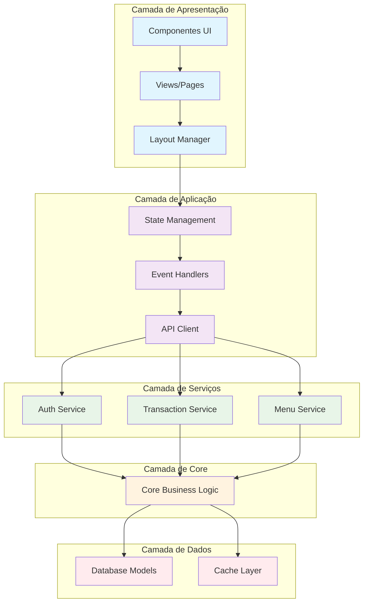

# Arquitetura da Interface do Usuário

## Visão Geral

A interface do usuário do DevStationPlatform é construída com **NiceGUI**, um framework web moderno para Python que permite criar interfaces ricas com componentes reativos. A arquitetura segue princípios de componentização, reatividade e separação de preocupações.

## Stack Tecnológico

### Tecnologias Principais

| Tecnologia | Versão | Propósito |
|------------|---------|-----------|
| **NiceGUI** | 1.4+ | Framework web principal |
| **Python** | 3.9+ | Linguagem backend |
| **Vue.js** | 3.x | Framework frontend (embutido no NiceGUI) |
| **Tailwind CSS** | 3.x | Sistema de estilização |
| **Quasar** | 2.x | Componentes UI (via NiceGUI) |
| **Socket.IO** | 4.x | Comunicação em tempo real |

### Dependências do Projeto

```yaml
# requirements.txt
nicegui>=1.4.0
fastapi>=0.104.0
uvicorn>=0.24.0
python-socketio>=5.9.0
aiohttp>=3.9.0
jinja2>=3.1.0
pydantic>=2.0.0
```

## Arquitetura em Camadas

### Diagrama de Arquitetura



## Estrutura de Diretórios

```
ui/
├── 📁 components/           # Componentes reutilizáveis
│   ├── 📄 __init__.py
│   ├── 📄 base.py          # Componente base
│   ├── 📄 forms.py         # Componentes de formulário
│   ├── 📄 tables.py        # Componentes de tabela
│   ├── 📄 charts.py        # Componentes de gráficos
│   ├── 📄 cards.py         # Componentes de card
│   └── 📄 modals.py        # Modais e diálogos
│
├── 📁 pages/               # Páginas da aplicação
│   ├── 📄 __init__.py
│   ├── 📄 login.py         # Página de login
│   ├── 📄 dashboard.py     # Dashboard principal
│   ├── 📄 transactions.py  # Execução de transações
│   ├── 📄 admin/           # Páginas administrativas
│   │   ├── 📄 users.py
│   │   ├── 📄 profiles.py
│   │   └── 📄 audit.py
│   └── 📄 plugins/         # Páginas de plugins
│
├── 📁 layouts/             # Layouts da aplicação
│   ├── 📄 __init__.py
│   ├── 📄 base.py          # Layout base
│   ├── 📄 auth.py          # Layout de autenticação
│   ├── 📄 admin.py         # Layout administrativo
│   └── 📄 sidebar.py       # Gerenciador de sidebar
│
├── 📁 stores/              # Gerenciamento de estado
│   ├── 📄 __init__.py
│   ├── 📄 auth_store.py    # Estado de autenticação
│   ├── 📄 ui_store.py      # Estado da UI
│   ├── 📄 menu_store.py    # Estado do menu
│   └── 📄 theme_store.py   # Estado do tema
│
├── 📁 services/            # Serviços da UI
│   ├── 📄 __init__.py
│   ├── 📄 api_client.py    # Cliente da API
│   ├── 📄 auth_service.py  # Serviço de autenticação
│   ├── 📄 menu_service.py  # Serviço de menu
│   └── 📄 theme_service.py # Serviço de temas
│
├── 📁 utils/               # Utilitários
│   ├── 📄 __init__.py
│   ├── 📄 validators.py    # Validação de formulários
│   ├── 📄 formatters.py    # Formatação de dados
│   ├── 📄 helpers.py       # Funções auxiliares
│   └── 📄 constants.py     # Constantes da UI
│
├── 📁 assets/              # Assets estáticos
│   ├── 📁 css/             # Estilos CSS
│   ├── 📁 js/              # JavaScript customizado
│   ├── 📁 images/          # Imagens e ícones
│   └── 📁 fonts/           # Fontes personalizadas
│
└── 📄 app.py               # Aplicação principal
```

## Componente Base

### Estrutura do Componente

```python
from nicegui import ui
from typing import Optional, Any, Dict, List
from abc import ABC, abstractmethod

class BaseComponent(ABC):
    """Classe base para todos os componentes da UI"""
    
    def __init__(self, 
                 component_id: Optional[str] = None,
                 classes: Optional[str] = None,
                 styles: Optional[Dict[str, str]] = None,
                 **kwargs):
        self.component_id = component_id or f"component_{id(self)}"
        self.classes = classes or ""
        self.styles = styles or {}
        self.kwargs = kwargs
        self.children: List[BaseComponent] = []
        self.parent: Optional[BaseComponent] = None
        
        # Estado reativo
        self._state = {}
        self._event_handlers = {}
    
    @abstractmethod
    def render(self) -> ui.element:
        """Renderiza o componente"""
        pass
    
    def mount(self) -> ui.element:
        """Monta o componente na UI"""
        element = self.render()
        
        # Aplicar classes e estilos
        if self.classes:
            element.classes(self.classes)
        
        if self.styles:
            for prop, value in self.styles.items():
                element.style(f"{prop}: {value}")
        
        # Aplicar propriedades adicionais
        for key, value in self.kwargs.items():
            if hasattr(element, key):
                setattr(element, key, value)
        
        return element
    
    def add_child(self, child: 'BaseComponent') -> 'BaseComponent':
        """Adiciona um componente filho"""
        child.parent = self
        self.children.append(child)
        return self
    
    def remove_child(self, child: 'BaseComponent') -> bool:
        """Remove um componente filho"""
        if child in self.children:
            child.parent = None
            self.children.remove(child)
            return True
        return False
    
    def update_state(self, key: str, value: Any) -> None:
        """Atualiza estado reativo"""
        self._state[key] = value
        self._notify_state_change(key, value)
    
    def get_state(self, key: str, default: Any = None) -> Any:
        """Obtém valor do estado"""
        return self._state.get(key, default)
    
    def on_event(self, event_type: str, handler: callable) -> None:
        """Registra handler de evento"""
        if event_type not in self._event_handlers:
            self._event_handlers[event_type] = []
        self._event_handlers[event_type].append(handler)
    
    def emit_event(self, event_type: str, *args, **kwargs) -> None:
        """Dispara evento para handlers registrados"""
        handlers = self._event_handlers.get(event_type, [])
        for handler in handlers:
            try:
                handler(*args, **kwargs)
            except Exception as e:
                logger.error(f"Error in event handler {event_type}: {e}")
    
    def _notify_state_change(self, key: str, value: Any) -> None:
        """Notifica mudanças de estado para filhos"""
        for child in self.children:
            if hasattr(child, '_on_parent_state_change'):
                child._on_parent_state_change(key, value)
    
    def dispose(self) -> None:
        """Libera recursos do componente"""
        for child in self.children:
            child.dispose()
        self.children.clear()
        self._event_handlers.clear()
        self._state.clear()
```

### Exemplo de Componente Concreto

```python
class CardComponent(BaseComponent):
    """Componente de card com header, conteúdo e footer"""
    
    def __init__(self, 
                 title: Optional[str] = None,
                 subtitle: Optional[str] = None,
                 elevation: int = 1,
                 **kwargs):
        super().__init__(**kwargs)
        self.title = title
        self.subtitle = subtitle
        self.elevation = elevation
        self.header_components: List[BaseComponent] = []
        self.footer_components: List[BaseComponent] = []
        
        # Classes padrão do card
        self.classes = f"rounded-lg shadow-{elevation} bg-white"
    
    def render(self) -> ui.element:
        """Renderiza o card"""
        with ui.card().classes(self.classes).style(self._build_styles()) as card:
            
            # Header
            if self.title or self.subtitle or self.header_components:
                with ui.card_section():
                    if self.title:
                        ui.label(self.title).classes("text-h6 font-bold")
                    
                    if self.subtitle:
                        ui.label(self.subtitle).classes("text-caption text-grey-7")
                    
                    for component in self.header_components:
                        component.mount()
            
            # Conteúdo principal
            with ui.card_section():
                for child in self.children:
                    child.mount()
            
            # Footer
            if self.footer_components:
                with ui.card_actions():
                    for component in self.footer_components:
                        component.mount()
        
        return card
    
    def add_header_component(self, component: BaseComponent) -> 'CardComponent':
        """Adiciona componente ao header"""
        self.header_components.append(component)
        return self
    
    def add_footer_component(self, component: BaseComponent) -> 'CardComponent':
        """Adiciona componente ao footer"""
        self.footer_components.append(component)
        return self
    
    def _build_styles(self) -> str:
        """Constrói string de estilos CSS"""
        styles = []
        for prop, value in self.styles.items():
            styles.append(f"{prop}: {value};")
        return " ".join(styles)
```

## Sistema de Roteamento

### Router Principal

```python
from nicegui import app
from typing import Dict, Callable, Optional, Any
from functools import wraps

class UIRouter:
    """Sistema de roteamento para a aplicação"""
    
    def __init__(self):
        self.routes: Dict[str, Dict[str, Any]] = {}
        self.middleware: List[Callable] = []
        self.current_route: Optional[str] = None
        self.route_history: List[str] = []
        
        # Configurar rota padrão
        self.add_route("/", self._default_route, name="home")
    
    def add_route(self, 
                  path: str, 
                  handler: Callable, 
                  name: Optional[str] = None,
                  requires_auth: bool = True,
                  permissions: Optional[List[str]] = None,
                  layout: Optional[str] = "default") -> None:
        """Adiciona uma rota ao router"""
        
        route_info = {
            "handler": handler,
            "name": name or path.replace("/", "_").strip("_"),
            "requires_auth": requires_auth,
            "permissions": permissions or [],
            "layout": layout,
            "metadata": {}
        }
        
        self.routes[path] = route_info
        logger.info(f"Rota registrada: {path} -> {name}")
    
    def add_middleware(self, middleware_func: Callable) -> None:
        """Adiciona middleware ao pipeline"""
        self.middleware.append(middleware_func)
    
    async def navigate(self, path: str, **kwargs) -> bool:
        """Navega para uma rota"""
        
        # Verificar se rota existe
        if path not in self.routes:
            logger.error(f"Rota não encontrada: {path}")
            await self.navigate("/404")
            return False
        
        route_info = self.routes[path]
        
        # Executar middleware
        for middleware in self.middleware:
            try:
                should_continue = await middleware(path, route_info, **kwargs)
                if not should_continue:
                    return False
            except Exception as e:
                logger.error(f"Erro no middleware: {e}")
                return False
        
        # Verificar autenticação
        if route_info["requires_auth"]:
            from stores.auth_store import auth_store
            if not auth_store.is_authenticated:
                logger.warning(f"Usuário não autenticado tentando acessar: {path}")
                await self.navigate("/login", redirect=path)
                return False
        
        # Verificar permissões
        if route_info["permissions"]:
            from stores.auth_store import auth_store
            user_permissions = auth_store.user_permissions
            
            required_permissions = set(route_info["permissions"])
            user_permission_set = set(user_permissions)
            
            if not required_permissions.issubset(user_permission_set):
                logger.warning(
                    f"Permissão negada para {path}. "
                    f"Requer: {required_permissions}, Tem: {user_permission_set}"
                )
                await self.navigate("/403")
                return False
        
        try:
            # Registrar no histórico
            if self.current_route:
                self.route_history.append(self.current_route)
            
            # Atualizar rota atual
            self.current_route = path
            
            # Limpar UI atual
            await self._clear_current_ui()
            
            # Executar handler da rota
            result = await route_info["handler"](**kwargs)
            
            # Aplicar layout
            await self._apply_layout(route_info["layout"], result)
            
            logger.info(f"Navegado para: {path}")
            return True
            
        except Exception as e:
            logger.error(f"Erro ao navegar para {path}: {e}")
            await self.navigate("/500", error=str(e))
            return False
    
    async def go_back(self) -> bool:
        """Volta para a rota anterior"""
        if self.route_history:
            previous_route = self.route_history.pop()
            return await self.navigate(previous_route)
        return False
    
    def route_decorator(self, 
                       path: str,
                       name: Optional[str] = None,
                       requires_auth: bool = True,
                       permissions: Optional[List[str]] = None,
                       layout: str = "default"):
        """Decorator para registrar rotas"""
        
        def decorator(handler: Callable):
            @wraps(handler)
            async def wrapper(*args, **kwargs):
                return await handler(*args, **kwargs)
            
            self.add_route(
                path=path,
                handler=wrapper,
                name=name,
                requires_auth=requires_auth,
                permissions=permissions,
                layout=layout
            )
            
            return wrapper
        
        return decorator
    
    async def _clear_current_ui(self) -> None:
        """Limpa a UI atual"""
        # Implementação específica do NiceGUI
        app.remove_head_html()
        # ... limpar componentes atuais
    
    async def _apply_layout(self, layout_name: str, content: Any) -> None:
        """Aplica layout à página"""
        from layouts import get_layout
        
        layout_class = get_layout(layout_name)
        if layout_class:
            layout = layout_class()
            await layout.apply(content)
        else:
            logger.warning(f"Layout não encontrado: {layout_name}")
    
    def _default_route(self) -> Any:
        """Rota padrão (home)"""
        from pages.dashboard import DashboardPage
        return DashboardPage()
```

### Exemplo de Uso do Router

```python
# Inicialização do router
router = UIRouter()

# Adicionar middleware de logging
@router.add_middleware
async def logging_middleware(path: str, route_info: Dict, **kwargs) -> bool:
    logger.info(f"Acessando rota: {path}")
    return True

# Adicionar middleware de autenticação
@router.add_middleware  
async def auth_middleware(path: str, route_info: Dict, **kwargs) -> bool:
    from stores.auth_store import auth_store
    
    # Rotas públicas não requerem autenticação
    if not route_info["requires_auth"]:
        return True
    
    # Verificar se usuário está autenticado
    if not auth_store.is_authenticated:
        logger.warning(f"Usuário não autenticado tentando acessar: {path}")
        
        # Redirecionar para login com URL de retorno
        redirect_path = kwargs.get("redirect", "/login")
        await router.navigate(redirect_path, return_to=path)
        return False
    
    return True
    
