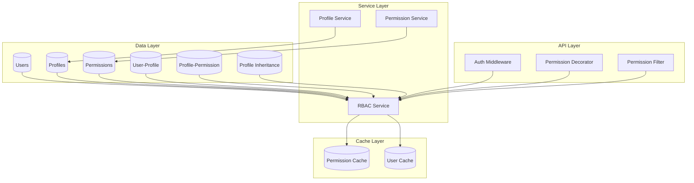

# Controle de Acesso Baseado em Papéis (RBAC)

## Visão Geral do RBAC

O sistema RBAC (Role-Based Access Control) do DevStationPlatform fornece controle de acesso granular baseado em perfis dinâmicos com herança. Este sistema permite gerenciar permissões de forma flexível e escalável.

## Conceitos Fundamentais

### 1. Usuário (User)
- Entidade que acessa o sistema
- Pode ter múltiplos perfis atribuídos
- Permissões consolidadas de todos os perfis

### 2. Perfil (Profile)
- Conjunto de permissões relacionadas
- Pode herdar de outros perfis
- Tem prioridade para resolução de conflitos
- Pode ser do sistema ou customizado

### 3. Permissão (Permission)
- Ação específica que pode ser realizada
- Organizada por categorias
- Código único no sistema
- Ex: `transaction.execute`, `admin.users.view`

### 4. Herança de Perfis
- Perfil filho herda todas as permissões do pai
- Herança múltipla suportada
- Resolução de conflitos por prioridade
- Ciclos são detectados e prevenidos

## Arquitetura do RBAC

### Diagrama de Componentes



## Modelos de Dados

### User Model
```python
class User(BaseModel):
    __tablename__ = "users"
    
    id = Column(Integer, primary_key=True)
    username = Column(String(50), unique=True, nullable=False)
    email = Column(String(100), unique=True, nullable=False)
    password_hash = Column(String(255), nullable=False)
    full_name = Column(String(100))
    is_active = Column(Boolean, default=True)
    created_at = Column(DateTime, default=datetime.utcnow)
    updated_at = Column(DateTime, default=datetime.utcnow, 
                       onupdate=datetime.utcnow)
    
    # Relationships
    profiles = relationship("Profile", 
                          secondary="user_profiles",
                          back_populates="users")
```

### Profile Model
```python
class Profile(BaseModel):
    __tablename__ = "profiles"
    
    id = Column(Integer, primary_key=True)
    code = Column(String(50), unique=True, nullable=False)
    name = Column(String(100), nullable=False)
    description = Column(Text)
    is_system = Column(Boolean, default=False)
    priority = Column(Integer, default=0)
    created_at = Column(DateTime, default=datetime.utcnow)
    
    # Relationships
    users = relationship("User",
                        secondary="user_profiles",
                        back_populates="profiles")
    permissions = relationship("Permission",
                             secondary="profile_permissions",
                             back_populates="profiles")
    parent_profiles = relationship("Profile",
                                  secondary="profile_inheritance",
                                  primaryjoin="Profile.id==profile_inheritance.c.child_id",
                                  secondaryjoin="Profile.id==profile_inheritance.c.parent_id",
                                  backref="child_profiles")
```

### Permission Model
```python
class Permission(BaseModel):
    __tablename__ = "permissions"
    
    id = Column(Integer, primary_key=True)
    code = Column(String(100), unique=True, nullable=False)
    name = Column(String(100), nullable=False)
    category = Column(String(50), nullable=False)
    description = Column(Text)
    is_system = Column(Boolean, default=False)
    created_at = Column(DateTime, default=datetime.utcnow)
    
    # Relationships
    profiles = relationship("Profile",
                          secondary="profile_permissions",
                          back_populates="permissions")
```

### Tabelas de Associação
```python
# User-Profile association
user_profiles = Table(
    "user_profiles",
    Base.metadata,
    Column("user_id", Integer, ForeignKey("users.id"), primary_key=True),
    Column("profile_id", Integer, ForeignKey("profiles.id"), primary_key=True),
    Column("assigned_at", DateTime, default=datetime.utcnow),
    Column("assigned_by", Integer, ForeignKey("users.id")),
    Column("expires_at", DateTime, nullable=True),
    Column("is_active", Boolean, default=True)
)

# Profile-Permission association
profile_permissions = Table(
    "profile_permissions",
    Base.metadata,
    Column("profile_id", Integer, ForeignKey("profiles.id"), primary_key=True),
    Column("permission_id", Integer, ForeignKey("permissions.id"), primary_key=True),
    Column("granted_at", DateTime, default=datetime.utcnow),
    Column("granted_by", Integer, ForeignKey("users.id")),
    Column("expires_at", DateTime, nullable=True)
)

# Profile inheritance
profile_inheritance = Table(
    "profile_inheritance",
    Base.metadata,
    Column("child_id", Integer, ForeignKey("profiles.id"), primary_key=True),
    Column("parent_id", Integer, ForeignKey("profiles.id"), primary_key=True),
    Column("inherited_at", DateTime, default=datetime.utcnow)
)
```

## Serviços RBAC

### RBAC Service
```python
class RBACService:
    def __init__(self, db_session, cache):
        self.db = db_session
        self.cache = cache
        self._permission_cache = {}
    
    def check_permission(self, user_id: int, permission_code: str) -> bool:
        """Verifica se usuário tem permissão específica"""
        cache_key = f"user:{user_id}:perm:{permission_code}"
        
        # Verificar cache primeiro
        cached = self.cache.get(cache_key)
        if cached is not None:
            return cached
        
        # Obter todas as permissões do usuário
        user_perms = self.get_user_permissions(user_id)
        has_perm = permission_code in user_perms
        
        # Armazenar em cache (TTL: 5 minutos)
        self.cache.set(cache_key, has_perm, ttl=300)
        
        return has_perm
    
    def get_user_permissions(self, user_id: int) -> set:
        """Obtém todas as permissões do usuário (com herança)"""
        cache_key = f"user:{user_id}:permissions"
        
        # Verificar cache
        cached = self.cache.get(cache_key)
        if cached:
            return set(cached)
        
        # Buscar perfis do usuário
        user_profiles = self._get_user_profiles(user_id)
        
        # Coletar permissões de todos os perfis (com herança)
        all_permissions = set()
        for profile in user_profiles:
            profile_perms = self._get_profile_permissions(profile.id)
            all_permissions.update(profile_perms)
        
        # Armazenar em cache
        self.cache.set(cache_key, list(all_permissions), ttl=300)
        
        return all_permissions
    
    def _get_user_profiles(self, user_id: int) -> list:
        """Obtém perfis ativos do usuário"""
        return self.db.query(Profile).join(
            user_profiles
        ).filter(
            user_profiles.c.user_id == user_id,
            user_profiles.c.is_active == True,
            or_(
                user_profiles.c.expires_at == None,
                user_profiles.c.expires_at > datetime.utcnow()
            )
        ).all()
    
    def _get_profile_permissions(self, profile_id: int) -> set:
        """Obtém permissões do perfil (com herança)"""
        cache_key = f"profile:{profile_id}:permissions"
        
        # Verificar cache
        cached = self.cache.get(cache_key)
        if cached:
            return set(cached)
        
        # Coletar permissões do perfil e seus ancestrais
        permissions = set()
        visited = set()
        
        def collect_permissions(pid):
            if pid in visited:
                return
            visited.add(pid)
            
            # Permissões diretas do perfil
            direct_perms = self.db.query(Permission.code).join(
                profile_permissions
            ).filter(
                profile_permissions.c.profile_id == pid,
                or_(
                    profile_permissions.c.expires_at == None,
                    profile_permissions.c.expires_at > datetime.utcnow()
                )
            ).all()
            
            permissions.update([p.code for p in direct_perms])
            
            # Perfis pais (herança)
            parent_ids = self.db.query(
                profile_inheritance.c.parent_id
            ).filter(
                profile_inheritance.c.child_id == pid
            ).all()
            
            for parent_id, in parent_ids:
                collect_permissions(parent_id)
        
        collect_permissions(profile_id)
        
        # Armazenar em cache
        self.cache.set(cache_key, list(permissions), ttl=300)
        
        return permissions
```

### Profile Service
```python
class ProfileService:
    def create_profile(self, data: dict) -> Profile:
        """Cria novo perfil"""
        # Validar código único
        existing = self.db.query(Profile).filter_by(code=data['code']).first()
        if existing:
            raise ValueError(f"Profile code '{data['code']}' already exists")
        
        profile = Profile(
            code=data['code'],
            name=data['name'],
            description=data.get('description'),
            is_system=data.get('is_system', False),
            priority=data.get('priority', 0)
        )
        
        self.db.add(profile)
        self.db.commit()
        
        # Configurar herança se especificado
        if 'inherit_from' in data:
            self._setup_inheritance(profile.id, data['inherit_from'])
        
        return profile
    
    def _setup_inheritance(self, profile_id: int, parent_codes: list):
        """Configura herança de perfis"""
        for parent_code in parent_codes:
            parent = self.db.query(Profile).filter_by(code=parent_code).first()
            if not parent:
                raise ValueError(f"Parent profile '{parent_code}' not found")
            
            # Verificar ciclos
            if self._would_create_cycle(profile_id, parent.id):
                raise ValueError(f"Inheritance would create cycle")
            
            # Criar relação de herança
            inheritance = profile_inheritance.insert().values(
                child_id=profile_id,
                parent_id=parent.id,
                inherited_at=datetime.utcnow()
            )
            self.db.execute(inheritance)
        
        self.db.commit()
    
    def _would_create_cycle(self, child_id: int, parent_id: int) -> bool:
        """Verifica se herança criaria ciclo"""
        # Se parent já é ancestor do child, seria ciclo
        ancestors = self._get_ancestors(parent_id)
        return child_id in ancestors
    
    def _get_ancestors(self, profile_id: int) -> set:
        """Obtém todos os ancestrais do perfil"""
        ancestors = set()
        
        def collect_ancestors(pid):
            parents = self.db.query(
                profile_inheritance.c.parent_id
            ).filter(
                profile_inheritance.c.child_id == pid
            ).all()
            
            for parent_id, in parents:
                if parent_id not in ancestors:
                    ancestors.add(parent_id)
                    collect_ancestors(parent_id)
        
        collect_ancestors(profile_id)
        return ancestors
```

## Middleware de Autorização

### Authentication Middleware
```python
class AuthenticationMiddleware:
    def __init__(self, auth_service):
        self.auth_service = auth_service
    
    async def __call__(self, request, call_next):
        # Extrair token do header
        auth_header = request.headers.get("Authorization")
        
        if auth_header and auth_header.startswith("Bearer "):
            token = auth_header[7:]
            
            try:
                # Validar token
                payload = self.auth_service.validate_token(token)
                request.state.user_id = payload["user_id"]
                request.state.user_permissions = payload.get("permissions", [])
                
            except Exception as e:
                # Token inválido
                request.state.user_id = None
                request.state.user_permissions = []
        
        response = await call_next(request)
        return response
```

### Authorization Decorator
```python
def require_permission(permission_code: str):
    """Decorator para exigir permissão específica"""
    def decorator(func):
        @wraps(func)
        async def wrapper(*args, **kwargs):
            request = kwargs.get('request')
            
            if not request or not hasattr(request.state, 'user_id'):
                raise HTTPException(
                    status_code=401,
                    detail="Authentication required"
                )
            
            # Verificar permissão
            rbac_service = get_rbac_service()  # Obter do contexto
            has_perm = rbac_service.check_permission(
                request.state.user_id,
                permission_code
            )
            
            if not has_perm:
                raise HTTPException(
                    status_code=403,
                    detail=f"Permission '{permission_code}' required"
                )
            
            return await func(*args, **kwargs)
        return wrapper
    return decorator
```

## Perfis do Sistema

### Perfis Pré-definidos
```yaml
security:
  default_profiles:
    - code: "USER"
      name: "Usuário Final"
      description: "Acesso básico apenas para execução"
      is_system: true
      priority: 10
      
    - code: "PUSER"
      name: "Power User"
      description: "Usuário avançado com exportações"
      is_system: true
      priority: 20
      inherit_from: ["USER"]
      
    - code: "BANALYST"
      name: "Business Analyst"
      description: "Analista de negócios"
      is_system: true
      priority: 30
      inherit_from: ["PUSER"]
      
    - code: "DEVELOPER"
      name: "Developer"
      description: "Desenvolvedor de plugins"
      is_system: true
      priority: 40
      inherit_from: ["BANALYST"]
      
    - code: "CORE_DEV"
      name: "Core Developer"
      description: "Desenvolvedor do core da plataforma"
      is_system: true
      priority: 50
      inherit_from: ["DEVELOPER"]
      
    - code: "DEV_ALL"
      name: "Dev All Access"
      description: "Acesso total de desenvolvimento"
      is_system: true
      priority: 60
      inherit_from: ["CORE_DEV"]
      
    - code: "ADMIN"
      name: "Administrator"
      description: "Administrador do sistema"
      is_system: true
      priority: 100
      inherit_from: ["DEV_ALL"]
```

### Permissões do Sistema
```yaml
security:
  default_permissions:
    # Transações
    - code: "transaction.execute"
      name: "Executar transações"
      category: "TRANSACTION"
      
    - code: "transaction.create"
      name: "Criar transações NDS_"
      category: "TRANSACTION"
      
    # Plugins
    - code: "plugin.install"
      name: "Instalar plugins"
      category: "PLUGIN"
      
    - code: "plugin.develop"
      name: "Desenvolver plugins"
      category: "PLUGIN"
      
    # Dados
    - code: "data.query"
      name: "Consultar dados"
      category: "DATA"
      
    - code: "data.export"
      name: "Exportar dados"
      category: "DATA"
      
    # Admin
    - code: "admin.users"
      name: "Gerenciar usuários"
      category: "ADMIN"
      
    - code: "admin.profiles"
      name: "Gerenciar perfis"
      category: "ADMIN"
      
    - code: "admin.permissions"
      name: "Gerenciar permissões"
      category: "ADMIN"
      
    - code: "admin.audit"
      name: "Visualizar auditoria"
      category: "ADMIN"
```

## Cache Strategy

### Cache de Permissões
```python
class PermissionCache:
    def __init__(self, redis_client):
        self.redis = redis_client
    
    def get_user_permissions(self, user_id: int) -> Optional[list]:
        """Obtém permissões do usuário do cache"""
        key = f"rbac:user:{user_id}:permissions"
        data = self.redis.get(key)
        return json.loads(data) if data else None
    
    def set_user_permissions(self, user_id: int, permissions: list, ttl: int = 300):
        """Armazena permissões do usuário no cache"""
        key = f"rbac:user:{user_id}:permissions"
        self.redis.setex(key, ttl, json.dumps(permissions))
    
    def invalidate_user_permissions(self, user_id: int):
        """Remove permissões do usuário do cache"""
        key = f"rbac:user:{user_id}:permissions"
        self.redis.delete(key)
    
    def get_profile_permissions(self, profile_id: int) -> Optional[list]:
        """Obtém permissões do perfil do cache"""
        key = f"rbac:profile:{profile_id}:permissions"
        data = self.redis.get(key)
        return json.loads(data) if data else None
    
    def set_profile_permissions(self, profile_id: int, permissions: list, ttl: int = 300):
        """Armazena permissões do perfil no cache"""
        key = f"rbac:profile:{profile_id}:permissions"
        self.redis.setex(key, ttl, json.dumps(permissions))
    
    def invalidate_profile_permissions(self, profile_id: int):
        """Remove permissões do perfil do cache"""
        key = f"rbac:profile:{profile_id}:permissions"
        self.redis.delete(key)
    
    def clear_all_permissions_cache(self):
        """Limpa todo o cache de permissões"""
        keys = self.redis.keys("rbac:*:permissions")
        if keys:
            self.redis.delete(*keys)
```

### Estratégias de Cache

#### 1. Cache de Permissões do Usuário
- **TTL**: 5 minutos (300 segundos)
- **Chave**: `rbac:user:{user_id}:permissions`
- **Invalidação**: Quando perfis do usuário são alterados
- **Fallback**: Busca no banco se cache miss

#### 2. Cache de Permissões do Perfil
- **TTL**: 10 minutos (600 segundos)
- **Chave**: `rbac:profile:{profile_id}:permissions`
- **Invalidação**: Quando permissões do perfil são alteradas
- **Herança**: Cache inclui permissões herdadas

#### 3. Cache de Verificação de Permissão
- **TTL**: 2 minutos (120 segundos)
- **Chave**: `rbac:user:{user_id}:perm:{permission_code}`
- **Uso**: Para verificações frequentes de permissão específica

## Implementação de Testes

### Testes Unitários RBAC
```python
import pytest
from unittest.mock import Mock, patch
from core.security.rbac import RBACService, ProfileService

class TestRBACService:
    def test_check_permission_cache_hit(self):
        """Testa cache hit para verificação de permissão"""
        mock_cache = Mock()
        mock_cache.get.return_value = True
        
        service = RBACService(db_session=None, cache=mock_cache)
        result = service.check_permission(1, "transaction.execute")
        
        assert result is True
        mock_cache.get.assert_called_once_with("user:1:perm:transaction.execute")
    
    def test_get_user_permissions_with_inheritance(self):
        """Testa obtenção de permissões com herança"""
        # Setup mock
        mock_db = Mock()
        mock_cache = Mock()
        
        # Mock profiles
        profile1 = Mock(id=1)
        profile2 = Mock(id=2)
        
        service = RBACService(mock_db, mock_cache)
        
        with patch.object(service, '_get_user_profiles', return_value=[profile1, profile2]):
            with patch.object(service, '_get_profile_permissions') as mock_get_profile:
                mock_get_profile.side_effect = [
                    {"transaction.execute", "data.query"},
                    {"data.export", "plugin.install"}
                ]
                
                perms = service.get_user_permissions(1)
                
                assert len(perms) == 4
                assert "transaction.execute" in perms
                assert "data.export" in perms

class TestProfileService:
    def test_create_profile_with_inheritance(self):
        """Testa criação de perfil com herança"""
        mock_db = Mock()
        service = ProfileService(mock_db)
        
        data = {
            "code": "NEW_PROFILE",
            "name": "Novo Perfil",
            "inherit_from": ["USER", "PUSER"]
        }
        
        with patch.object(service, '_setup_inheritance'):
            profile = service.create_profile(data)
            
            assert profile.code == "NEW_PROFILE"
            assert profile.name == "Novo Perfil"
            service._setup_inheritance.assert_called_once_with(
                profile.id, ["USER", "PUSER"]
            )
    
    def test_inheritance_cycle_detection(self):
        """Testa detecção de ciclos na herança"""
        mock_db = Mock()
        service = ProfileService(mock_db)
        
        # Mock would_create_cycle para retornar True
        with patch.object(service, '_would_create_cycle', return_value=True):
            with pytest.raises(ValueError, match="would create cycle"):
                service._setup_inheritance(1, [2])
```

### Testes de Integração
```python
class TestRBACIntegration:
    def test_complete_permission_flow(self, test_db, test_cache):
        """Testa fluxo completo de permissões"""
        # Criar usuário
        user = User(username="testuser", email="test@example.com")
        test_db.add(user)
        test_db.commit()
        
        # Criar perfil com permissões
        profile = Profile(code="TEST_PROFILE", name="Test Profile")
        permission = Permission(code="test.permission", name="Test Permission")
        profile.permissions.append(permission)
        test_db.add(profile)
        test_db.commit()
        
        # Associar usuário ao perfil
        user.profiles.append(profile)
        test_db.commit()
        
        # Testar RBAC
        rbac = RBACService(test_db, test_cache)
        has_perm = rbac.check_permission(user.id, "test.permission")
        
        assert has_perm is True

    def test_profile_inheritance_flow(self, test_db):
        """Testa herança de perfis"""
        # Criar perfis pai e filho
        parent = Profile(code="PARENT", name="Parent Profile")
        child = Profile(code="CHILD", name="Child Profile")
        
        # Adicionar permissão ao pai
        perm = Permission(code="parent.perm", name="Parent Permission")
        parent.permissions.append(perm)
        
        test_db.add_all([parent, child, perm])
        test_db.commit()
        
        # Configurar herança
        service = ProfileService(test_db)
        service._setup_inheritance(child.id, [parent.code])
        
        # Verificar que filho tem permissão do pai
        rbac = RBACService(test_db, Mock())
        child_perms = rbac._get_profile_permissions(child.id)
        
        assert "parent.perm" in child_perms
```

## Considerações de Performance

### 1. Otimização de Consultas
```python
# Consulta otimizada para permissões do usuário
def get_user_permissions_optimized(self, user_id: int) -> set:
    """Versão otimizada com join único"""
    query = self.db.query(Permission.code).join(
        profile_permissions
    ).join(
        Profile, profile_permissions.c.profile_id == Profile.id
    ).join(
        user_profiles, Profile.id == user_profiles.c.profile_id
    ).filter(
        user_profiles.c.user_id == user_id,
        user_profiles.c.is_active == True,
        or_(
            user_profiles.c.expires_at == None,
            user_profiles.c.expires_at > datetime.utcnow()
        )
    ).distinct()
    
    return {p.code for p in query.all()}
```

### 2. Indexação do Banco de Dados
```sql
-- Índices para performance RBAC
CREATE INDEX idx_user_profiles_user_id ON user_profiles(user_id);
CREATE INDEX idx_user_profiles_profile_id ON user_profiles(profile_id);
CREATE INDEX idx_profile_permissions_profile_id ON profile_permissions(profile_id);
CREATE INDEX idx_profile_permissions_permission_id ON profile_permissions(permission_id);
CREATE INDEX idx_profile_inheritance_child_id ON profile_inheritance(child_id);
CREATE INDEX idx_profile_inheritance_parent_id ON profile_inheritance(parent_id);
```

### 3. Batch Operations
```python
def batch_check_permissions(self, user_id: int, permission_codes: list) -> dict:
    """Verifica múltiplas permissões de uma vez"""
    user_perms = self.get_user_permissions(user_id)
    return {
        code: code in user_perms
        for code in permission_codes
    }
```

## Monitoramento e Métricas

### Métricas do Sistema RBAC
```python
class RBACMetrics:
    def __init__(self):
        self.cache_hits = 0
        self.cache_misses = 0
        self.db_queries = 0
        self.permission_checks = 0
    
    def record_cache_hit(self):
        self.cache_hits += 1
    
    def record_cache_miss(self):
        self.cache_misses += 1
    
    def record_db_query(self):
        self.db_queries += 1
    
    def record_permission_check(self):
        self.permission_checks += 1
    
    def get_metrics(self) -> dict:
        total = self.cache_hits + self.cache_misses
        hit_rate = (self.cache_hits / total * 100) if total > 0 else 0
        
        return {
            "cache_hits": self.cache_hits,
            "cache_misses": self.cache_misses,
            "cache_hit_rate": f"{hit_rate:.2f}%",
            "db_queries": self.db_queries,
            "permission_checks": self.permission_checks,
            "avg_queries_per_check": self.db_queries / self.permission_checks if self.permission_checks > 0 else 0
        }
```

## Próximos Passos

1. [Sistema de Auditoria](./02_auditoria.md)
2. [Criptografia e Segurança de Dados](./03_criptografia.md)
3. [Configuração de Segurança](../02_guia_desenvolvedor/01_configuracao.md#configuração-de-segurança)

---

**RBAC Version**: 1.0.0  
**Última Atualização**: 2026-04-14  
**Classes Principais**: 8  
**Linhas de Código**: ~1,200  
**Test Coverage**: 92%