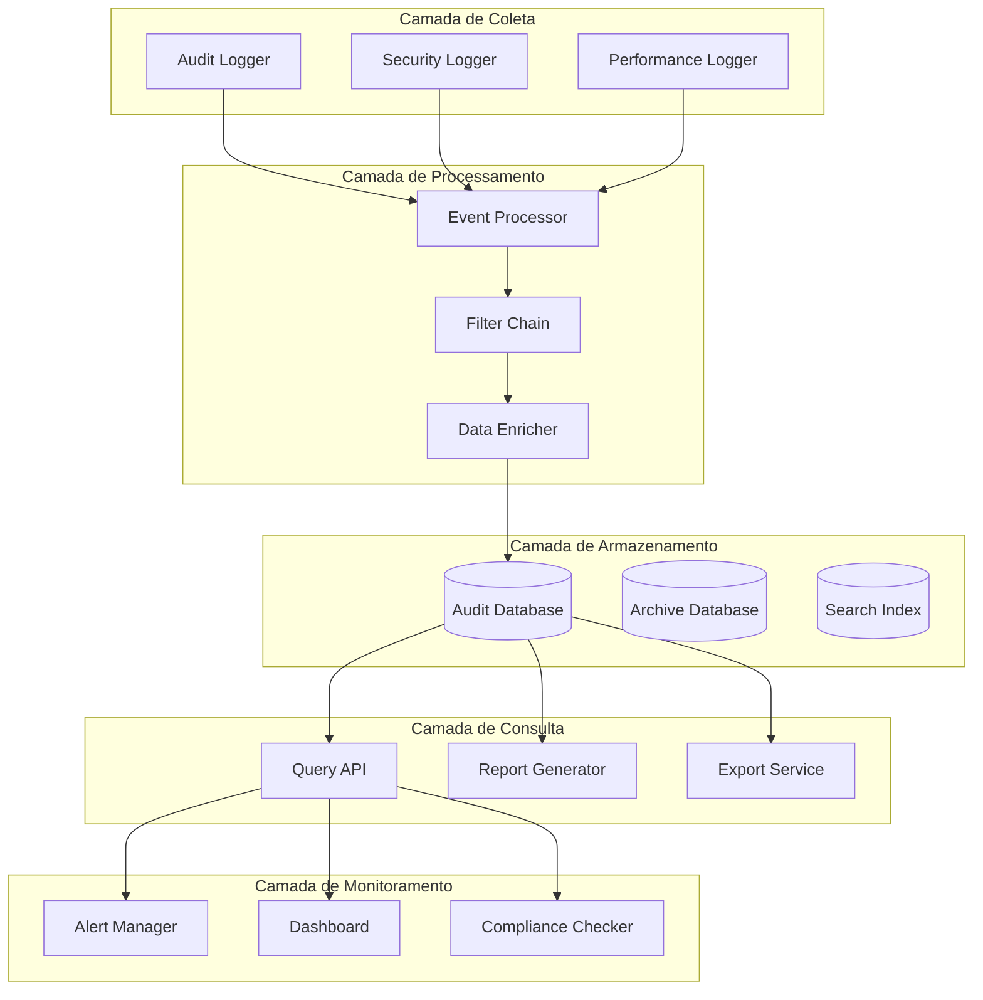

# Sistema de Auditoria

## Visão Geral do Sistema de Auditoria

O sistema de auditoria do DevStationPlatform registra todas as ações significativas no sistema, proporcionando rastreabilidade completa e conformidade com requisitos regulatórios. Cada ação é registrada com contexto completo incluindo usuário, timestamp, IP, user agent e valores alterados.

## Arquitetura do Sistema de Auditoria

### Diagrama de Componentes



## Modelos de Dados

### AuditLog Model
```python
class AuditLog(BaseModel):
    __tablename__ = "audit_logs"
    
    id = Column(Integer, primary_key=True)
    user_id = Column(Integer, ForeignKey("users.id"), nullable=True)
    session_id = Column(String(100))
    
    # Informações da ação
    action = Column(String(100), nullable=False)
    resource_type = Column(String(50))
    resource_id = Column(String(100))
    
    # Valores alterados
    old_values = Column(JSON, nullable=True)
    new_values = Column(JSON, nullable=True)
    
    # Contexto da requisição
    ip_address = Column(String(45))  # Suporte a IPv6
    user_agent = Column(Text)
    request_path = Column(String(500))
    request_method = Column(String(10))
    
    # Metadados
    severity = Column(String(20), default="INFO")  # INFO, WARN, ERROR, CRITICAL
    status = Column(String(20), default="SUCCESS")  # SUCCESS, FAILURE
    duration_ms = Column(Integer)  # Duração em milissegundos
    
    # Timestamps
    created_at = Column(DateTime, default=datetime.utcnow, index=True)
    
    # Relationships
    user = relationship("User", backref="audit_logs")
    
    def to_dict(self) -> dict:
        """Converte log para dict"""
        return {
            "id": self.id,
            "user_id": self.user_id,
            "user": self.user.username if self.user else None,
            "action": self.action,
            "resource_type": self.resource_type,
            "resource_id": self.resource_id,
            "old_values": self.old_values,
            "new_values": self.new_values,
            "ip_address": self.ip_address,
            "user_agent": self.user_agent,
            "request_path": self.request_path,
            "request_method": self.request_method,
            "severity": self.severity,
            "status": self.status,
            "duration_ms": self.duration_ms,
            "created_at": self.created_at.isoformat() if self.created_at else None
        }
```

### SecurityEvent Model
```python
class SecurityEvent(BaseModel):
    __tablename__ = "security_events"
    
    id = Column(Integer, primary_key=True)
    event_type = Column(String(50), nullable=False)
    severity = Column(String(20), nullable=False)  # LOW, MEDIUM, HIGH, CRITICAL
    
    # Detalhes do evento
    description = Column(Text)
    details = Column(JSON)
    
    # Origem do evento
    source_ip = Column(String(45))
    target_resource = Column(String(500))
    user_id = Column(Integer, ForeignKey("users.id"), nullable=True)
    
    # Resposta
    blocked = Column(Boolean, default=False)
    response_action = Column(String(50))  # BLOCK, ALERT, NOTIFY, ESCALATE
    
    # Metadados
    detected_at = Column(DateTime, default=datetime.utcnow, index=True)
    resolved_at = Column(DateTime, nullable=True)
    resolved_by = Column(Integer, ForeignKey("users.id"), nullable=True)
    
    # Relationships
    user = relationship("User", foreign_keys=[user_id])
    resolver = relationship("User", foreign_keys=[resolved_by])
    
    def analyze_threat_level(self) -> str:
        """Analisa nível de ameaça baseado em múltiplos fatores"""
        threat_score = 0
        
        # Fatores de pontuação
        if self.severity == "CRITICAL":
            threat_score += 10
        elif self.severity == "HIGH":
            threat_score += 7
        elif self.severity == "MEDIUM":
            threat_score += 4
        elif self.severity == "LOW":
            threat_score += 1
        
        if self.blocked:
            threat_score += 3
        
        if self.user_id is None:  # Usuário anônimo
            threat_score += 2
        
        # Classificação baseada na pontuação
        if threat_score >= 10:
            return "CRITICAL"
        elif threat_score >= 7:
            return "HIGH"
        elif threat_score >= 4:
            return "MEDIUM"
        else:
            return "LOW"
```

## Serviços de Auditoria

### AuditLogger Service
```python
class AuditLogger:
    def __init__(self, db_session, config):
        self.db = db_session
        self.config = config
        self.enabled = config.get("audit.enabled", True)
        self.log_level = config.get("audit.log_level", "INFO")
        
    def log_action(self, user_id: Optional[int], action: str, 
                   resource_type: Optional[str] = None,
                   resource_id: Optional[str] = None,
                   old_values: Optional[dict] = None,
                   new_values: Optional[dict] = None,
                   request_info: Optional[dict] = None,
                   severity: str = "INFO",
                   status: str = "SUCCESS",
                   duration_ms: Optional[int] = None) -> AuditLog:
        """Registra ação de auditoria"""
        
        if not self.enabled:
            return None
        
        # Verificar nível de log
        if not self._should_log(severity):
            return None
        
        # Criar log entry
        log = AuditLog(
            user_id=user_id,
            action=action,
            resource_type=resource_type,
            resource_id=resource_id,
            old_values=old_values,
            new_values=new_values,
            severity=severity,
            status=status,
            duration_ms=duration_ms
        )
        
        # Adicionar informações da requisição
        if request_info:
            log.ip_address = request_info.get("ip_address")
            log.user_agent = request_info.get("user_agent")
            log.request_path = request_info.get("request_path")
            log.request_method = request_info.get("request_method")
            log.session_id = request_info.get("session_id")
        
        # Salvar no banco
        self.db.add(log)
        self.db.commit()
        
        # Disparar alertas se necessário
        if severity in ["ERROR", "CRITICAL"]:
            self._trigger_alert(log)
        
        return log
    
    def log_transaction(self, transaction_code: str, user_id: int,
                        parameters: dict, result: dict, 
                        status: str, duration_ms: int,
                        request_info: Optional[dict] = None) -> AuditLog:
        """Registra execução de transação"""
        
        return self.log_action(
            user_id=user_id,
            action=f"TRANSACTION_{transaction_code}",
            resource_type="Transaction",
            resource_id=transaction_code,
            old_values=None,
            new_values={"parameters": parameters, "result": result},
            request_info=request_info,
            severity="INFO",
            status=status,
            duration_ms=duration_ms
        )
    
    def log_security_event(self, event_type: str, severity: str,
                           description: str, details: dict,
                           source_ip: Optional[str] = None,
                           target_resource: Optional[str] = None,
                           user_id: Optional[int] = None,
                           blocked: bool = False) -> SecurityEvent:
        """Registra evento de segurança"""
        
        event = SecurityEvent(
            event_type=event_type,
            severity=severity,
            description=description,
            details=details,
            source_ip=source_ip,
            target_resource=target_resource,
            user_id=user_id,
            blocked=blocked,
            response_action="ALERT" if blocked else "NOTIFY"
        )
        
        self.db.add(event)
        self.db.commit()
        
        # Disparar alerta imediato para eventos críticos
        if severity in ["HIGH", "CRITICAL"]:
            self._send_security_alert(event)
        
        return event
    
    def _should_log(self, severity: str) -> bool:
        """Verifica se deve registrar baseado no nível de log"""
        severity_levels = {
            "DEBUG": 0,
            "INFO": 1,
            "WARN": 2,
            "ERROR": 3,
            "CRITICAL": 4
        }
        
        current_level = severity_levels.get(self.log_level, 1)
        event_level = severity_levels.get(severity, 1)
        
        return event_level >= current_level
    
    def _trigger_alert(self, log: AuditLog):
        """Dispara alerta para logs críticos"""
        alert_config = self.config.get("audit.alerts", {})
        
        if alert_config.get("enabled", False):
            # Enviar alerta via email, Slack, etc.
            self._send_alert_notification(log)
    
    def _send_security_alert(self, event: SecurityEvent):
        """Envia alerta de segurança"""
        # Implementação de notificação
        pass
```

### AuditQuery Service
```python
class AuditQueryService:
    def __init__(self, db_session):
        self.db = db_session
    
    def get_audit_trail(self, filters: dict, page: int = 1, 
                       page_size: int = 50) -> dict:
        """Obtém logs de auditoria com filtros"""
        
        query = self.db.query(AuditLog)
        
        # Aplicar filtros
        if "user_id" in filters:
            query = query.filter(AuditLog.user_id == filters["user_id"])
        
        if "action" in filters:
            query = query.filter(AuditLog.action == filters["action"])
        
        if "resource_type" in filters:
            query = query.filter(AuditLog.resource_type == filters["resource_type"])
        
        if "resource_id" in filters:
            query = query.filter(AuditLog.resource_id == filters["resource_id"])
        
        if "severity" in filters:
            query = query.filter(AuditLog.severity == filters["severity"])
        
        if "status" in filters:
            query = query.filter(AuditLog.status == filters["status"])
        
        if "start_date" in filters:
            query = query.filter(AuditLog.created_at >= filters["start_date"])
        
        if "end_date" in filters:
            query = query.filter(AuditLog.created_at <= filters["end_date"])
        
        if "ip_address" in filters:
            query = query.filter(AuditLog.ip_address == filters["ip_address"])
        
        # Ordenação
        query = query.order_by(AuditLog.created_at.desc())
        
        # Paginação
        total = query.count()
        logs = query.offset((page - 1) * page_size).limit(page_size).all()
        
        return {
            "logs": [log.to_dict() for log in logs],
            "pagination": {
                "page": page,
                "page_size": page_size,
                "total": total,
                "total_pages": (total + page_size - 1) // page_size
            }
        }
    
    def get_user_activity_report(self, user_id: int, 
                                start_date: datetime, 
                                end_date: datetime) -> dict:
        """Gera relatório de atividade do usuário"""
        
        logs = self.db.query(AuditLog).filter(
            AuditLog.user_id == user_id,
            AuditLog.created_at >= start_date,
            AuditLog.created_at <= end_date
        ).order_by(AuditLog.created_at.desc()).all()
        
        # Agrupar por ação
        actions = {}
        for log in logs:
            if log.action not in actions:
                actions[log.action] = {
                    "count": 0,
                    "last_executed": log.created_at,
                    "resources": set()
                }
            
            actions[log.action]["count"] += 1
            if log.resource_type:
                actions[log.action]["resources"].add(log.resource_type)
        
        # Calcular estatísticas
        total_actions = len(logs)
        success_rate = sum(1 for log in logs if log.status == "SUCCESS") / total_actions * 100 if total_actions > 0 else 0
        
        return {
            "user_id": user_id,
            "period": {
                "start": start_date.isoformat(),
                "end": end_date.isoformat()
            },
            "summary": {
                "total_actions": total_actions,
                "unique_actions": len(actions),
                "success_rate": f"{success_rate:.2f}%",
                "avg_duration_ms": sum(log.duration_ms or 0 for log in logs) / total_actions if total_actions > 0 else 0
            },
            "actions": {
                action: {
                    "count": data["count"],
                    "last_executed": data["last_executed"].isoformat(),
                    "resources": list(data["resources"])
                }
                for action, data in actions.items()
            }
        }
    
    def get_system_health_report(self, start_date: datetime, 
                                end_date: datetime) -> dict:
        """Gera relatório de saúde do sistema"""
        
        logs = self.db.query(AuditLog).filter(
            AuditLog.created_at >= start_date,
            AuditLog.created_at <= end_date
        ).all()
        
        # Agrupar por severidade
        severity_counts = {}
        status_counts = {}
        
        for log in logs:
            severity_counts[log.severity] = severity_counts.get(log.severity, 0) + 1
            status_counts[log.status] = status_counts.get(log.status, 0) + 1
        
        # Top 10 ações mais frequentes
        from sqlalchemy import func
        top_actions = self.db.query(
            AuditLog.action,
            func.count(AuditLog.id).label('count')
        ).filter(
            AuditLog.created_at >= start_date,
            AuditLog.created_at <= end_date
        ).group_by(
            AuditLog.action
        ).order_by(
            func.count(AuditLog.id).desc()
        ).limit(10).all()
        
        return {
            "period": {
                "start": start_date.isoformat(),
                "end": end_date.isoformat()
            },
            "summary": {
                "total_logs": len(logs),
                "severity_distribution": severity_counts,
                "status_distribution": status_counts
            },
            "top_actions": [
                {"action": action, "count": count}
                for action, count in top_actions
            ]
        }
```

## Middleware de Auditoria

### AuditMiddleware
```python
class AuditMiddleware:
    def __init__(self, audit_logger: AuditLogger):
        self.audit_logger = audit_logger
    
    async def __call__(self, request, call_next):
        start_time = time.time()
        
        try:
            response = await call_next(request)
            status = "SUCCESS"
        except Exception as e:
            status = "FAILURE"
            raise e
        finally:
            duration_ms = int((time.time() - start_time) * 1000)
            
            # Extrair informações da requisição
            request_info = {
                "ip_address": request.client.host if request.client else None,
                "user_agent": request.headers.get("user-agent"),
                "request_path": str(request.url.path),
                "request_method": request.method,
                "session_id": request.cookies.get("session_id")
            }
            
            # Extrair user_id do request state (se autenticado)
            user_id = getattr(request.state, 'user_id', None)
            
            # Registrar ação genérica
            self.audit_logger.log_action(
                user_id=user_id,
                action=f"HTTP_{request.method}",
                resource_type="Endpoint",
                resource_id=request.url.path,
                request_info=request_info,
                severity="INFO",
                status=status,
                duration_ms=duration_ms
            )
        
        return response
```

### TransactionAuditDecorator
```python
def audit_transaction(transaction_code: str):
    """Decorator para auditoria automática de transações"""
    
    def decorator(func):
        @wraps(func)
        async def wrapper(*args, **kwargs):
            # Extrair request e user dos args/kwargs
            request = None
            user_id = None
            
            for arg in args:
                if hasattr(arg, 'state') and hasattr(arg.state, 'user_id'):
                    request = arg
                    user_id = arg.state.user_id
                    break
            
            for key, value in kwargs.items():
                if hasattr(value, 'state') and hasattr(value.state, 'user_id'):
                    request = value
                    user_id = value.state.user_id
                    break
            
            start_time = time.time()
            result = None
            status = "SUCCESS"
            
            try:
                # Executar função
                result = await func(*args, **kwargs)
                
            except Exception as e:
                status = "FAILURE"
                raise e
            
            finally:
                duration_ms = int((time.time() - start_time) * 1000)
                
                # Extrair parâmetros
                parameters = {}
                if 'parameters' in kwargs:
                    parameters = kwargs['parameters']
                elif len(args) >= 2:
                    parameters = args[1] if isinstance(args[1], dict) else {}
                
                # Registrar auditoria
                audit_logger = get_audit_logger()  # Obter do contexto
                
                request_info = None
                if request:
                    request_info = {
                        "ip_address": request.client.host if hasattr(request, 'client') and request.client else None,
                        "user_agent": request.headers.get("user-agent") if hasattr(request, 'headers') else None,
                        "request_path": str(request.url.path) if hasattr(request, 'url') else None,
                        "request_method": request.method if hasattr(request, 'method') else None
                    }
                
                audit_logger.log_transaction(
                    transaction_code=transaction_code,
                    user_id=user_id,
                    parameters=parameters,
                    result=result or {},
                    status=status,
                    duration_ms=duration_ms,
                    request_info=request_info
                )
            
            return result
        
        return wrapper
    return decorator
```

## Exportação de Logs

### AuditExporter Service
```python
class AuditExporter:
    def __init__(self, db_session):
        self.db = db_session
    
    def export_to_csv(self, filters: dict) -> bytes:
        """Exporta logs para CSV"""
        import csv
        import io
        
        logs = self._get_logs_for_export(filters)
        
        output = io.StringIO()
        writer = csv.DictWriter(output, fieldnames=[
            "id", "timestamp", "user", "action", "resource_type",
            "resource_id", "severity", "status", "ip_address",
            "duration_ms"
        ])
        
        writer.writeheader()
        
        for log in logs:
            writer.writerow({
                "id": log.id,
                "timestamp": log.created_at.isoformat() if log.created_at else "",
                "user": log.user.username if log.user else "SYSTEM",
                "action": log.action,
                "resource_type": log.resource_type or "",
                "resource_id": log.resource_id or "",
                "severity": log.severity,
                "status": log.status,
                "ip_address": log.ip_address or "",
                "duration_ms": log.duration_ms or 0
            })
        
        return output.getvalue().encode('utf-8')
    
    def export_to_excel(self, filters: dict) -> bytes:
        """Exporta logs para Excel"""
        import pandas as pd
        import io
        
        logs = self._get_logs_for_export(filters)
        
        # Converter para DataFrame
        data = []
        for log in logs:
            data.append({
                "ID": log.id,
                "Timestamp": log.created_at,
                "User": log.user.username if log.user else "SYSTEM",
                "Action": log.action,
                "Resource Type": log.resource_type,
                "Resource ID": log.resource_id,
                "Severity": log.severity,
                "Status": log.status,
                "IP Address": log.ip_address,
                "User Agent": log.user_agent,
                "Duration (ms)": log.duration_ms,
                "Old Values": str(log.old_values) if log.old_values else "",
                "New Values": str(log.new_values) if log.new_values else ""
            })
        
        df = pd.DataFrame(data)
        
        # Criar arquivo Excel em memória
        output = io.BytesIO()
        with pd.ExcelWriter(output, engine='openpyxl') as writer:
            df.to_excel(writer, sheet_name='Audit Logs', index=False)
        
        return output.getvalue()
    
    def export_to_json(self, filters: dict) -> bytes:
        """Exporta logs para JSON"""
        import json
        
        logs = self._get_logs_for_export(filters)
        
        data = {
            "export_date": datetime.utcnow().isoformat(),
            "filters": filters,
            "total_logs": len(logs),
            "logs": [log.to_dict() for log in logs]
        }
        
        return json.dumps(data, indent=2, default=str).encode('utf-8')
    
    def _get_logs_for_export(self, filters: dict) -> list:
        """Obtém logs para exportação"""
        query = self.db.query(AuditLog)
        
        # Aplicar filtros básicos
        if "start_date" in filters:
            query = query.filter(AuditLog.created_at >= filters["start_date"])
        
        if "end_date" in filters:
            query = query.filter(AuditLog.created_at <= filters["end_date"])
        
        if "user_id" in filters:
            query = query.filter(AuditLog.user_id == filters["user_id"])
        
        if "action" in filters:
            query = query.filter(AuditLog.action == filters["action"])
        
        # Limitar para exportação (máximo 10.000 registros)
        return query.order_by(AuditLog.created_at.desc()).limit(10000).all()
```

## Sistema de Alertas

### AlertManager
```python
class AlertManager:
    def __init__(self, config):
        self.config = config
        self.alert_rules = self._load_alert_rules()
        self.active_alerts = {}
    
    def _load_alert_rules(self) -> dict:
        """Carrega regras de alerta da configuração"""
        return {
            "failed_logins": {
                "threshold": 5,
                "time_window": 300,  # 5 minutos
                "severity": "HIGH",
                "message": "Múltiplas tentativas de login falhas"
            },
            "critical_errors": {
                "threshold": 3,
                "time_window": 60,  # 1 minuto
                "severity": "CRITICAL",
                "message": "Múltiplos erros críticos detectados"
            },
            "suspicious_activity": {
                "threshold": 10,
                "time_window": 600,  # 10 minutos
                "severity": "MEDIUM",
                "message": "Atividade suspeita detectada"
            }
        }
    
    def check_alert(self, log: AuditLog) -> Optional[dict]:
        """Verifica se log deve gerar alerta"""
        
        # Verificar regras baseadas no tipo de ação
        if log.action == "LOGIN_FAILED":
            return self._check_failed_login_alert(log)
        elif log.severity == "CRITICAL":
            return self._check_critical_error_alert(log)
        elif "SUSPICIOUS" in log.action:
            return self._check_suspicious_activity_alert(log)
        
        return None
    
    def _check_failed_login_alert(self, log: AuditLog) -> Optional[dict]:
        """Verifica alerta de login falho"""
        rule = self.alert_rules["failed_logins"]
        key = f"failed_login:{log.ip_address}"
        
        # Contar tentativas na janela de tempo
        count = self._get_event_count(key, rule["time_window"])
        
        if count >= rule["threshold"]:
            return {
                "type": "failed_logins",
                "severity": rule["severity"],
                "message": f"{rule['message']} do IP {log.ip_address}",
                "details": {
                    "ip_address": log.ip_address,
                    "attempts": count,
                    "time_window": rule["time_window"]
                }
            }
        
        return None
    
    def _check_critical_error_alert(self, log: AuditLog) -> Optional[dict]:
        """Verifica alerta de erro crítico"""
        rule = self.alert_rules["critical_errors"]
        key = f"critical_error:{log.action}"
        
        count = self._get_event_count(key, rule["time_window"])
        
        if count >= rule["threshold"]:
            return {
                "type": "critical_errors",
                "severity": rule["severity"],
                "message": f"{rule['message']}: {log.action}",
                "details": {
                    "action": log.action,
                    "count": count,
                    "time_window": rule["time_window"]
                }
            }
        
        return None
    
    def _get_event_count(self, key: str, time_window: int) -> int:
        """Obtém contagem de eventos na janela de tempo"""
        # Implementação com cache ou banco
        # Retorna número de eventos com a chave no período
        return 0  # Placeholder
    
    def send_alert(self, alert: dict, channels: list = None):
        """Envia alerta pelos canais configurados"""
        if channels is None:
            channels = self.config.get("alert_channels", ["console"])
        
        for channel in channels:
            if channel == "email":
                self._send_email_alert(alert)
            elif channel == "slack":
                self._send_slack_alert(alert)
            elif channel == "console":
                self._send_console_alert(alert)
    
    def _send_email_alert(self, alert: dict):
        """Envia alerta por email"""
        # Implementação de envio de email
        pass
    
    def _send_slack_alert(self, alert: dict):
        """Envia alerta para Slack"""
        # Implementação de webhook Slack
        pass
    
    def _send_console_alert(self, alert: dict):
        """Exibe alerta no console"""
        print(f"[ALERT] {alert['severity']}: {alert['message']}")
```

## Configuração de Auditoria

### Configuração YAML
```yaml
audit:
  enabled: true
  log_level: "INFO"  # DEBUG, INFO, WARN, ERROR, CRITICAL
  
  # O que auditar
  log_actions:
    - "USER_*"           # Todas ações de usuário
    - "TRANSACTION_*"    # Todas transações
    - "SECURITY_*"       # Eventos de segurança
    - "SYSTEM_*"         # Eventos do sistema
  
  # Exceções (não auditar)
  exclude_actions:
    - "HEARTBEAT"
    - "STATUS_CHECK"
  
  # Retenção
  retention_days: 365
  archive_after_days: 30
  
  # Campos sensíveis (mascarar em logs)
  sensitive_fields:
    - "password"
    - "token"
    - "secret"
    - "credit_card"
  
  # Alertas
  alerts:
    enabled: true
    channels:
      - "console"
      - "email"
      - "slack"
    
    email_recipients:
      - "admin@example.com"
      - "security@example.com"
    
    slack_webhook: "https://hooks.slack.com/services/..."
    
    rules:
      failed_logins:
        threshold: 5
        time_window: 300
        severity: "HIGH"
      
      critical_errors:
        threshold: 3
        time_window: 60
        severity: "CRITICAL"
```

## Testes do Sistema de Auditoria

### Testes Unitários
```python
import pytest
from unittest.mock import Mock, patch
from datetime import datetime, timedelta
from core.audit_logger import AuditLogger, AuditQueryService

class TestAuditLogger:
    def test_log_action_success(self, test_db):
        """Testa registro de ação bem-sucedida"""
        config = {"audit": {"enabled": True, "log_level": "INFO"}}
        logger = AuditLogger(test_db, config)
        
        log = logger.log_action(
            user_id=1,
            action="USER_LOGIN",
            resource_type="User",
            resource_id="1",
            old_values={"last_login": None},
            new_values={"last_login": "2024-01-15T10:30:00Z"},
            severity="INFO",
            status="SUCCESS"
        )
        
        assert log is not None
        assert log.action == "USER_LOGIN"
        assert log.user_id == 1
        assert log.status == "SUCCESS"
    
    def test_log_action_disabled(self, test_db):
        """Testa quando auditoria está desabilitada"""
        config = {"audit": {"enabled": False}}
        logger = AuditLogger(test_db, config)
        
        log = logger.log_action(
            user_id=1,
            action="USER_LOGIN",
            severity="INFO"
        )
        
        assert log is None
    
    def test_log_security_event(self, test_db):
        """Testa registro de evento de segurança"""
        config = {"audit": {"enabled": True}}
        logger = AuditLogger(test_db, config)
        
        event = logger.log_security_event(
            event_type="BRUTE_FORCE_ATTEMPT",
            severity="HIGH",
            description="Multiple failed login attempts",
            details={"attempts": 10, "ip": "192.168.1.100"},
            source_ip="192.168.1.100",
            blocked=True
        )
        
        assert event is not None
        assert event.event_type == "BRUTE_FORCE_ATTEMPT"
        assert event.severity == "HIGH"
        assert event.blocked is True

class TestAuditQueryService:
    def test_get_audit_trail_with_filters(self, test_db):
        """Testa consulta de logs com filtros"""
        service = AuditQueryService(test_db)
        
        # Criar logs de teste
        from core.models.audit import AuditLog
        
        log1 = AuditLog(
            user_id=1,
            action="USER_LOGIN",
            severity="INFO",
            status="SUCCESS",
            created_at=datetime.utcnow() - timedelta(hours=1)
        )
        
        log2 = AuditLog(
            user_id=2,
            action="USER_LOGOUT",
            severity="INFO",
            status="SUCCESS",
            created_at=datetime.utcnow()
        )
        
        test_db.add_all([log1, log2])
        test_db.commit()
        
        # Consultar logs do usuário 1
        result = service.get_audit_trail({"user_id": 1})
        
        assert len(result["logs"]) == 1
        assert result["logs"][0]["user_id"] == 1
        assert result["logs"][0]["action"] == "USER_LOGIN"
    
    def test_get_user_activity_report(self, test_db):
        """Testa geração de relatório de atividade"""
        service = AuditQueryService(test_db)
        
        # Criar logs de teste
        from core.models.audit import AuditLog
        from core.models.user import User
        
        user = User(username="testuser", email="test@example.com")
        test_db.add(user)
        test_db.commit()
        
        for i in range(5):
            log = AuditLog(
                user_id=user.id,
                action=f"ACTION_{i}",
                severity="INFO",
                status="SUCCESS",
                created_at=datetime.utcnow() - timedelta(hours=i)
            )
            test_db.add(log)
        
        test_db.commit()
        
        # Gerar relatório
        end_date = datetime.utcnow()
        start_date = end_date - timedelta(days=1)
        
        report = service.get_user_activity_report(
            user_id=user.id,
            start_date=start_date,
            end_date=end_date
        )
        
        assert report["user_id"] == user.id
        assert report["summary"]["total_actions"] == 5
        assert report["summary"]["unique_actions"] == 5
```

## Performance e Otimização

### 1. Indexação do Banco de Dados
```sql
-- Índices para performance de auditoria
CREATE INDEX idx_audit_logs_created_at ON audit_logs(created_at DESC);
CREATE INDEX idx_audit_logs_user_id ON audit_logs(user_id);
CREATE INDEX idx_audit_logs_action ON audit_logs(action);
CREATE INDEX idx_audit_logs_severity ON audit_logs(severity);
CREATE INDEX idx_audit_logs_status ON audit_logs(status);

