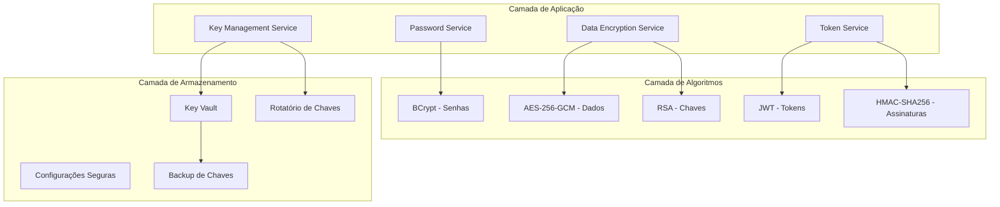

# Sistema de Criptografia

## Visão Geral

O sistema de criptografia do DevStationPlatform fornece segurança abrangente para dados sensíveis, incluindo senhas, tokens, configurações e dados de usuários. O sistema implementa múltiplas camadas de proteção usando algoritmos modernos e boas práticas de segurança.

## Arquitetura do Sistema de Criptografia



## Componentes Principais

### 1. Password Service (`security/password_service.py`)

#### Responsabilidades:
- Hash de senhas usando BCrypt
- Verificação de senhas
- Validação de política de senhas
- Geração de senhas temporárias
- Reset de senhas seguras

#### Implementação:

```python
import bcrypt
import secrets
import string
from typing import Dict, Tuple
from dataclasses import dataclass

@dataclass
class PasswordPolicy:
    """Política de senhas configurável"""
    min_length: int = 8
    require_uppercase: bool = True
    require_lowercase: bool = True
    require_digits: bool = True
    require_special: bool = True
    max_age_days: int = 90
    prevent_reuse: int = 5
    max_attempts: int = 5
    lockout_minutes: int = 15

class PasswordService:
    """Serviço de gerenciamento de senhas"""
    
    def __init__(self, config: dict):
        self.config = config
        self.policy = PasswordPolicy(**config.get('password_policy', {}))
        self.bcrypt_rounds = config.get('bcrypt_rounds', 12)
    
    def hash_password(self, password: str) -> str:
        """
        Gera hash BCrypt da senha
        
        Args:
            password: Senha em texto claro
            
        Returns:
            Hash BCrypt da senha
        """
        # Valida senha antes de hash
        self.validate_password_strength(password)
        
        # Gera salt e hash
        salt = bcrypt.gensalt(rounds=self.bcrypt_rounds)
        password_bytes = password.encode('utf-8')
        hashed = bcrypt.hashpw(password_bytes, salt)
        
        return hashed.decode('utf-8')
    
    def verify_password(self, password: str, hashed_password: str) -> bool:
        """
        Verifica se senha corresponde ao hash
        
        Args:
            password: Senha em texto claro
            hashed_password: Hash BCrypt armazenado
            
        Returns:
            True se senha válida, False caso contrário
        """
        try:
            password_bytes = password.encode('utf-8')
            hashed_bytes = hashed_password.encode('utf-8')
            return bcrypt.checkpw(password_bytes, hashed_bytes)
        except Exception:
            # Log de erro sem expor detalhes
            return False
    
    def validate_password_strength(self, password: str) -> Dict[str, bool]:
        """
        Valida força da senha contra política
        
        Args:
            password: Senha a validar
            
        Returns:
            Dict com resultados da validação
            
        Raises:
            ValueError: Se senha não atende política
        """
        results = {
            'length_ok': len(password) >= self.policy.min_length,
            'has_uppercase': any(c.isupper() for c in password),
            'has_lowercase': any(c.islower() for c in password),
            'has_digit': any(c.isdigit() for c in password),
            'has_special': any(c in string.punctuation for c in password),
        }
        
        # Verifica todos os requisitos
        if self.policy.require_uppercase and not results['has_uppercase']:
            raise ValueError("Senha deve conter pelo menos uma letra maiúscula")
        if self.policy.require_lowercase and not results['has_lowercase']:
            raise ValueError("Senha deve conter pelo menos uma letra minúscula")
        if self.policy.require_digits and not results['has_digit']:
            raise ValueError("Senha deve conter pelo menos um dígito")
        if self.policy.require_special and not results['has_special']:
            raise ValueError("Senha deve conter pelo menos um caractere especial")
        if not results['length_ok']:
            raise ValueError(f"Senha deve ter pelo menos {self.policy.min_length} caracteres")
        
        # Verifica senhas comuns
        if self._is_common_password(password):
            raise ValueError("Senha muito comum. Escolha uma senha mais segura.")
        
        return results
    
    def generate_temp_password(self, length: int = 12) -> str:
        """
        Gera senha temporária segura
        
        Args:
            length: Comprimento da senha
            
        Returns:
            Senha temporária segura
        """
        alphabet = string.ascii_letters + string.digits + string.punctuation
        password = ''.join(secrets.choice(alphabet) for _ in range(length))
        
        # Garante que atende política
        while not all(self.validate_password_strength(password).values()):
            password = ''.join(secrets.choice(alphabet) for _ in range(length))
        
        return password
    
    def _is_common_password(self, password: str) -> bool:
        """Verifica se senha está na lista de senhas comuns"""
        common_passwords = {
            'password', '123456', '12345678', '1234', 'qwerty',
            'admin', 'welcome', 'monkey', 'letmein', 'dragon'
        }
        return password.lower() in common_passwords
```

### 2. Token Service (`security/token_service.py`)

#### Responsabilidades:
- Geração e validação de tokens JWT
- Refresh tokens
- Revogação de tokens
- Gerenciamento de sessões
- Tokens de API

#### Implementação:

```python
import jwt
import datetime
import secrets
from typing import Dict, Optional, Union
from dataclasses import dataclass

@dataclass
class TokenConfig:
    """Configuração de tokens"""
    jwt_secret: str
    jwt_algorithm: str = "HS256"
    access_token_expiry: int = 3600  # 1 hora
    refresh_token_expiry: int = 86400 * 7  # 7 dias
    api_token_expiry: int = 86400 * 30  # 30 dias

class TokenService:
    """Serviço de gerenciamento de tokens"""
    
    def __init__(self, config: TokenConfig):
        self.config = config
        self.revoked_tokens = set()  # Em produção, usar Redis
    
    def generate_access_token(self, user_id: int, permissions: list) -> str:
        """
        Gera token de acesso JWT
        
        Args:
            user_id: ID do usuário
            permissions: Lista de permissões do usuário
            
        Returns:
            Token JWT assinado
        """
        payload = {
            'user_id': user_id,
            'permissions': permissions,
            'token_type': 'access',
            'exp': datetime.datetime.utcnow() + 
                  datetime.timedelta(seconds=self.config.access_token_expiry),
            'iat': datetime.datetime.utcnow(),
            'jti': secrets.token_hex(16)  # ID único do token
        }
        
        return jwt.encode(
            payload, 
            self.config.jwt_secret, 
            algorithm=self.config.jwt_algorithm
        )
    
    def generate_refresh_token(self, user_id: int) -> str:
        """
        Gera token de refresh
        
        Args:
            user_id: ID do usuário
            
        Returns:
            Token de refresh
        """
        payload = {
            'user_id': user_id,
            'token_type': 'refresh',
            'exp': datetime.datetime.utcnow() + 
                  datetime.timedelta(seconds=self.config.refresh_token_expiry),
            'iat': datetime.datetime.utcnow(),
            'jti': secrets.token_hex(16)
        }
        
        return jwt.encode(
            payload,
            self.config.jwt_secret,
            algorithm=self.config.jwt_algorithm
        )
    
    def generate_api_token(self, client_id: str, scopes: list) -> str:
        """
        Gera token de API para integrações
        
        Args:
            client_id: ID do cliente/API
            scopes: Escopos de acesso
            
        Returns:
            Token de API
        """
        payload = {
            'client_id': client_id,
            'scopes': scopes,
            'token_type': 'api',
            'exp': datetime.datetime.utcnow() + 
                  datetime.timedelta(seconds=self.config.api_token_expiry),
            'iat': datetime.datetime.utcnow(),
            'jti': secrets.token_hex(16)
        }
        
        return jwt.encode(
            payload,
            self.config.jwt_secret,
            algorithm=self.config.jwt_algorithm
        )
    
    def validate_token(self, token: str) -> Dict:
        """
        Valida token JWT
        
        Args:
            token: Token JWT
            
        Returns:
            Payload decodificado se válido
            
        Raises:
            jwt.ExpiredSignatureError: Token expirado
            jwt.InvalidTokenError: Token inválido
        """
        # Verifica se token foi revogado
        if token in self.revoked_tokens:
            raise jwt.InvalidTokenError("Token revogado")
        
        # Decodifica token
        payload = jwt.decode(
            token,
            self.config.jwt_secret,
            algorithms=[self.config.jwt_algorithm]
        )
        
        return payload
    
    def refresh_access_token(self, refresh_token: str) -> Tuple[str, str]:
        """
        Gera novo token de acesso a partir de refresh token
        
        Args:
            refresh_token: Token de refresh válido
            
        Returns:
            Tuple (novo_access_token, novo_refresh_token)
        """
        # Valida refresh token
        payload = self.validate_token(refresh_token)
        
        if payload.get('token_type') != 'refresh':
            raise jwt.InvalidTokenError("Token não é um refresh token")
        
        user_id = payload['user_id']
        
        # Revoga refresh token antigo
        self.revoke_token(refresh_token)
        
        # Gera novos tokens
        # Em produção, buscar permissões do banco
        new_access_token = self.generate_access_token(user_id, [])
        new_refresh_token = self.generate_refresh_token(user_id)
        
        return new_access_token, new_refresh_token
    
    def revoke_token(self, token: str):
        """
        Revoga token (adiciona à lista de revogados)
        
        Args:
            token: Token a revogar
        """
        self.revoked_tokens.add(token)
    
    def logout_all_user_tokens(self, user_id: int):
        """
        Revoga todos os tokens de um usuário
        Em produção, implementar com Redis
        """
        # Esta é uma implementação simplificada
        # Em produção, usar Redis com TTL
        pass
```

### 3. Data Encryption Service (`security/data_encryption.py`)

#### Responsabilidades:
- Criptografia de dados sensíveis
- Criptografia em repouso
- Criptografia em trânsito
- Gerenciamento de chaves de criptografia
- Rotação de chaves

#### Implementação:

```python
import os
import base64
import json
from typing import Any, Dict, Optional
from cryptography.fernet import Fernet
from cryptography.hazmat.primitives import hashes
from cryptography.hazmat.primitives.kdf.pbkdf2 import PBKDF2HMAC
from cryptography.hazmat.primitives.ciphers import Cipher, algorithms, modes
from cryptography.hazmat.backends import default_backend
from cryptography.hazmat.primitives import padding

class DataEncryptionService:
    """Serviço de criptografia de dados"""
    
    def __init__(self, master_key: Optional[str] = None):
        """
        Inicializa serviço de criptografia
        
        Args:
            master_key: Chave mestra (se None, gera nova)
        """
        self.backend = default_backend()
        
        if master_key:
            self.master_key = master_key.encode()
        else:
            # Gera chave mestra segura
            self.master_key = Fernet.generate_key()
        
        # Deriva chave de criptografia de dados
        self.data_key = self._derive_data_key(self.master_key)
        self.fernet = Fernet(self.data_key)
    
    def _derive_data_key(self, master_key: bytes, salt: bytes = None) -> bytes:
        """
        Deriva chave de criptografia a partir da chave mestra
        
        Args:
            master_key: Chave mestra
            salt: Salt para KDF (opcional)
            
        Returns:
            Chave derivada
        """
        if salt is None:
            salt = os.urandom(16)
        
        kdf = PBKDF2HMAC(
            algorithm=hashes.SHA256(),
            length=32,
            salt=salt,
            iterations=100000,
            backend=self.backend
        )
        
        return base64.urlsafe_b64encode(kdf.derive(master_key))
    
    def encrypt_data(self, data: Any, key_id: str = "default") -> Dict:
        """
        Criptografa dados usando AES-256-GCM
        
        Args:
            data: Dados a criptografar (qualquer tipo serializável)
            key_id: ID da chave usada
            
        Returns:
            Dict com dados criptografados e metadados
        """
        # Serializa dados para JSON
        if isinstance(data, (dict, list)):
            json_data = json.dumps(data)
        else:
            json_data = str(data)
        
        data_bytes = json_data.encode('utf-8')
        
        # Gera IV (Initialization Vector)
        iv = os.urandom(12)  # 96 bits para GCM
        
        # Cria cipher AES-GCM
        cipher = Cipher(
            algorithms.AES(self.data_key),
            modes.GCM(iv),
            backend=self.backend
        )
        
        encryptor = cipher.encryptor()
        
        # Criptografa dados
        ciphertext = encryptor.update(data_bytes) + encryptor.finalize()
        
        # Obtém tag de autenticação
        tag = encryptor.tag
        
        return {
            'ciphertext': base64.b64encode(ciphertext).decode('utf-8'),
            'iv': base64.b64encode(iv).decode('utf-8'),
            'tag': base64.b64encode(tag).decode('utf-8'),
            'key_id': key_id,
            'algorithm': 'AES-256-GCM',
            'version': '1.0'
        }
    
    def decrypt_data(self, encrypted_data: Dict) -> Any:
        """
        Descriptografa dados
        
        Args:
            encrypted_data: Dict com dados criptografados
            
        Returns:
            Dados originais
            
        Raises:
            ValueError: Se dados criptografados inválidos
        """
        try:
            # Extrai componentes
            ciphertext = base64.b64decode(encrypted_data['ciphertext'])
            iv = base64.b64decode(encrypted_data['iv'])
            tag = base64.b64decode(encrypted_data['tag'])
            
            # Verifica algoritmo
            if encrypted_data.get('algorithm') != 'AES-256-GCM':
                raise ValueError("Algoritmo de criptografia não suportado")
            
            # Cria cipher para descriptografia
            cipher = Cipher(
                algorithms.AES(self.data_key),
                modes.GCM(iv, tag),
                backend=self.backend
            )
            
            decryptor = cipher.decryptor()
            
            # Descriptografa
            plaintext = decryptor.update(ciphertext) + decryptor.finalize()
            
            # Tenta desserializar JSON
            try:
                return json.loads(plaintext.decode('utf-8'))
            except json.JSONDecodeError:
                return plaintext.decode('utf-8')
                
        except Exception as e:
            raise ValueError(f"Falha na descriptografia: {str(e)}")
    
    def encrypt_field(self, field_value: str) -> str:
        """
        Criptografa campo individual (para colunas de banco de dados)
        
        Args:
            field_value: Valor do campo
            
        Returns:
            Valor criptografado em base64
        """
        # Usa Fernet para campos individuais (mais simples)
        encrypted = self.fernet.encrypt(field_value.encode('utf-8'))
        return base64.b64encode(encrypted).decode('utf-8')
    
    def decrypt_field(self, encrypted_field: str) -> str:
        """
        Descriptografa campo individual
        
        Args:
            encrypted_field: Valor criptografado em base64
            
        Returns:
            Valor original
        """
        try:
            encrypted_bytes = base64.b64decode(encrypted_field)
            decrypted = self.fernet.decrypt(encrypted_bytes)
            return decrypted.decode('utf-8')
        except Exception as e:
            raise ValueError(f"Falha na descriptografia do campo: {str(e)}")
    
    def rotate_keys(self, new_master_key: Optional[str] = None):
        """
        Rotaciona chaves de criptografia
        
        Args:
            new_master_key: Nova chave mestra (se None, gera nova)
        """
        old_master_key = self.master_key
        
        if new_master_key:
            self.master_key = new_master_key.encode()
        else:
            self.master_key = Fernet.generate_key()
        
        # Deriva nova chave de dados
        self.data_key = self._derive_data_key(self.master_key)
        self.fernet = Fernet(self.data_key)
        
        # Em produção, re-criptografar dados com nova chave
        return old_master_key
    
    def generate_key_pair(self) -> Dict[str, str]:
        """
        Gera par de chaves RSA para criptografia assimétrica
        
        Returns:
            Dict com chave pública e privada
        """
        from cryptography.hazmat.primitives.asymmetric import rsa
        from cryptography.hazmat.primitives import serialization
        
        # Gera chave privada
        private_key = rsa.generate_private_key(
            public_exponent=65537,
            key_size=2048,
            backend=self.backend
        )
        
        # Gera chave pública
        public_key = private_key.public_key()
        
        # Serializa chaves
        private_pem = private_key.private_bytes(
            encoding=serialization.Encoding.PEM,
            format=serialization.PrivateFormat.PKCS8,
            encryption_algorithm=serialization.NoEncryption()
        )
        
        public_pem = public_key.public_bytes(
            encoding=serialization.Encoding.PEM,
            format=serialization.PublicFormat.SubjectPublicKeyInfo
        )
        
        return {
            'private_key': private_pem.decode('utf-8'),
            'public_key': public_pem.decode('utf-8')
        }
```

### 4. Key Management Service (`security/key_management.py`)

#### Responsabilidades:
- Armazenamento seguro de chaves
- Rotação automática de chaves
- Backup e recuperação de chaves
- Auditoria de uso de chaves
- Gerenciamento de ciclo de vida

#### Implementação:

```python
import json
import hashlib
import datetime
from typing import Dict, List, Optional
from dataclasses import dataclass
from enum import Enum

class KeyType(Enum):
    """Tipos de chaves suportados"""
    MASTER = "master"
    DATA = "data"
    JWT = "jwt"
    API = "api"
    RSA_PRIVATE = "rsa_private"
    RSA_PUBLIC = "rsa_public"

class KeyStatus(Enum):
    """Status das chaves"""
    ACTIVE = "active"
    EXPIRED = "expired"
    REVOKED = "revoked"
    COMPROMISED = "compromised"

@dataclass
class KeyMetadata:
    """Metadados de uma chave"""
    key_id: str
    key_type: KeyType
    status: KeyStatus
    created_at: datetime.datetime
    expires_at: Optional[datetime.datetime]
    algorithm: str
    key_size: int
    created_by: str
    last_used: Optional[datetime.datetime]
    usage_count: int = 0

class KeyManagementService:
    """Serviço de gerenciamento de chaves"""
    
    def __init__(self, storage_path: str):
        """
        Inicializa serviço de gerenciamento de chaves
        
        Args:
            storage_path: Caminho para armazenamento seguro
        """
        self.storage_path = storage_path
        self.keys_metadata: Dict[str, KeyMetadata] = {}
        self._load_metadata()
    
    def _load_metadata(self):
        """Carrega metadados das chaves"""
        metadata_file = f"{self.storage_path}/keys_metadata.json"
        if os.path.exists(metadata_file):
            with open(metadata_file, 'r') as f:
                data = json.load(f)
                for key_id, meta in data.items():
                    self.keys_metadata[key_id] = KeyMetadata(
                        key_id=meta['key_id'],
                        key_type=KeyType(meta['key_type']),
                        status=KeyStatus(meta['status']),
                        created_at=datetime.datetime.fromisoformat(meta['created_at']),
                        expires_at=datetime.datetime.fromisoformat(meta['expires_at']) 
                            if meta['expires_at'] else None,
                        algorithm=meta['algorithm'],
                        key_size=meta['key_size'],
                        created_by=meta['created_by'],
                        last_used=datetime.datetime.fromisoformat(meta['last_used'])
                            if meta['last_used'] else None,
                        usage_count=meta['usage_count']
                    )
    
    def _save_metadata(self):
        """Salva metadados das chaves"""
        metadata_file = f"{self.storage_path}/keys_metadata.json"
        data = {}
        for key_id, meta in self.keys_metadata.items():
            data[key_id] = {
                'key_id': meta.key_id,
                'key_type': meta.key_type.value,
                'status': meta.status.value,
                'created_at': meta.created_at.isoformat(),
                'expires_at': meta.expires_at.isoformat() if meta.expires_at else None,
                'algorithm': meta.algorithm,
                'key_size': meta.key_size,
                'created_by': meta.created_by,
                'last_used': meta.last_used.isoformat() if meta.last_used else None,
                'usage_count': meta.usage_count
            }
        
        with open(metadata_file, 'w') as f:
            json.dump(data, f, indent=2)
    
    def generate_key(self, key_type: KeyType, created_by: str, 
                    expires_in_days: int = 365) -> str:
        """
        Gera nova chave
        
        Args:
            key_type: Tipo da chave
            created_by: Quem criou a chave
            expires_in_days: Dias até expiração
            
        Returns:
            ID da chave gerada
        """
        import secrets
        
        # Gera chave baseada no tipo
        if key_type == KeyType.MASTER:
            key_value = secrets.token_bytes(32)  # 256 bits
            algorithm = "AES-256"
            key_size = 256
        elif key_type == KeyType.JWT:
            key_value = secrets.token_bytes(32)
            algorithm = "HMAC-SHA256"
            key_size = 256
        elif key_type == KeyType.DATA:
            key_value = secrets.token_bytes(32)
            algorithm = "AES-256-GCM"
            key_size = 256
        else:
            raise ValueError(f"Tipo de chave não suportado: {key_type}")
        
        # Gera ID único para a chave
        key_id = hashlib.sha256(key_value).hexdigest()[:16]
        
        # Armazena chave de forma segura
        self._store_key(key_id, key_value, key_type)
        
        # Cria metadados
        metadata = KeyMetadata(
            key_id=key_id,
            key_type=key_type,
            status=KeyStatus.ACTIVE,
            created_at=datetime.datetime.utcnow(),
            expires_at=datetime.datetime.utcnow() + 
                      datetime.timedelta(days=expires_in_days),
            algorithm=algorithm,
            key_size=key_size,
            created_by=created_by,
            last_used=None,
            usage_count=0
        )
        
        self.keys_metadata[key_id] = metadata
        self._save_metadata()
        
        return key_id
    
    def _store_key(self, key_id: str, key_value: bytes, key_type: KeyType):
        """
        Armazena chave de forma segura
        
        Args:
            key_id: ID da chave
            key_value: Valor da chave
            key_type: Tipo da chave
        """
        # Em produção, usar HSM ou serviço de gerenciamento de chaves
        # Esta é uma implementação simplificada para desenvolvimento
        
        key_file = f"{self.storage_path}/{key_id}.key"
        
        # Criptografa chave antes de armazenar
        # Em produção, usar criptografia com chave mestra do sistema
        with open(key_file, 'wb') as f:
            f.write(key_value)
        
        # Define permissões restritas
        os.chmod(key_file, 0o600)
    
    def get_key(self, key_id: str) -> Optional[bytes]:
        """
        Obtém chave pelo ID
        
        Args:
            key_id: ID da chave
            
        Returns:
            Valor da chave ou None se não encontrada
        """
        # Verifica se chave existe e está ativa
        if key_id not in self.keys_metadata:
            return None
        
        metadata = self.keys_metadata[key_id]
        
        if metadata.status != KeyStatus.ACTIVE:
            raise ValueError(f"Chave {key_id} não está ativa (status: {metadata.status})")
        
        # Verifica expiração
        if metadata.expires_at and metadata.expires_at < datetime.datetime.utcnow():
            self.revoke_key(key_id, "expired")
            raise ValueError(f"Chave {key_id} expirada")
        
        # Atualiza uso
        metadata.last_used = datetime.datetime.utcnow()
        metadata.usage_count += 1
        self._save_metadata()
        
        # Recupera chave
        key_file = f"{self.storage_path}/{key_id}.key"
        if os.path.exists(key_file):
            with open(key_file, 'rb') as f:
                return f.read()
        
        return None
    
    def revoke_key(self, key_id: str, reason: str = "manual"):
        """
        Revoga chave
        
        Args:
            key_id: ID da chave
            reason: Motivo da revogação
        """
        if key_id in self.keys_metadata:
            self.keys_metadata[key_id].status = KeyStatus.REVOKED
            self._save_metadata()
            
            # Log de auditoria
            self._log_key_action(key_id, "revoke", reason)
    
    def rotate_key(self, key_id: str, new_expires_days: int = 365) -> str:
        """
        Rotaciona chave (cria nova e marca antiga como expirada)
        
        Args:
            key_id: ID da chave antiga
            new_expires_days: Dias até expiração da nova chave
            
        Returns:
            ID da nova chave
        """
        if key_id not in self.keys_metadata:
            raise ValueError(f"Chave {key_id} não encontrada")
        
        old_metadata = self.keys_metadata[key_id]
        
        # Gera nova chave do mesmo tipo
        new_key_id = self.generate_key(
            old_metadata.key_type,
            old_metadata.created_by,
            new_expires_days
        )
        
        # Marca chave antiga como expirada
        old_metadata.status = KeyStatus.EXPIRED
        self._save_metadata()
        
        # Log de auditoria
        self._log_key_action(key_id, "rotate", f"Rotated to {new_key_id}")
        
        return new_key_id
    
    def get_active_keys(self, key_type: Optional[KeyType] = None) -> List[KeyMetadata]:
        """
        Obtém lista de chaves ativas
        
        Args:
            key_type: Filtrar por tipo (opcional)
            
        Returns:
            Lista de metadados de chaves ativas
        """
        active_keys = []
        now = datetime.datetime.utcnow()
        
        for metadata in self.keys_metadata.values():
            if metadata.status == KeyStatus.ACTIVE:
                # Verifica expiração
                if metadata.expires_at and metadata.expires_at < now:
                    metadata.status = KeyStatus.EXPIRED
                    continue
                
                if key_type is None or metadata.key_type == key_type:
                    active_keys.append(metadata)
        
        return active_keys
    
    def _log_key_action(self, key_id: str, action: str, details: str):
        """
        Registra ação em log de auditoria
        
        Args:
            key_id: ID da chave
            action: Ação realizada
            details: Detalhes da ação
        """
        log_entry = {
            'timestamp': datetime.datetime.utcnow().isoformat(),
            'key_id': key_id,
            'action': action,
            'details': details,
            'user': 'system'  # Em produção, obter do contexto
        }
        
        log_file = f"{self.storage_path}/key_audit.log"
        with open(log_file, 'a') as f:
            f.write(json.dumps(log_entry) + '\n')
```

## Configuração de Criptografia

### Arquivo de Configuração (`config/security.yaml`)

```yaml
# Configurações de Segurança e Criptografia
security:
  # Configurações de Senha
  password_policy:
    min_length: 12
    require_uppercase: true
    require_lowercase: true
    require_digits: true
    require_special: true
    max_age_days: 90
    prevent_reuse: 5
    max_attempts: 5
    lockout_minutes: 30
  
  # Configurações BCrypt
  bcrypt:
    rounds: 12
  
  # Configurações JWT
  jwt:
    secret: "${JWT_SECRET}"  # Deve ser definida como variável de ambiente
    algorithm: "HS256"
    access_token_expiry: 3600  # 1 hora em segundos
    refresh_token_expiry: 604800  # 7 dias em segundos
    api_token_expiry: 2592000  # 30 dias em segundos
  
  # Configurações de Criptografia de Dados
  encryption:
    master_key: "${ENCRYPTION_MASTER_KEY}"  # Variável de ambiente
    algorithm: "AES-256-GCM"
    key_rotation_days: 90
    data_key_salt: "${DATA_KEY_SALT}"  # Salt para derivação de chave
  
  # Gerenciamento de Chaves
  key_management:
    storage_path: "/secure/keys"
    backup_enabled: true
    backup_path: "/secure/backups"
    auto_rotation: true
    rotation_days: 365
  
  # Configurações de Sessão
  session:
    cookie_secure: true
    cookie_httponly: true
    cookie_samesite: "Strict"
    session_timeout: 3600
    max_sessions_per_user: 5
  
  # Headers de Segurança HTTP
  headers:
    hsts_enabled: true
    hsts_max_age: 31536000
    csp_enabled: true
    xss_protection: true
    nosniff: true
    frameguard: "DENY"
```

## Middleware de Segurança

### Security Headers Middleware (`security/middleware/security_headers.py`)

```python
from typing import Callable
from fastapi import Request, Response
from fastapi.middleware import Middleware

class SecurityHeadersMiddleware:
    """Middleware para adicionar headers de segurança HTTP"""
    
    def __init__(self, config: dict):
        self.config = config.get('security', {}).get('headers', {})
    
    async def __call__(self, request: Request, call_next: Callable) -> Response:
        response = await call_next(request)
        
        # Adiciona headers de segurança
        if self.config.get('hsts_enabled', True):
            response.headers['Strict-Transport-Security'] = \
                f"max-age={self.config.get('hsts_max_age', 31536000)}"
        
        if self.config.get('csp_enabled', True):
            response.headers['Content-Security-Policy'] = \
                "default-src 'self'; script-src 'self' 'unsafe-inline';"
        
        if self.config.get('xss_protection', True):
            response.headers['X-XSS-Protection'] = "1; mode=block"
        
        if self.config.get('nosniff', True):
            response.headers['X-Content-Type-Options'] = "nosniff"
        
        if self.config.get('frameguard', 'DENY'):
            response.headers['X-Frame-Options'] = self.config['frameguard']
        
        # Remove headers sensíveis
        if 'Server' in response.headers:
            del response.headers['Server']
        
        return response
```

### Rate Limiting Middleware (`security/middleware/rate_limiting.py`)

```python
import time
from typing import Dict, Tuple
from collections import defaultdict
from fastapi import Request, HTTPException

class RateLimiter:
    """Implementação de rate limiting"""
    
    def __init__(self, config: dict):
        self.config = config
        self.requests: Dict[str, list] = defaultdict(list)
    
    def is_rate_limited(self, key: str, limit: int, window: int) -> bool:
        """
        Verifica se requisição excede limite
        
        Args:
            key: Chave de identificação (ex: IP, user_id)
            limit: Número máximo de requisições
            window: Janela de tempo em segundos
            
        Returns:
            True se limitado, False caso contrário
        """
        now = time.time()
        
        # Remove requisições antigas
        self.requests[key] = [
            req_time for req_time in self.requests[key]
            if now - req_time < window
        ]
        
        # Verifica limite
        if len(self.requests[key]) >= limit:
            return True
        
        # Adiciona requisição atual
        self.requests[key].append(now)
        return False

class RateLimitingMiddleware:
    """Middleware para rate limiting"""
    
    def __init__(self, config: dict):
        self.config = config
        self.limiter = RateLimiter(config)
        
        # Limites configuráveis
        self.global_limit = config.get('global_limit', 100)
        self.global_window = config.get('global_window', 60)
        
        self.auth_limit = config.get('auth_limit', 5)
        self.auth_window = config.get('auth_window', 300)
        
        self.api_limit = config.get('api_limit', 1000)
        self.api_window = config.get('api_window', 3600)
    
    async def __call__(self, request: Request, call_next):
        client_ip = request.client.host if request.client else "unknown"
        
        # Limite global por IP
        if self.limiter.is_rate_limited(
            f"global:{client_ip}", 
            self.global_limit, 
            self.global_window
        ):
            raise HTTPException(
                status_code=429, 
                detail="Too many requests"
            )
        
        # Limite específico para endpoints de autenticação
        if request.url.path in ['/auth/login', '/auth/register']:
            if self.limiter.is_rate_limited(
                f"auth:{client_ip}",
                self.auth_limit,
                self.auth_window
            ):
                raise HTTPException(
                    status_code=429,
                    detail="Too many authentication attempts"
                )
        
        # Limite para API tokens
        api_key = request.headers.get('X-API-Key')
        if api_key:
            if self.limiter.is_rate_limited(
                f"api:{api_key}",
                self.api_limit,
                self.api_window
            ):
                raise HTTPException(
                    status_code=429,
                    detail="API rate limit exceeded"
                )
        
        return await call_next(request)
```

## Testes de Segurança

### Testes Unitários (`tests/security/test_cryptography.py`)

```python
import pytest
import json
from unittest.mock import Mock, patch
from security.password_service import PasswordService, PasswordPolicy
from security.token_service import TokenService, TokenConfig
from security.data_encryption import DataEncryptionService
from security.key_management import KeyManagementService, KeyType, KeyStatus

class TestPasswordService:
    """Testes para PasswordService"""
    
    def setup_method(self):
        """Configuração antes de cada teste"""
        config = {
            'password_policy': {
                'min_length': 8,
                'require_uppercase': True,
                'require_lowercase': True,
                'require_digits': True,
                'require_special': True
            },
            'bcrypt_rounds': 4  # Baixo para testes
        }
        self.service = PasswordService(config)
    
    def test_hash_and_verify_password(self):
        """Testa hash e verificação de senha"""
        password = "SecurePass123!"
        hashed = self.service.hash_password(password)
        
        # Verifica que hash é diferente da senha original
        assert hashed != password
        assert len(hashed) > 0
        
        # Verifica que senha correta é validada
        assert self.service.verify_password(password, hashed) == True
        
        # Verifica que senha incorreta é rejeitada
        assert self.service.verify_password("WrongPass123!", hashed) == False
    
    def test_password_policy_validation(self):
        """Testa validação de política de senhas"""
        # Senha válida
        valid_password = "SecurePass123!"
        result = self.service.validate_password_strength(valid_password)
        assert all(result.values())
        
        # Senha muito curta
        with pytest.raises(ValueError, match="pelo menos 8 caracteres"):
            self.service.validate_password_strength("Short1!")
        
        # Sem maiúscula
        with pytest.raises(ValueError, match="letra maiúscula"):
            self.service.validate_password_strength("lowercase123!")
        
        # Sem minúscula
        with pytest.raises(ValueError, match="letra minúscula"):
            self.service.validate_password_strength("UPPERCASE123!")
        
        # Sem dígito
        with pytest.raises(ValueError, match="dígito"):
            self.service.validate_password_strength("NoDigits!")
        
        # Sem caractere especial
        with pytest.raises(ValueError, match="caractere especial"):
            self.service.validate_password_strength("NoSpecial123")
    
    def test_generate_temp_password(self):
        """Testa geração de senha temporária"""
        temp_password = self.service.generate_temp_password()
        
        # Verifica comprimento
        assert len(temp_password) >= 12
        
        # Verifica que atende política
        result = self.service.validate_password_strength(temp_password)
        assert all(result.values())

class TestTokenService:
    """Testes para TokenService"""
    
    def setup_method(self):
        """Configuração antes de cada teste"""
        config = TokenConfig(
            jwt_secret="test-secret-key-for-unit-tests-only",
            access_token_expiry=3600,
            refresh_token_expiry=86400
        )
        self.service = TokenService(config)
    
    def test_generate_and_validate_access_token(self):
        """Testa geração e validação de token de acesso"""
        user_id = 123
        permissions = ["user.read", "user.write"]
        
        token = self.service.generate_access_token(user_id, permissions)
        
        # Valida token
        payload = self.service.validate_token(token)
        
        assert payload['user_id'] == user_id
        assert payload['permissions'] == permissions
        assert payload['token_type'] == 'access'
        assert 'exp' in payload
        assert 'iat' in payload
        assert 'jti' in payload
    
    def test_token_expiration(self):
        """Testa expiração de token"""
        import time
        
        # Configura token com expiração de 1 segundo
        config = TokenConfig(
            jwt_secret="test-secret",
            access_token_expiry=1
        )
        service = TokenService(config)
        
        token = service.generate_access_token(123, [])
        
        # Token deve ser válido inicialmente
        service.validate_token(token)
        
        # Aguarda expiração
        time.sleep(2)
        
        # Token deve ser inválido após expiração
        with pytest.raises(jwt.ExpiredSignatureError):
            service.validate_token(token)
    
    def test_token_revocation(self):
        """Testa revogação de token"""
        token = self.service.generate_access_token(123, [])
        
        # Token deve ser válido inicialmente
        self.service.validate_token(token)
        
        # Revoga token
        self.service.revoke_token(token)
        
        # Token deve ser inválido após revogação
        with pytest.raises(jwt.InvalidTokenError, match="revogado"):
            self.service.validate_token(token)
    
    def test_refresh_token_flow(self):
        """Testa fluxo de refresh token"""
        user_id = 123
        
        # Gera refresh token
        refresh_token = self.service.generate_refresh_token(user_id)
        
        # Gera novos tokens a partir do refresh
        new_access, new_refresh = self.service.refresh_access_token(refresh_token)
        
        # Verifica que novos tokens são válidos
        access_payload = self.service.validate_token(new_access)
        refresh_payload = self.service.validate_token(new_refresh)
        
        assert access_payload['user_id'] == user_id
        assert refresh_payload['user_id'] == user_id
        
        # Verifica que refresh token antigo foi revogado
        with pytest.raises(jwt.InvalidTokenError):
            self.service.validate_token(refresh_token)

class TestDataEncryptionService:
    """Testes para DataEncryptionService"""
    
    def setup_method(self):
        """Configuração antes de cada teste"""
        self.service = DataEncryptionService()
    
    def test_encrypt_decrypt_data(self):
        """Testa criptografia e descriptografia de dados"""
        test_data = {
            'name': 'John Doe',
            'email': 'john@example.com',
            'ssn': '123-45-6789',
            'balance': 1000.50
        }
        
        # Criptografa dados
        encrypted = self.service.encrypt_data(test_data)
        
        # Verifica estrutura
        assert 'ciphertext' in encrypted
        assert 'iv' in encrypted
        assert 'tag' in encrypted
        assert encrypted['algorithm'] == 'AES-256-GCM'
        
        # Descriptografa dados
        decrypted = self.service.decrypt_data(encrypted)
        
        # Verifica que dados são iguais
        assert decrypted == test_data
    
    def test_encrypt_decrypt_field(self):
        """Testa criptografia e descriptografia de campo individual"""
        original = "Sensitive Data Here"
        
        encrypted = self.service.encrypt_field(original)
        decrypted = self.service.decrypt_field(encrypted)
        
        assert decrypted == original
        assert encrypted != original
    
    def test_key_rotation(self):
        """Testa rotação de chaves"""
        original_data = {"secret": "original data"}
        
        # Criptografa com chave original
        encrypted1 = self.service.encrypt_data(original_data)
        decrypted1 = self.service.decrypt_data(encrypted1)
        assert decrypted1 == original_data
        
        # Rotaciona chaves
        old_key = self.service.rotate_keys()
        
        # Dados criptografados com chave antiga ainda devem ser descriptografáveis
        # (em produção, re-criptografar dados)
        decrypted_after_rotation = self.service.decrypt_data(encrypted1)
        assert decrypted_after_rotation == original_data
        
        # Novos dados usam nova chave
        encrypted2 = self.service.encrypt_data(original_data)
        decrypted2 = self.service.decrypt_data(encrypted2)
        assert decrypted2 == original_data
    
    def test_invalid_decryption(self):
        """Testa falha na descriptografia com dados inválidos"""
        invalid_data = {
            'ciphertext': 'invalid',
            'iv': 'invalid',
            'tag': 'invalid',
            'algorithm': 'AES-256-GCM'
        }
        
        with pytest.raises(ValueError, match="Falha na descriptografia"):
            self.service.decrypt_data(invalid_data)

class TestKeyManagementService:
    """Testes para KeyManagementService"""
    
    def setup_method(self):
        """Configuração antes de cada teste"""
        import tempfile
        import os
        
        # Cria diretório temporário para testes
        self.temp_dir = tempfile.mkdtemp()
        self.service = KeyManagementService(self.temp_dir)
    
    def teardown_method(self):
        """Limpeza após cada teste"""
        import shutil
        if os.path.exists(self.temp_dir):
            shutil.rmtree(self.temp_dir)
    
    def test_generate_and_get_key(self):
        """Testa geração e recuperação de chave"""
        key_id = self.service.generate_key(
            KeyType.MASTER,
            "test_user",
            expires_in_days=7
        )
        
        # Verifica que chave foi gerada
        assert key_id is not None
        assert len(key_id) == 16
        
        # Obtém chave
        key_value = self.service.get_key(key_id)
        assert key_value is not None
        assert len(key_value) == 32  # 256 bits
        
        # Verifica metadados
        metadata = self.service.keys_metadata[key_id]
        assert metadata.key_type == KeyType.MASTER
        assert metadata.status == KeyStatus.ACTIVE
        assert metadata.created_by == "test_user"
        assert metadata.usage_count == 1
    
    def test_key_expiration(self):
        """Testa expiração de chave"""
        import datetime
        
        key_id = self.service.generate_key(
            KeyType.JWT,
            "test_user",
            expires_in_days=0  # Expira imediatamente
        )
        
        # Modifica data de expiração para passado
        metadata = self.service.keys_metadata[key_id]
        metadata.expires_at = datetime.datetime.utcnow() - datetime.timedelta(days=1)
        self.service._save_metadata()
        
        # Tenta obter chave expirada
        with pytest.raises(ValueError, match="expirada"):
            self.service.get_key(key_id)
        
        # Verifica que status foi atualizado
        assert metadata.status == KeyStatus.EXPIRED
    
    def test_key_revocation(self):
        """Testa revogação de chave"""
        key_id = self.service.generate_key(KeyType.DATA, "test_user")
        
        # Revoga chave
        self.service.revoke_key(key_id, "test_revocation")
        
        # Tenta obter chave revogada
        with pytest.raises(ValueError, match="não está ativa"):
            self.service.get_key(key_id)
        
        # Verifica status
        metadata = self.service.keys_metadata[key_id]
        assert metadata.status == KeyStatus.REVOKED
    
    def test_key_rotation(self):
        """Testa rotação de chave"""
        key_id = self.service.generate_key(KeyType.MASTER, "test_user")
        
        # Rotaciona chave
        new_key_id = self.service.rotate_key(key_id)
        
        # Verifica que nova chave foi criada
        assert new_key_id != key_id
        assert new_key_id in self.service.keys_metadata
        
        # Verifica que chave antiga está expirada
        old_metadata = self.service.keys_metadata[key_id]
        assert old_metadata.status == KeyStatus.EXPIRED
        
        # Verifica que nova chave está ativa
        new_metadata = self.service.keys_metadata[new_key_id]
        assert new_metadata.status == KeyStatus.ACTIVE
    
    def test_get_active_keys(self):
        """Testa obtenção de chaves ativas"""
        # Gera múltiplas chaves
        key1 = self.service.generate_key(KeyType.MASTER, "user1")
        key2 = self.service.generate_key(KeyType.JWT, "user2")
        key3 = self.service.generate_key(KeyType.DATA, "user3")
        
        # Revoga uma chave
        self.service.revoke_key(key2, "test")
        
        # Obtém chaves ativas
        active_keys = self.service.get_active_keys()
        
        # Verifica que apenas 2 chaves estão ativas
        assert len(active_keys) == 2
        
        # Filtra por tipo
        master_keys = self.service.get_active_keys(KeyType.MASTER)
        assert len(master_keys) == 1
        assert master_keys[0].key_id == key1
```

## Integração com o Sistema

### Inicialização dos Serviços de Segurança (`security/__init__.py`)

```python
"""
Módulo de segurança - Inicialização dos serviços
"""

import os
from typing import Dict, Any
from .password_service import PasswordService, PasswordPolicy
from .token_service import TokenService, TokenConfig
from .data_encryption import DataEncryptionService
from .key_management import KeyManagementService, KeyType
from .middleware.security_headers import SecurityHeadersMiddleware
from .middleware.rate_limiting import RateLimitingMiddleware

class SecurityManager:
    """Gerenciador central de segurança"""
    
    def __init__(self, config: Dict[str, Any]):
        """
        Inicializa todos os serviços de segurança
        
        Args:
            config: Configurações de segurança
        """
        self.config = config
        
        # Inicializa serviços
        self.password_service = PasswordService(config)
        self.token_service = self._init_token_service(config)
        self.data_encryption = self._init_data_encryption(config)
        self.key_management = self._init_key_management(config)
        
        # Inicializa middlewares
        self.security_headers_middleware = SecurityHeadersMiddleware(config)
        self.rate_limiting_middleware = RateLimitingMiddleware(
            config.get('rate_limiting', {})
        )
    
    def _init_token_service(self, config: Dict) -> TokenService:
        """Inicializa serviço de tokens"""
        jwt_config = config.get('jwt', {})
        
        # Obtém segredo JWT de variável de ambiente
        jwt_secret = os.getenv(
            'JWT_SECRET',
            jwt_config.get('secret', 'fallback-secret-change-in-production')
        )
        
        token_config = TokenConfig(
            jwt_secret=jwt_secret,
            jwt_algorithm=jwt_config.get('algorithm', 'HS256'),
            access_token_expiry=jwt_config.get('access_token_expiry', 3600),
            refresh_token_expiry=jwt_config.get('refresh_token_expiry', 604800),
            api_token_expiry=jwt_config.get('api_token_expiry', 2592000)
        )
        
        return TokenService(token_config)
    
    def _init_data_encryption(self, config: Dict) -> DataEncryptionService:
        """Inicializa serviço de criptografia de dados"""
        encryption_config = config.get('encryption', {})
        
        # Obtém chave mestra de variável de ambiente
        master_key = os.getenv(
            'ENCRYPTION_MASTER_KEY',
            encryption_config.get('master_key')
        )
        
        return DataEncryptionService(master_key)
    
    def _init_key_management(self, config: Dict) -> KeyManagementService:
        """Inicializa serviço de gerenciamento de chaves"""
        key_config = config.get('key_management', {})
        storage_path = key_config.get('storage_path', '/secure/keys')
        
        # Cria diretório se não existir
        os.makedirs(storage_path, exist_ok=True)
        
        return KeyManagementService(storage_path)
    
    def get_middlewares(self) -> list:
        """
        Retorna lista de middlewares de segurança
        
        Returns:
            Lista de middlewares para adicionar à aplicação
        """
        return [
            self.security_headers_middleware,
            self.rate_limiting_middleware
        ]
    
    def initialize_system_keys(self):
        """Inicializa chaves do sistema se necessário"""
        # Verifica se chave JWT existe
        active_jwt_keys = self.key_management.get_active_keys(KeyType.JWT)
        if not active_jwt_keys:
            # Gera chave JWT do sistema
            self.key_management.generate_key(
                KeyType.JWT,
                "system",
                expires_in_days=365
            )
            print("Chave JWT do sistema gerada")
        
        # Verifica se chave de dados existe
        active_data_keys = self.key_management.get_active_keys(KeyType.DATA)
        if not active_data_keys:
            # Gera chave de dados do sistema
            self.key_management.generate_key(
                KeyType.DATA,
                "system",
                expires_in_days=365
            )
            print("Chave de dados do sistema gerada")

# Singleton para acesso global
_security_manager = None

def get_security_manager(config: Dict = None) -> SecurityManager:
    """
    Obtém instância do gerenciador de segurança (singleton)
    
    Args:
        config: Configurações (apenas na primeira chamada)
        
    Returns:
        Instância do SecurityManager
    """
    global _security_manager
    
    if _security_manager is None and config is not None:
        _security_manager = SecurityManager(config)
    
    return _security_manager
```

## Auditoria de Criptografia

### Logs de Auditoria de Segurança (`security/audit/crypto_audit.py`)

```python
import datetime
import json
from typing import Dict, Any, Optional
from enum import Enum

class CryptoAuditAction(Enum):
    """Ações auditáveis de criptografia"""
    PASSWORD_HASH = "password_hash"
    PASSWORD_VERIFY = "password_verify"
    TOKEN_GENERATE = "token_generate"
    TOKEN_VALIDATE = "token_validate"
    TOKEN_REVOKE = "token_revoke"
    DATA_ENCRYPT = "data_encrypt"
    DATA_DECRYPT = "data_decrypt"
    KEY_GENERATE = "key_generate"
    KEY_ROTATE = "key_rotate"
    KEY_REVOKE = "key_revoke"

class CryptoAuditLogger:
    """Logger de auditoria para operações de criptografia"""
    
    def __init__(self, audit_service):
        """
        Inicializa logger de auditoria
        
        Args:
            audit_service: Serviço de auditoria do sistema
        """
        self.audit_service = audit_service
    
    def log_crypto_action(self, user_id: Optional[int], action: CryptoAuditAction,
                         resource_type: str, resource_id: str,
                         details: Dict[str, Any], success: bool):
        """
        Registra ação de criptografia no log de auditoria
        
        Args:
            user_id: ID do usuário (None para sistema)
            action: Ação realizada
            resource_type: Tipo do recurso
            resource_id: ID do recurso
            details: Detalhes da ação
            success: Se ação foi bem-sucedida
        """
        audit_details = {
            'action': action.value,
            'resource_type': resource_type,
            'resource_id': resource_id,
            'details': self._sanitize_details(details),
            'success': success,
            'timestamp': datetime.datetime.utcnow().isoformat()
        }
        
        # Usa serviço de auditoria do sistema
        self.audit_service.log_security_event(
            user_id=user_id,
            event_type=f"crypto_{action.value}",
            details=audit_details
        )
    
    def _sanitize_details(self, details: Dict[str, Any]) -> Dict[str, Any]:
        """
        Sanitiza detalhes para remover informações sensíveis
        
        Args:
            details: Detalhes originais
            
        Returns:
            Detalhes sanitizados
        """
        sanitized = details.copy()
        
        # Remove valores sensíveis
        sensitive_keys = ['password', 'token', 'key', 'secret', 'private_key']
        for key in list(sanitized.keys()):
            key_lower = key.lower()
            if any(sensitive in key_lower for sensitive in sensitive_keys):
                if isinstance(sanitized[key], str) and len(sanitized[key]) > 0:
                    # Mantém apenas informação sobre comprimento
                    sanitized[key] = f"[REDACTED - {len(sanitized[key])} chars]"
                else:
                    sanitized[key] = "[REDACTED]"
        
        return sanitized
    
    def log_password_hash(self, user_id: int, success: bool, 
                         policy_checks: Dict[str, bool]):
        """Log de hash de senha"""
        self.log_crypto_action(
            user_id=user_id,
            action=CryptoAuditAction.PASSWORD_HASH,
            resource_type="user",
            resource_id=str(user_id),
            details={'policy_checks': policy_checks},
            success=success
        )
    
    def log_token_generation(self, user_id: int, token_type: str, 
                            scopes: list, success: bool):
        """Log de geração de token"""
        self.log_crypto_action(
            user_id=user_id,
            action=CryptoAuditAction.TOKEN_GENERATE,
            resource_type="token",
            resource_id=f"user_{user_id}",
            details={'token_type': token_type, 'scopes': scopes},
            success=success
        )
    
    def log_key_rotation(self, key_id: str, key_type: str, 
                        new_key_id: str, rotated_by: str):
        """Log de rotação de chave"""
        self.log_crypto_action(
            user_id=None,  # Ação do sistema
            action=CryptoAuditAction.KEY_ROTATE,
            resource_type="encryption_key",
            resource_id=key_id,
            details={
                'key_type': key_type,
                'new_key_id': new_key_id,
                'rotated_by': rotated_by
            },
            success=True
        )
```

## Monitoramento e Alertas

### Monitor de Segurança (`security/monitoring/security_monitor.py`)

```python
import time
import statistics
from typing import Dict, List, Optional
from datetime import datetime, timedelta
from dataclasses import dataclass
from enum import Enum

class SecurityEventSeverity(Enum):
    """Severidade de eventos de segurança"""
    LOW = "low"
    MEDIUM = "medium"
    HIGH = "high"
    CRITICAL = "critical"

@dataclass
class SecurityMetric:
    """Métrica de segurança"""
    name: str
    value: float
    timestamp: datetime
    tags: Dict[str, str]

@dataclass
class SecurityAlert:
    """Alerta de segurança"""
    id: str
    severity: SecurityEventSeverity
    title: str
    description: str
    metric_name: str
    threshold: float
    current_value: float
    timestamp: datetime
    resolved: bool = False
    resolved_at: Optional[datetime] = None

class SecurityMonitor:
    """Monitor de métricas de segurança"""
    
    def __init__(self, config: Dict):
        """
        Inicializa monitor de segurança
        
        Args:
            config: Configurações de monitoramento
        """
        self.config = config
        self.metrics: Dict[str, List[SecurityMetric]] = {}
        self.alerts: Dict[str, SecurityAlert] = {}
        
        # Configurações de alertas
        self.alert_rules = config.get('alert_rules', {})
        
        # Limites padrão
        self.default_limits = {
            'failed_logins_per_minute': 5,
            'password_resets_per_hour': 10,
            'token_generations_per_minute': 20,
            'decryption_failures_per_hour': 3,
            'key_rotations_per_day': 5
        }
    
    def record_metric(self, name: str, value: float, tags: Dict[str, str] = None):
        """
        Registra métrica de segurança
        
        Args:
            name: Nome da métrica
            value: Valor da métrica
            tags: Tags adicionais
        """
        metric = SecurityMetric(
            name=name,
            value=value,
            timestamp=datetime.utcnow(),
            tags=tags or {}
        )
        
        if name not in self.metrics:
            self.metrics[name] = []
        
        self.metrics[name].append(metric)
        
        # Limpa métricas antigas
        self._cleanup_old_metrics()
        
        # Verifica alertas
        self._check_alerts(name, value)
    
    def _cleanup_old_metrics(self, retention_hours: int = 24):
        """Remove métricas antigas"""
        cutoff = datetime.utcnow() - timedelta(hours=retention_hours)
        
        for name in list(self.metrics.keys()):
            self.metrics[name] = [
                m for m in self.metrics[name]
                if m.timestamp > cutoff
            ]
            
            if not self.metrics[name]:
                del self.metrics[name]
    
    def _check_alerts(self, metric_name: str, current_value: float):
        """
        Verifica se métrica dispara alerta
        
        Args:
            metric_name: Nome da métrica
            current_value: Valor atual
        """
        # Obtém regra de alerta
        rule = self.alert_rules.get(metric_name, {})
        if not rule:
            return
        
        threshold = rule.get('threshold', 
                           self.default_limits.get(metric_name, float('inf')))
        severity = SecurityEventSeverity(rule.get('severity', 'medium'))
        
        if current_value > threshold:
            # Cria alerta
            alert_id = f"{metric_name}_{int(time.time())}"
            
            alert = SecurityAlert(
                id=alert_id,
                severity=severity,
                title=rule.get('title', f"Alerta de {metric_name}"),
                description=rule.get('description', 
                                   f"Métrica {metric_name} excedeu limite"),
                metric_name=metric_name,
                threshold=threshold,
                current_value=current_value,
                timestamp=datetime.utcnow()
            )
            
            self.alerts[alert_id] = alert
            
            # Dispara ação (ex: notificação)
            self._trigger_alert_action(alert)
    
    def _trigger_alert_action(self, alert: SecurityAlert):
        """Dispara ação para alerta"""
        # Em produção, enviar para sistema de notificação
        # Slack, Email, PagerDuty, etc.
        
        print(f"[SECURITY ALERT] {alert.severity.value}: {alert.title}")
        print(f"  Métrica: {alert.metric_name}")
        print(f"  Valor: {alert.current_value} > Limite: {alert.threshold}")
        print(f"  Descrição: {alert.description}")
    
    def get_metric_stats(self, metric_name: str, 
                        time_window_minutes: int = 60) -> Dict[str, float]:
        """
        Obtém estatísticas de métrica
        
        Args:
            metric_name: Nome da métrica
            time_window_minutes: Janela de tempo em minutos
            
        Returns:
            Dict com estatísticas
        """
        if metric_name not in self.metrics:
            return {}
        
        cutoff = datetime.utcnow() - timedelta(minutes=time_window_minutes)
        recent_metrics = [
            m for m in self.metrics[metric_name]
            if m.timestamp > cutoff
        ]
        
        if not recent_metrics:
            return {}
        
        values = [m.value for m in recent_metrics]
        
        return {
            'count': len(values),
            'sum': sum(values),
            'mean': statistics.mean(values),
            'median': statistics.median(values),
            'min': min(values),
            'max': max(values),
            'stddev': statistics.stdev(values) if len(values) > 1 else 0
        }
    
    def get_active_alerts(self) -> List[SecurityAlert]:
        """
        Obtém alertas ativos (não resolvidos)
        
        Returns:
            Lista de alertas ativos
        """
        return [
            alert for alert in self.alerts.values()
            if not alert.resolved
        ]
    
    def resolve_alert(self, alert_id: str, resolution_notes: str = ""):
        """
        Marca alerta como resolvido
        
        Args:
            alert_id: ID do alerta
            resolution_notes: Notas sobre resolução
        """
        if alert_id in self.alerts:
            self.alerts[alert_id].resolved = True
            self.alerts[alert_id].resolved_at = datetime.utcnow()
```

## Considerações de Performance

### Cache de Permissões com Segurança

```python
import functools
from typing import Dict, List
from security.token_service import TokenService

class SecureCache:
    """Cache seguro com invalidação automática"""
    
    def __init__(self, token_service: TokenService):
        self.token_service = token_service
        self._cache: Dict[str, tuple] = {}
    
    def get_cached_permissions(self, token: str) -> List[str]:
        """
        Obtém permissões do cache com validação de token
        
        Args:
            token: Token JWT
            
        Returns:
            Lista de permissões
        """
        cache_key = f"permissions:{token}"
        
        if cache_key in self._cache:
            cached_data, expiry = self._cache[cache_key]
            
            # Verifica se cache ainda é válido
            if expiry > time.time():
                return cached_data
        
        # Se não em cache ou expirado, valida token e obtém permissões
        try:
            payload = self.token_service.validate_token(token)
            permissions = payload.get('permissions', [])
            
            # Armazena em cache com expiração
            expiry = payload.get('exp', time.time() + 3600)
            self._cache[cache_key] = (permissions, expiry)
            
            return permissions
        except Exception:
            return []
    
    def invalidate_token_cache(self, token: str):
        """Invalida cache para token específico"""
        cache_key = f"permissions:{token}"
        if cache_key in self._cache:
            del self._cache[cache_key]
```

## Próximos Passos

1. **Implementação de HSM (Hardware Security Module)**: Para ambientes de produção com requisitos de segurança mais altos
2. **Integração com Vault**: Usar HashiCorp Vault para gerenciamento de segredos
3. **Certificados SSL/TLS**: Gerenciamento automático de certificados
4. **Análise Estática de Código**: Integrar ferramentas como Bandit para análise de segurança
5. **Pentesting Automatizado**: Testes de penetração regulares
6. **Compliance**: Verificação automática de conformidade com padrões (PCI-DSS, GDPR, etc.)

## Referências

- [OWASP Cryptographic Storage Cheat Sheet](https://cheatsheetseries.owasp.org/cheatsheets/Cryptographic_Storage_Cheat_Sheet.html)
- [NIST Password Guidelines](https://pages.nist.gov/800-63-3/sp800-63b.html)
- [RFC 7519 - JSON Web Tokens](https://tools.ietf.org/html/rfc7519)
- [Python Cryptography Documentation](https://cryptography.io/en/latest/)

---
**Versão do Documento**: 1.0  
**Última Atualização**: 2026-04-14  
**Responsável**: Sistema de Segurança DevStationPlatform  
**Próxima Revisão**: 2026-07-14