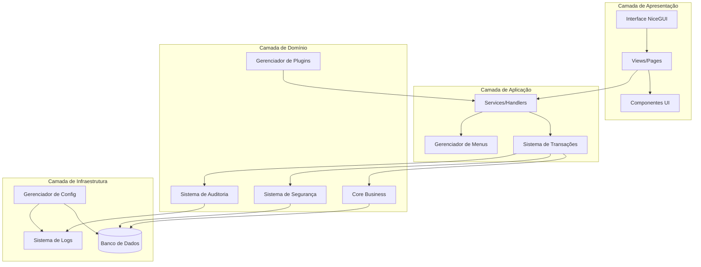
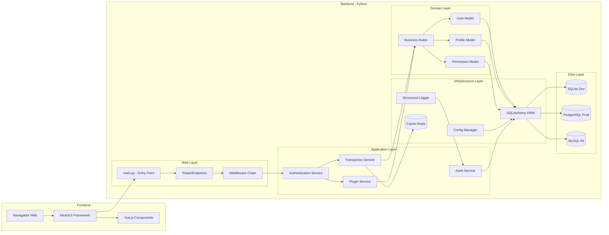
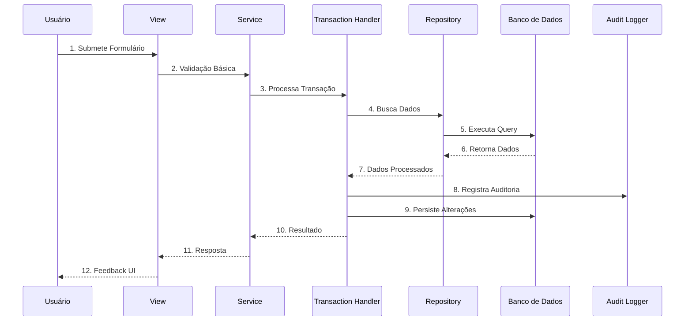
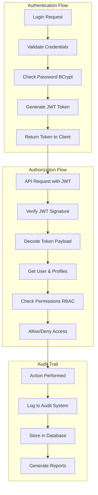
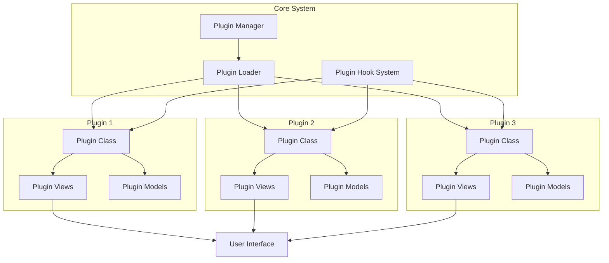
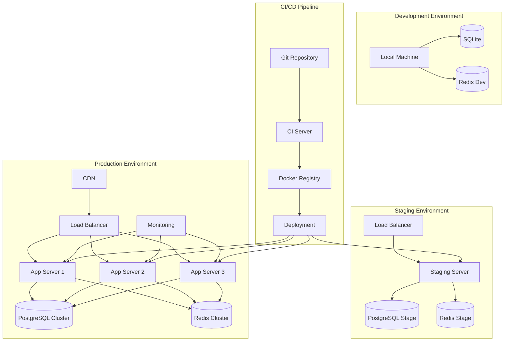
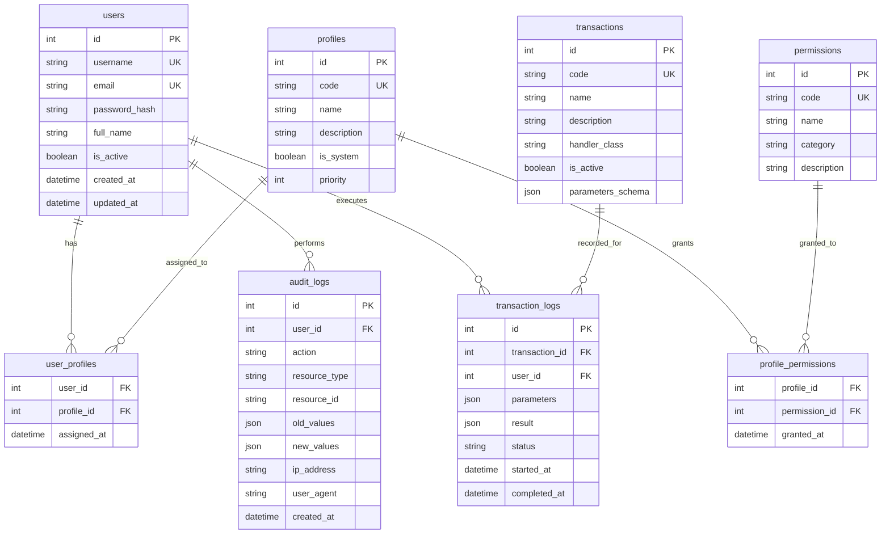
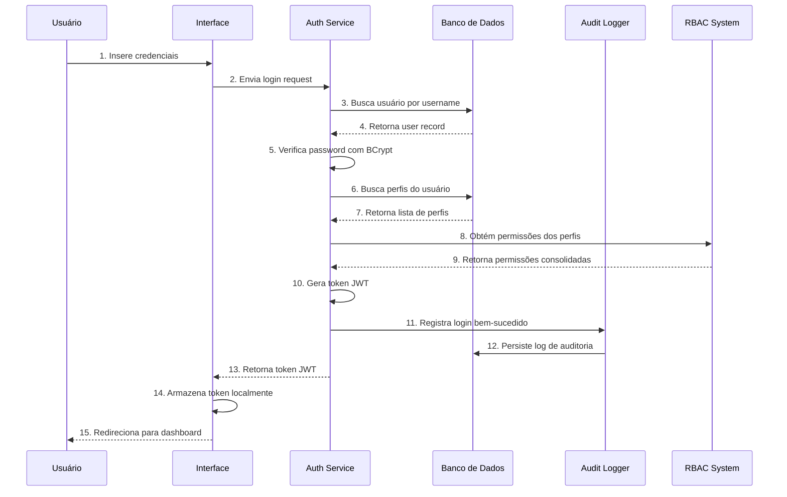
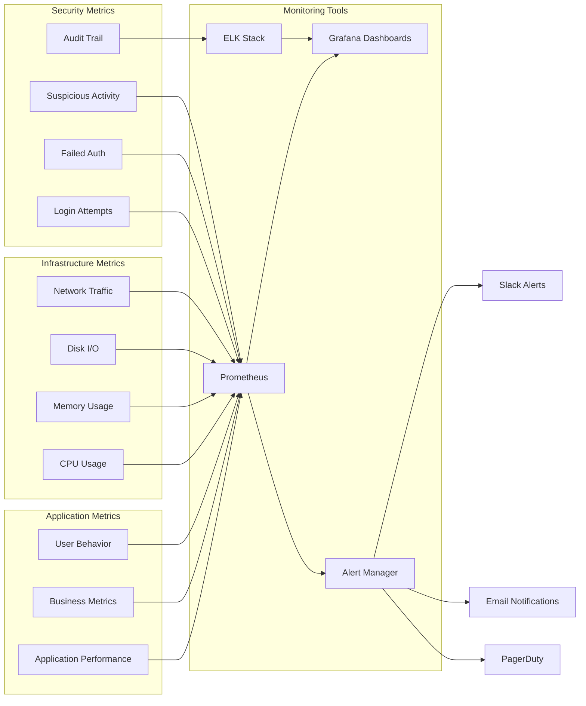

# Diagrama de Arquitetura

## Diagrama de Alto Nível

## Diagrama de Componentes Detalhado

## Diagrama de Fluxo de Dados

## Diagrama de Sistema de Segurança

## Diagrama de Plugin Architecture

## Diagrama de Deployment

## Diagrama de Banco de Dados

## Diagrama de Sequência - Login Completo

## Diagrama de Monitoramento

## Legenda dos Diagramas

### Símbolos Utilizados
- **Retângulo**: Componente/Processo
- **Círculo**: Banco de Dados/Storage
- **Setas**: Fluxo de dados/controle
- **Subgraph**: Agrupamento lógico
- **Linha Pontilhada**: Dependência opcional

### Cores (quando aplicável)
- **Azul**: Componentes do sistema
- **Verde**: Fluxos bem-sucedidos
- **Vermelho**: Fluxos de erro
- **Amarelo**: Componentes de infraestrutura
- **Roxo**: Componentes de segurança

## Próximos Diagramas

1. [Diagrama de Classes](./02_diagrama_classes.md)
2. [Diagrama de Sequência Detalhado](./03_diagrama_sequencia.md)
3. [Diagrama de Banco de Dados Completo](./04_diagrama_banco_dados.md)

---

**Diagramas Gerados**: 2026-04-14  
**Ferramentas**: Mermaid.js, Draw.io  
**Versão**: 1.0  
**Atualizações Automáticas**: Semanais via CI/CD