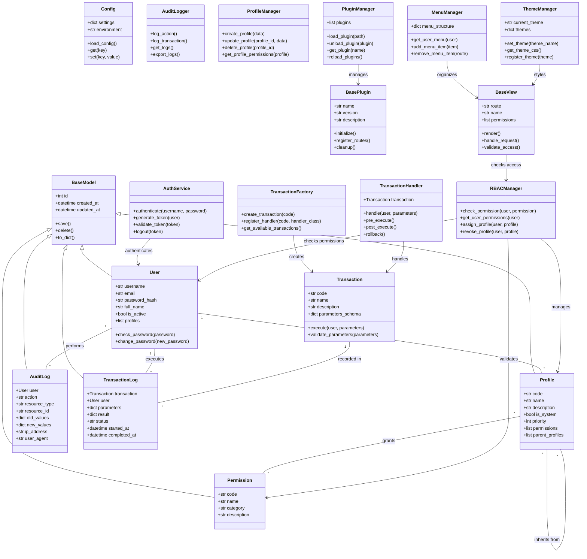
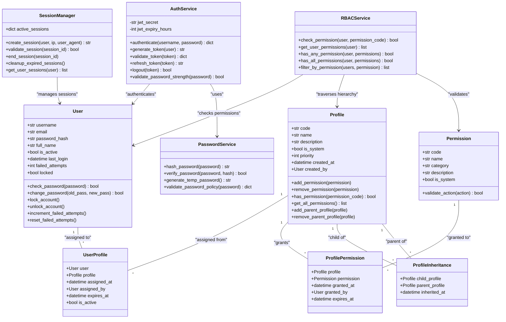
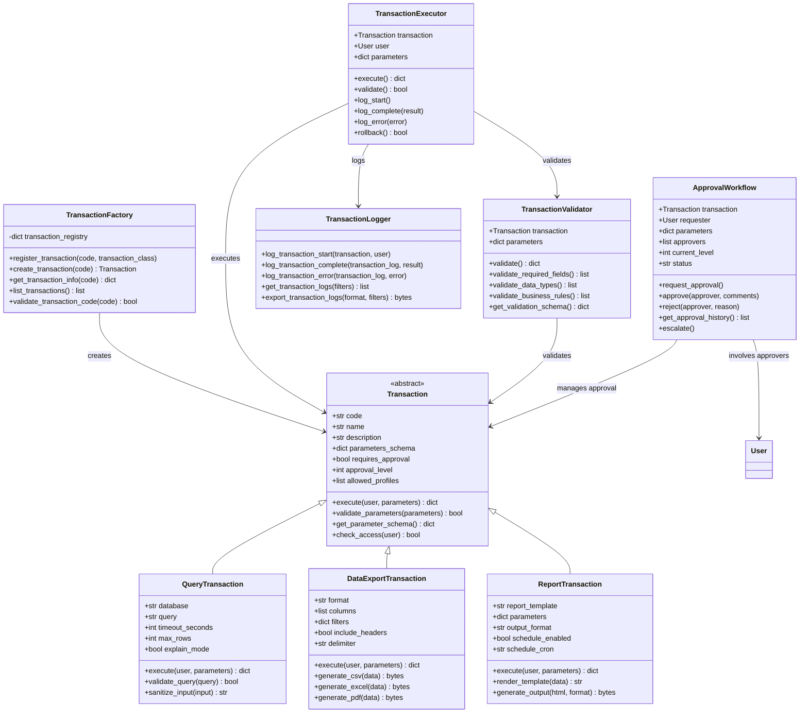
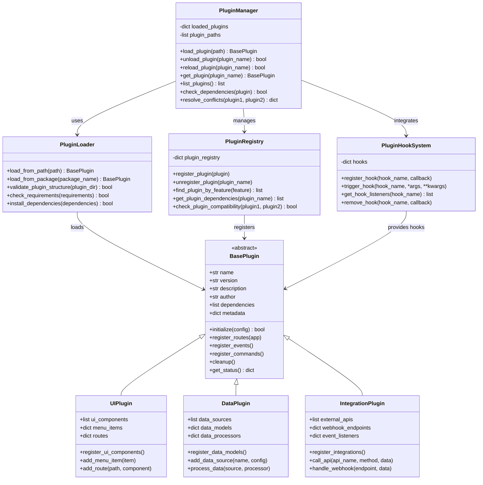

# Diagrama de Classes

## Visão Geral das Classes

Este diagrama mostra as principais classes do sistema e seus relacionamentos.

## Diagrama de Classes Principal



## Diagrama de Classes Detalhado - Módulo de Segurança



## Diagrama de Classes - Sistema de Transações



## Diagrama de Classes - Sistema de Plugins



## Diagrama de Classes - Sistema de Auditoria

```mermaid
classDiagram
    class AuditLogger {
        +log_action(user, action, resource, old_val, new_val)
        +log_security_event(user, event_type, details)
        +log_system_event(event_type, details)
        +log_performance_metric(metric_name, value)
        +get_audit_trail(filters) list
        +export_audit_logs(format, filters) bytes
        +cleanup_old_logs(retention_days)
    }
    
    class AuditLog {
        +int id
        +User user
        +str action
        +str resource_type
        +str resource_id
        +json old_values
        +json new_values
        +str ip_address
        +str user_agent
        +datetime timestamp
        +str session_id
        +get_changes_summary() str
        +to_dict() dict
    }
    
    class SecurityEvent {
        +str event_type
        +str severity
        +dict details
        +str source_ip
        +str target_resource
        +bool blocked
        +str response_action
        +datetime detected_at
        +analyze_threat_level() str
        +generate_alert() dict
    }
    
    class PerformanceMetric {
        +str metric_name
        +float value
        +str unit
        +dict tags
        +datetime timestamp
        +str source
        +bool is_anomaly
        +calculate_trend() float
        +check_threshold() bool
    }
    
    class AuditConfig {
        +bool enabled
        +list logged_actions
        +list excluded_actions
        +int retention_days
        +bool log_ip_address
        +bool log_user_agent
        +bool real_time_alerts
        +list alert_recipients
        +validate_config() bool
        +update_config(new_config)
    }
    
    class AuditExporter {
        +export_to_csv(logs) bytes
        +export_to_excel(logs) bytes
        +export_to_pdf(logs) bytes
        +export_to_json(logs) bytes
        +generate_report(logs, template) bytes
        +compress_data(data, format) bytes
    }
    
    class AuditAnalyzer {
        +list logs
        +analyze_user_behavior(user) dict
        +detect_anomalies(time_range) list
        +generate_compliance_report() dict
        +calculate_metrics(metric_name, period) dict
        +find_correlation(event1, event2) float
    }
    
    class AlertManager {
        +list active_alerts
        +dict alert_rules
        +check_alerts(log_entry)
        +send_alert(alert, recipients)
        +escalate_alert(alert)
        +resolve_alert(alert_id)
        +get_alert_history() list
    }
    
    %% Relationships
    AuditLogger --> AuditLog : creates
    AuditLogger --> SecurityEvent : logs
    AuditLogger --> PerformanceMetric : records
    
    AuditLogger --> AuditConfig : uses configuration
    
    AuditExporter --> AuditLog : exports
    AuditExporter --> SecurityEvent : exports
    AuditExporter --> PerformanceMetric : exports
    
    AuditAnalyzer --> AuditLog : analyzes
    AuditAnalyzer --> SecurityEvent : analyzes
    AuditAnalyzer --> PerformanceMetric : analyzes
    
    AlertManager --> SecurityEvent : manages alerts
   