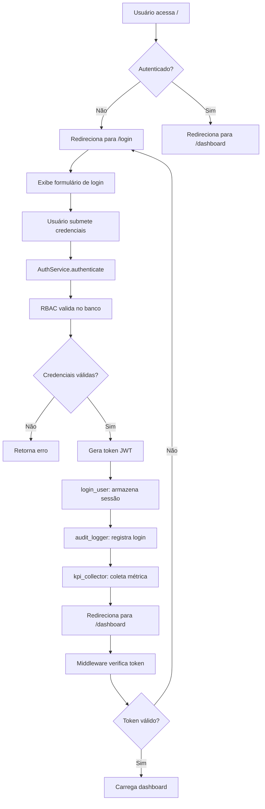

# Diagramas de Fluxo DevStationPlatform

## Índice
1. [Arquitetura Geral](#arquitetura-geral)
2. [Fluxo de Autenticação](#fluxo-de-autenticação)
3. [Fluxo de Transação](#fluxo-de-transação)
4. [Sistema de Permissões](#sistema-de-permissões)
5. [Ciclo de Vida do Plugin](#ciclo-de-vida-do-plugin)
6. [Auditoria e Logging](#auditoria-e-logging)
7. [Menu Dinâmico](#menu-dinâmico)

## 1. Arquitetura Geral

### Diagrama de Camadas
```
┌─────────────────────────────────────────────────────────┐
│                    CAMADA DE INTERFACE                   │
│  ┌─────────────────────────────────────────────────┐    │
│  │                NiceGUI Framework                │    │
│  │  • Páginas Web (SPA)                           │    │
│  │  • Componentes Visuais                         │    │
│  │  • Roteamento Client-side                      │    │
│  └─────────────────────────────────────────────────┘    │
├─────────────────────────────────────────────────────────┤
│                    CAMADA DE APLICAÇÃO                   │
│  ┌─────────────────────────────────────────────────┐    │
│  │               Serviços e Controles              │    │
│  │  • Autenticação (AuthService)                   │    │
│  │  • Middleware de Segurança                      │    │
│  │  • Gerenciamento de Sessão                      │    │
│  │  • Rotas e Navegação                            │    │
│  └─────────────────────────────────────────────────┘    │
├─────────────────────────────────────────────────────────┤
│                      CAMADA CORE                        │
│  ┌─────────┐ ┌─────────┐ ┌─────────┐ ┌─────────┐       │
│  │  RBAC   │ │ Plugins │ │ Trans.  │ │  KPI    │       │
│  │ Sistema │ │ Manager │ │ System  │ │ Collector│       │
│  └─────────┘ └─────────┘ └─────────┘ └─────────┘       │
│  ┌─────────┐ ┌─────────┐ ┌─────────┐ ┌─────────┐       │
│  │  Audit  │ │  Menu   │ │  Theme  │ │ Config  │       │
│  │ Logger  │ │ Manager │ │ Manager │ │ Manager │       │
│  └─────────┘ └─────────┘ └─────────┘ └─────────┘       │
├─────────────────────────────────────────────────────────┤
│                    CAMADA DE DADOS                      │
│  ┌─────────────────────────────────────────────────┐    │
│  │              SQLAlchemy ORM                     │    │
│  │  • Modelos de Domínio                           │    │
│  │  • Migrações (Alembic)                          │    │
│  │  • Conexões Pool                                │    │
│  └─────────────────────────────────────────────────┘    │
│  ┌─────────────────────────────────────────────────┐    │
│  │                Banco de Dados                   │    │
│  │  • SQLite (dev) / PostgreSQL (prod)             │    │
│  │  • Tabelas: users, profiles, permissions, etc.  │    │
│  └─────────────────────────────────────────────────┘    │
└─────────────────────────────────────────────────────────┘
```

### Fluxo de Dependências
```
main.py
    ↓
ui/app.py (create_app)
    ├── core/config.py (Config singleton)
    ├── core/security/rbac.py (autenticação)
    ├── core/audit_logger.py (logs)
    ├── core/kpi/collector.py (métricas)
    └── ui/pages/*.py (telas)
        ├── views/*.py (componentes)
        └── core/transaction.py (transações)
            └── core/models/*.py (banco de dados)
```

## 2. Fluxo de Autenticação

### Diagrama de Sequência
```
Usuário           Navegador          NiceGUI           AuthService          RBAC           Banco
   │                   │                  │                   │                │               │
   │--- Acessa / ----->│                  │                   │                │               │
   │                   │--- GET / ------->│                   │                │               │
   │                   │                  │--- Redireciona -->│                │               │
   │                   │<-- /login -------│                   │                │               │
   │                   │                  │                   │                │               │
   │--- Login ---------│                  │                   │                │               │
   │(user/pass)        │--- POST /login ->│                   │                │               │
   │                   │                  │--- authenticate ->│                │               │
   │                   │                  │                   │--- auth ------>│               │
   │                   │                  │                   │                │--- query ----->│
   │                   │                  │                   │                │<-- user -------│
   │                   │                  │                   │<-- token ------│                │
   │                   │                  │--- login_user --->│                │               │
   │                   │                  │--- audit_log ---->│                │               │
   │                   │                  │--- kpi_record --->│                │               │
   │                   │<-- /dashboard ---│                   │                │               │
   │                   │                  │                   │                │               │
   │--- Dashboard -----│                  │                   │                │               │
```

### Fluxo Detalhado


### Estados da Sessão
```
┌─────────────┐     ┌─────────────┐     ┌─────────────┐
│   Não       │     │   Login     │     │  Autenticado│
│ Autenticado │---->│  Pendente   │---->│   Ativo     │
│             │     │             │     │             │
└─────────────┘     └─────────────┘     └─────────────┘
       ↑                   ↑                    │
       │                   │                    │
       └───────────────────┼────────────────────┘
               (Timeout ou Logout)        │
                                          │
                                   ┌─────────────┐
                                   │   Sessão    │
                                   │  Expirada   │
                                   │             │
                                   └─────────────┘
```

## 3. Fluxo de Transação

### Diagrama de Execução
```
Decorator @transaction           Função Decorada           Sistema
      │                               │                       │
      │--- Intercepta chamada ------->│                       │
      │                               │                       │
      │--- Valida permissões ---------│---------------------->│
      │                               │                       │
      │--- Inicia timer KPI --------->│                       │
      │                               │                       │
      │--- Executa função ----------->│                       │
      │                               │--- Lógica negócio --->│
      │                               │<-- Resultado ---------│
      │                               │                       │
      │--- Registra audit log ------->│---------------------->│
      │                               │                       │
      │--- Coleta métricas KPI ------>│---------------------->│
      │                               │                       │
      │<-- Retorna resultado ---------│                       │
```

### Estados da Transação
```
┌─────────────┐     ┌─────────────┐     ┌─────────────┐
│  Pendente   │     │ Em Execução │     │ Concluída   │
│   (Queued)  │---->│ (Running)   │---->│ (Completed) │
│             │     │             │     │             │
└─────────────┘     └─────────────┘     └─────────────┘
                            │                    │
                            ▼                    ▼
                    ┌─────────────┐     ┌─────────────┐
                    │   Erro      │     │   Auditado  │
                    │  (Error)    │     │  (Audited)  │
                    │             │     │             │
                    └─────────────┘     └─────────────┘
```

### Fluxo com Context Manager
```python
with Transaction("DS_COMPLEXA") as tx:
    # Estado: Pendente → Em Execução
    passo1()
    
    # Adiciona contexto ao log
    tx.add_context("etapa", "processamento")
    
    passo2()
    
    # Estado: Em Execução → Concluída
    # Commit automático
    return resultado

# Se exceção: Estado: Em Execução → Erro
# Rollback automático
```

## 4. Sistema de Permissões

### Hierarquia de Perfis
```
                         ADMIN (100)
                             │
                         DEV_ALL (60)
                             │
                        CORE_DEV (50)
                             │
                       DEVELOPER (40)
                             │
                      BANALYST (30)
                             │
                        PUSER (20)
                             │
                         USER (10)
```

### Herança de Permissões
```
Perfil: DEVELOPER
│
├── Herda de: BANALYST
│   ├── Herda de: PUSER
│   │   ├── Herda de: USER
│   │   │   ├── Permissão: transaction.execute
│   │   │   └── Permissão: data.query
│   │   ├── Permissão: data.export
│   │   └── Permissão: plugin.install
│   ├── Permissão: transaction.create
│   └── Permissão: ia.consult
│
├── Permissões próprias:
│   ├── plugin.develop
│   └── transaction.modify.ds
│
└── Permissões totais: [transaction.execute, data.query, data.export, 
                       plugin.install, transaction.create, ia.consult,
                       plugin.develop, transaction.modify.ds]
```

### Fluxo de Verificação
```
┌─────────────┐     ┌─────────────┐     ┌─────────────┐
│   Ação      │     │  Verificação│     │  Decisão    │
│  do Usuário │---->│ de Permissão│---->│   Final     │
└─────────────┘     └─────────────┘     └─────────────┘
         │                   │                    │
         │                   ▼                    ▼
         │          ┌─────────────────┐   ┌─────────────┐
         │          │ 1. Obter perfis │   │  Permitido  │
         └──────────>│   do usuário   │   │   (Allow)   │
                    │                 │   │             │
                    │ 2. Expandir     │   └─────────────┘
                    │   herança       │          │
                    │                 │          │
                    │ 3. Listar todas │          ▼
                    │    permissões   │   ┌─────────────┐
                    │                 │   │  Negado     │
                    │ 4. Verificar se │   │  (Deny)     │
                    │    permissão    │   │             │
                    │    está na lista│   └─────────────┘
                    └─────────────────┘
```

## 5. Ciclo de Vida do Plugin

### Diagrama de Estados
```
┌─────────────┐     ┌─────────────┐     ┌─────────────┐
│  Não        │     │  Carregado  │     │  Registrado │
│ Carregado   │---->│ (Loaded)    │---->│ (Registered)│
│             │     │             │     │             │
└─────────────┘     └─────────────┘     └─────────────┘
                            │                    │
                            ▼                    ▼
                    ┌─────────────┐     ┌─────────────┐
                    │   Ativado   │     │ Desativado  │
                    │  (Enabled)  │<--->│ (Disabled)  │
                    │             │     │             │
                    └─────────────┘     └─────────────┘
                            │
                            ▼
                    ┌─────────────┐
                    │   Removido  │
                    │  (Removed)  │
                    │             │
                    └─────────────┘
```

### Fluxo de Carregamento
```
PluginManager          Plugin Class          Sistema
      │                      │                   │
      │--- Descobre plugins->│                   │
      │    no diretório      │                   │
      │                      │                   │
      │--- Importa módulo -->│                   │
      │                      │--- __init__() --->│
      │                      │                   │
      │--- Instancia ------->│                   │
      │    classe            │                   │
      │                      │                   │
      │--- register() ------>│                   │
      │                      │--- Configura -----│
      │                      │    hooks iniciais │
      │                      │                   │
      │--- enable() -------->│                   │
      │                      │--- Conecta ------>│
      │                      │    todos hooks    │
      │                      │                   │
      │                      │--- Adiciona ----->│
      │                      │    rotas/menu     │
```

### Hooks do Plugin
```
Evento do Sistema       Plugin Hooks           Ações do Plugin
      │                       │                        │
      │--- App Start -------->│--- on_app_start() ---->│
      │                       │                        │--- Inicializa recursos
      │                       │                        │--- Configura rotas
      │                       │                        │
      │--- User Login ------->│--- on_user_login() --->│
      │                       │                        │--- Registra atividade
      │                       │                        │--- Personaliza experiência
      │                       │                        │
      │--- Transaction ------>│--- on_transaction() -->│
      │    Execute            │                        │--- Intercepta transação
      │                       │                        │--- Adiciona funcionalidade
      │                       │                        │
      │--- Menu Render ------>│--- on_menu_render() -->│
      │                       │                        │--- Adiciona itens
      │                       │                        │--- Filtra por permissão
      │                       │                        │
      │--- Audit Log -------->│--- on_audit_log() ---->│
      │                       │                        │--- Processa logs
      │                       │                        │--- Envia para sistema externo
```

## 6. Auditoria e Logging

### Fluxo de Logging
```
Componente              AuditLogger             KPI Collector         Arquivo/Sistema
      │                       │                        │                    │
      │--- Evento ----------->│                        │                    │
      │                       │                        │                    │
      │                       │--- Formata log ------->│                    │
      │                       │                        │                    │
      │                       │--- Registra ---------->│                    │
      │                       │    no banco            │                    │
      │                       │                        │                    │
      │                       │--- Envia para -------->│                    │
      │                       │    KPI Collector       │                    │
      │                       │                        │--- Processa ------->│
      │                       │                        │    métricas        │
      │                       │                        │                    │
      │                       │--- Escreve no ---------│-------------------->│
      │                       │    arquivo de log      │                    │
```

### Estrutura do Log
```json
{
  "timestamp": "2024-01-15T10:30:00Z",
  "level": "INFO",
  "component": "transaction",
  "transaction_id": "tx_abc123",
  "transaction_code": "DS_QUERY",
  "user": {
    "id": 123,
    "username": "joao.silva",
    "profiles": ["DEVELOPER", "BANALYST"]
  },
  "action": {
    "type": "EXECUTE",
    "object_type": "QUERY",
    "object_name": "SELECT * FROM users"
  },
  "details": {
    "parameters": {"limit": 100},
    "result": {"rows_affected": 42},
    "duration_ms": 150
  },
  "kpi_tags": ["