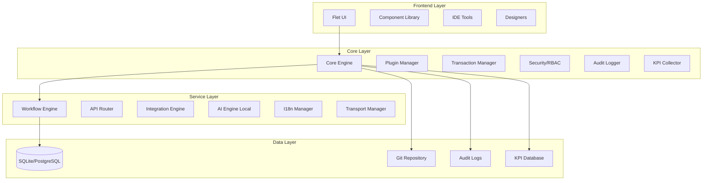
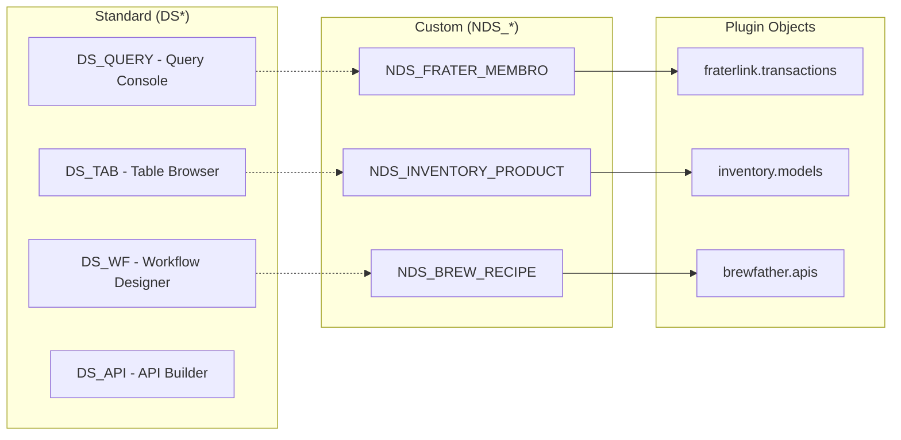
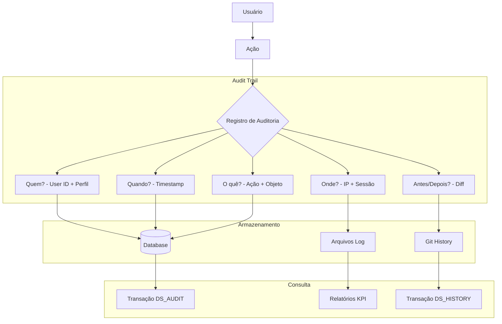
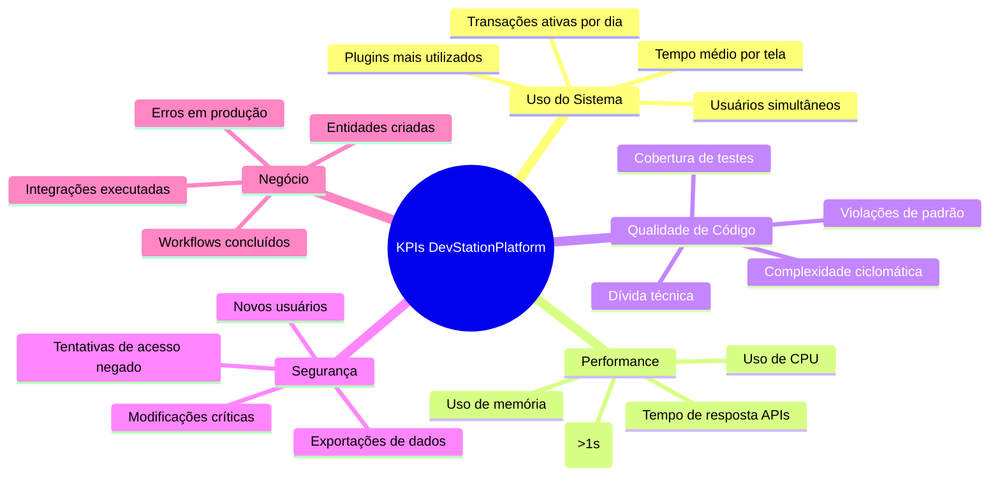
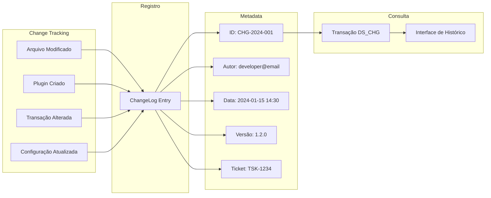
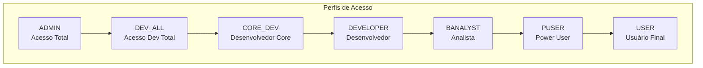
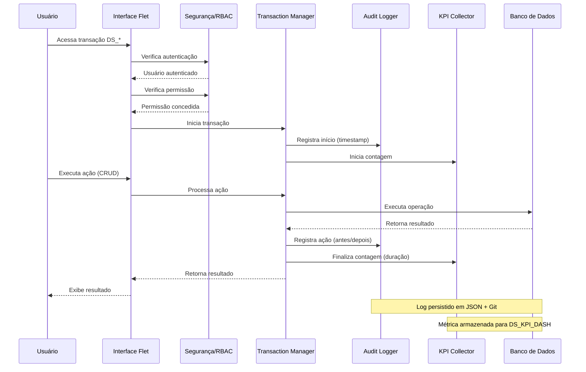
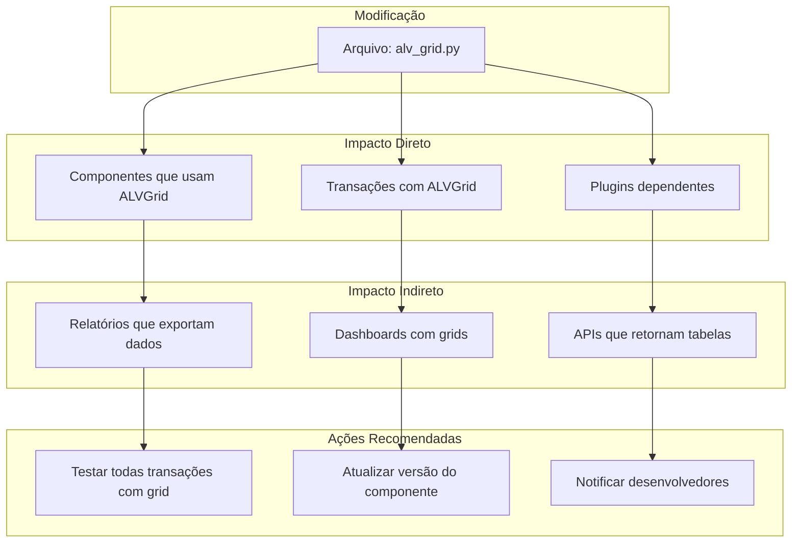

# 📘 DOCUMENTO DE ARQUITETURA - DevStationPlatform

## Plataforma RAD Inspirada em SAP com Rastreabilidade Total

**Versão:** 1.0.0  
**Data:** 2024  
**Status:** Em Desenvolvimento

---

## 🎯 SUMÁRIO EXECUTIVO

A **DevStationPlatform** é uma plataforma de desenvolvimento rápido (RAD) inspirada no ecossistema SAP ECC/ABAP, projetada para permitir a construção modular de sistemas empresariais com controle total de rastreabilidade, KPIs, perfis de acesso e versionamento.

### Diferenciais Estratégicos

| Característica | Benefício |
|----------------|------------|
| **Transações DS*** | Padrão próprio, não conflita com SAP (que usa Z*) |
| **Sufixo NDS_** | Identifica claramente objetos customizados não-standard |
| **Rastreabilidade total** | Cada modificação é auditada e versionada |
| **KPIs integrados** | Métricas de uso, performance e qualidade |
| **Perfis granulares** | 7 níveis de acesso hierárquicos |

---

## 🏗️ ARQUITETURA GERAL



---

## 📋 NOMENCLATURA DE TRANSAÇÕES E OBJETOS

### Por que "DS" e não "Z"?

O sistema SAP tradicional utiliza o prefixo `Z` para objetos customizados. Para evitar conflitos e estabelecer identidade própria, a DevStationPlatform utiliza:

| Prefixo | Tipo | Descrição | Exemplo |
|---------|------|-----------|---------|
| **DS** | Standard Platform | Transações nativas da plataforma | `DS_QUERY`, `DS_TAB` |
| **NDS_** | Non-Standard Custom | Objetos criados pelo usuário/plugins | `NDS_FRATER` |

### Hierarquia de Objetos



---

## 🔐 RASTREABILIDADE E AUDITORIA

### Arquitetura de Rastreabilidade



### Modelo de Dados de Auditoria

```python
# core/models/audit.py

class AuditLog(Base):
    __tablename__ = "audit_logs"
    
    id = Column(Integer, primary_key=True)
    timestamp = Column(DateTime, default=datetime.utcnow, index=True)
    
    # Quem
    user_id = Column(Integer, ForeignKey("users.id"))
    user_name = Column(String(100))
    user_profile = Column(String(50))  # USER, DEVELOPER, ADMIN, etc.
    session_id = Column(String(128))
    ip_address = Column(String(45))
    
    # O quê
    transaction_code = Column(String(20), index=True)  # DS_* ou NDS_*
    action_type = Column(String(50))  # CREATE, READ, UPDATE, DELETE, EXECUTE, EXPORT
    object_type = Column(String(100))  # TRANSACTION, PLUGIN, WORKFLOW, API, USER
    object_id = Column(String(200))
    object_name = Column(String(200))
    
    # Antes/Depois
    old_value = Column(JSON, nullable=True)
    new_value = Column(JSON, nullable=True)
    diff_summary = Column(String(500))
    
    # Contexto
    execution_time_ms = Column(Integer)
    success = Column(Boolean, default=True)
    error_message = Column(Text, nullable=True)
    
    # KPI Tags
    kpi_tags = Column(JSON, default=list)  # ["critical", "financial", "compliance"]
```

---

## 📊 SISTEMA DE KPIs (Key Performance Indicators)

### KPIs Monitorados



### Estrutura de Coleta de KPIs

```python
# core/kpi/collector.py

class KPICollector:
    """Coletor centralizado de métricas"""
    
    def __init__(self):
        self.metrics = {
            "transactions": CounterMetric("ds_transactions_total"),
            "response_time": HistogramMetric("ds_response_time_seconds"),
            "active_users": GaugeMetric("ds_active_users"),
            "errors": CounterMetric("ds_errors_total", labels=["type"])
        }
    
    def record_transaction(self, transaction_code: str, duration_ms: int, success: bool):
        """Registra execução de transação"""
        self.metrics["transactions"].inc(labels={"code": transaction_code})
        self.metrics["response_time"].observe(duration_ms / 1000)
        
        if not success:
            self.metrics["errors"].inc(labels={"type": transaction_code})
        
        # Armazenamento para consulta via DS_KPI
        self._store_to_db(transaction_code, duration_ms, success)
    
    def get_dashboard_data(self, period: str = "day") -> dict:
        """Retorna dados para dashboard de KPIs"""
        return {
            "most_used_transactions": self._get_top_transactions(period),
            "average_response_time": self._get_avg_response_time(period),
            "error_rate": self._get_error_rate(period),
            "active_users_peak": self._get_peak_users(period),
            "kpi_score": self._calculate_kpi_score()
        }
```

### Transação de Consulta de KPIs

| Código | Nome | Perfil Mínimo | Descrição |
|--------|------|---------------|-----------|
| `DS_KPI_DASH` | KPI Dashboard | `BANALYST` | Dashboard visual de métricas |
| `DS_KPI_DETAIL` | KPI Detailed | `DEVELOPER` | Consulta detalhada de KPIs |
| `DS_KPI_EXPORT` | Export KPIs | `ADMIN` | Exportação para Excel/CSV |

---

## 📝 REGISTRO DE MODIFICAÇÕES (Change Log)

### Estrutura de Versionamento



### Modelo de ChangeLog

```python
# core/models/changelog.py

class ChangeLog(Base):
    __tablename__ = "changelog"
    
    id = Column(String(20), primary_key=True)  # CHG-2024-001
    timestamp = Column(DateTime, default=datetime.utcnow)
    
    # Autoria
    author_id = Column(Integer, ForeignKey("users.id"))
    author_name = Column(String(100))
    author_profile = Column(String(50))
    
    # Objeto modificado
    object_type = Column(String(50))  # FILE, TRANSACTION, PLUGIN, WORKFLOW, API
    object_path = Column(String(500))
    object_code = Column(String(50))  # Código da transação, se aplicável
    
    # Modificação
    change_type = Column(String(30))  # CREATE, MODIFY, DELETE, RENAME, MOVE
    change_summary = Column(String(200))
    change_description = Column(Text)
    
    # Versionamento
    version_before = Column(String(20))
    version_after = Column(String(20))
    git_commit_hash = Column(String(40))
    
    # Rastreabilidade
    ticket_id = Column(String(50))  # Integração com Jira/ClickUp
    branch_name = Column(String(100))
    
    # Impacto
    affected_objects = Column(JSON, default=list)  # Lista de objetos impactados
    kpi_impact = Column(String(100))  # POSITIVE, NEUTRAL, NEGATIVE
```

---

## 👥 PERFIS DE ACESSO DETALHADOS

### Matriz de Permissões Hierárquica



### Permissões Detalhadas por Módulo

| Módulo | USER | PUSER | BANALYST | DEVELOPER | CORE_DEV | DEV_ALL | ADMIN |
|--------|------|-------|----------|-----------|----------|---------|-------|
| **Transações** |
| Executar | ✅ | ✅ | ✅ | ✅ | ✅ | ✅ | ✅ |
| Criar NDS_* | ❌ | ❌ | ❌ | ✅ | ✅ | ✅ | ❌ |
| Modificar DS_* | ❌ | ❌ | ❌ | ❌ | ✅ | ✅ | ❌ |
| **Plugins** |
| Instalar | ❌ | ❌ | ❌ | ✅ | ✅ | ✅ | ✅ |
| Desenvolver | ❌ | ❌ | ❌ | ✅ | ✅ | ✅ | ❌ |
| Publicar | ❌ | ❌ | ❌ | ❌ | ✅ | ✅ | ❌ |
| **Dados** |
| Consultar | ✅ | ✅ | ✅ | ✅ | ✅ | ✅ | ✅ |
| Exportar | ❌ | ✅ | ✅ | ✅ | ✅ | ✅ | ✅ |
| Importar | ❌ | ❌ | ❌ | ✅ | ✅ | ✅ | ✅ |
| **Workflows** |
| Executar | ✅ | ✅ | ✅ | ✅ | ✅ | ✅ | ✅ |
| Criar | ❌ | ❌ | ✅ | ✅ | ✅ | ✅ | ❌ |
| Publicar | ❌ | ❌ | ❌ | ❌ | ✅ | ✅ | ❌ |
| **APIs** |
| Consumir | ✅ | ✅ | ✅ | ✅ | ✅ | ✅ | ✅ |
| Criar | ❌ | ❌ | ❌ | ✅ | ✅ | ✅ | ❌ |
| Expor | ❌ | ❌ | ❌ | ❌ | ✅ | ✅ | ❌ |
| **Administração** |
| Usuários | ❌ | ❌ | ❌ | ❌ | ❌ | ❌ | ✅ |
| Auditoria | ❌ | ❌ | ❌ | ❌ | ✅ | ✅ | ✅ |
| Backup | ❌ | ❌ | ❌ | ❌ | ❌ | ❌ | ✅ |
| **IA** |
| Consultar IA | ✅ | ✅ | ✅ | ✅ | ✅ | ✅ | ✅ |
| Treinar Modelo | ❌ | ❌ | ❌ | ❌ | ✅ | ✅ | ❌ |

### Código de Implementação do RBAC

```python
# core/security/rbac.py

from enum import Enum
from functools import wraps
from typing import Callable, List

class Profile(str, Enum):
    USER = "USER"
    PUSER = "PUSER"
    BANALYST = "BANALYST"
    DEVELOPER = "DEVELOPER"
    CORE_DEV = "CORE_DEV"
    DEV_ALL = "DEV_ALL"
    ADMIN = "ADMIN"

class Permission(str, Enum):
    # Transações
    TRANSACTION_EXECUTE = "transaction.execute"
    TRANSACTION_CREATE_NDS = "transaction.create.nds"
    TRANSACTION_MODIFY_DS = "transaction.modify.ds"
    
    # Plugins
    PLUGIN_INSTALL = "plugin.install"
    PLUGIN_DEVELOP = "plugin.develop"
    PLUGIN_PUBLISH = "plugin.publish"
    
    # Dados
    DATA_QUERY = "data.query"
    DATA_EXPORT = "data.export"
    DATA_IMPORT = "data.import"
    
    # Workflows
    WORKFLOW_EXECUTE = "workflow.execute"
    WORKFLOW_CREATE = "workflow.create"
    WORKFLOW_PUBLISH = "workflow.publish"
    
    # APIs
    API_CONSUME = "api.consume"
    API_CREATE = "api.create"
    API_EXPOSE = "api.expose"
    
    # Admin
    ADMIN_USERS = "admin.users"
    ADMIN_AUDIT = "admin.audit"
    ADMIN_BACKUP = "admin.backup"
    
    # IA
    IA_CONSULT = "ia.consult"
    IA_TRAIN = "ia.train"

# Matriz de permissões por perfil
PROFILE_PERMISSIONS = {
    Profile.USER: [
        Permission.TRANSACTION_EXECUTE,
        Permission.DATA_QUERY,
        Permission.WORKFLOW_EXECUTE,
        Permission.API_CONSUME,
        Permission.IA_CONSULT,
    ],
    Profile.PUSER: [
        *PROFILE_PERMISSIONS[Profile.USER],
        Permission.DATA_EXPORT,
    ],
    Profile.BANALYST: [
        *PROFILE_PERMISSIONS[Profile.PUSER],
        Permission.WORKFLOW_CREATE,
    ],
    Profile.DEVELOPER: [
        *PROFILE_PERMISSIONS[Profile.BANALYST],
        Permission.TRANSACTION_CREATE_NDS,
        Permission.PLUGIN_INSTALL,
        Permission.PLUGIN_DEVELOP,
        Permission.DATA_IMPORT,
        Permission.API_CREATE,
    ],
    Profile.CORE_DEV: [
        *PROFILE_PERMISSIONS[Profile.DEVELOPER],
        Permission.TRANSACTION_MODIFY_DS,
        Permission.PLUGIN_PUBLISH,
        Permission.WORKFLOW_PUBLISH,
        Permission.API_EXPOSE,
        Permission.ADMIN_AUDIT,
        Permission.IA_TRAIN,
    ],
    Profile.DEV_ALL: [
        *PROFILE_PERMISSIONS[Profile.CORE_DEV],
        # Acesso total de desenvolvimento
    ],
    Profile.ADMIN: [
        *PROFILE_PERMISSIONS[Profile.DEV_ALL],
        Permission.ADMIN_USERS,
        Permission.ADMIN_BACKUP,
    ],
}

def require_permission(permission: Permission):
    """Decorator para verificar permissão"""
    def decorator(func: Callable):
        @wraps(func)
        def wrapper(*args, **kwargs):
            current_user = get_current_user()
            if permission not in PROFILE_PERMISSIONS.get(current_user.profile, []):
                raise PermissionError(f"Usuário {current_user.name} não tem permissão {permission}")
            return func(*args, **kwargs)
        return wrapper
    return decorator
```

---

## 🔄 FLUXO COMPLETO DE UMA TRANSAÇÃO



---

## 📦 OBJETOS NDS_ (NON-STANDARD)

### Quando Criar um NDS_

Um objeto **NDS_** (Non-Standard) deve ser criado sempre que:

1. ✅ Desenvolver um **plugin de negócio** específico
2. ✅ Criar uma **transação customizada** para um processo único
3. ✅ Adicionar **campos/extensões** a objetos standard
4. ✅ Implementar **regras de negócio** específicas do cliente

### Estrutura de um Objeto NDS_

```python
# plugins/fraterlink/transactions.py

@transaction(
    code="NDS_FRATER_MEMBRO",  # Prefixo NDS_ indica custom
    name="Manutenção de Membros",
    group="FraterLink",
    type="CRUD",
    version="1.0.0",
    author="dev@fraterlink.com",
    permissions=["fraterlink.membro.edit"]
)
class NDSMembroMaintenance(Transaction):
    """
    Transação NDS_ para manutenção de membros da Loja.
    Criada em: 2024-01-15
    Ticket: FRL-001
    """
    
    model = Membro
    
    # Configuração específica
    screen_class = FormBuilder
    audit_level = "FULL"  # FULL, SUMMARY, NONE
    kpi_tracking = True
    
    def build_screen(self):
        return FormBuilder(
            model=self.model,
            fields=['nome', 'cargo', 'data_nascimento'],
            custom_validations=self._validate_telegram
        )
    
    def _validate_telegram(self, data):
        """Validação customizada"""
        # Regra de negócio específica
        pass
```

### Registro Automático de NDS_

```python
# core/transaction/registry.py

class TransactionRegistry:
    """Registro central de todas as transações DS_ e NDS_"""
    
    def __init__(self):
        self.transactions = {}  # code -> Transaction class
        self.nds_objects = []   # Lista de NDS_ criados
        self.change_log = []
    
    def register(self, transaction_class):
        """Registra uma transação (DS_ ou NDS_)"""
        code = transaction_class.code
        
        # Validação do prefixo
        if code.startswith("DS_"):
            # Standard - só core devs podem registrar
            self._validate_core_developer()
        elif code.startswith("NDS_"):
            # Non-standard - registro com metadados
            self.nds_objects.append({
                "code": code,
                "name": transaction_class.name,
                "author": transaction_class.author,
                "version": transaction_class.version,
                "created_at": datetime.utcnow(),
                "ticket": transaction_class.ticket_id
            })
            self._log_nds_creation(transaction_class)
        else:
            raise ValueError(f"Transação {code} deve começar com DS_ ou NDS_")
        
        self.transactions[code] = transaction_class
        return transaction_class
```

---

## 📈 DASHBOARD DE RASTREABILIDADE

### Transação DS_TRACE

```python
# ide/trace_viewer.py

@transaction(
    code="DS_TRACE",
    name="Rastreabilidade Completa",
    group="Administration",
    type="REPORT",
    permissions=["admin.audit"]
)
class TraceabilityDashboard(Transaction):
    """
    Dashboard unificado para consulta de:
    - Auditoria (quem, quando, o quê)
    - ChangeLog (modificações)
    - KPIs (métricas de uso)
    - NDS_ Objects (customizações)
    """
    
    def build_screen(self):
        return TabStrip(
            tabs=[
                Tab("Auditoria", self.build_audit_tab()),
                Tab("Modificações", self.build_changelog_tab()),
                Tab("KPIs", self.build_kpi_tab()),
                Tab("NDS Objects", self.build_nds_tab()),
                Tab("Mapa de Impacto", self.build_impact_map()),
            ]
        )
    
    def build_audit_tab(self):
        return ALVGrid(
            model=AuditLog,
            columns=[
                {"field": "timestamp", "label": "Data/Hora"},
                {"field": "user_name", "label": "Usuário"},
                {"field": "transaction_code", "label": "Transação"},
                {"field": "action_type", "label": "Ação"},
                {"field": "object_name", "label": "Objeto"},
            ],
            filters=True,
            export=True,
            on_double_click=self.show_diff
        )
    
    def build_nds_tab(self):
        return ALVGrid(
            model=NDSObject,  # Modelo que armazena NDS_ registrados
            columns=[
                {"field": "code", "label": "Código NDS_"},
                {"field": "name", "label": "Nome"},
                {"field": "author", "label": "Autor"},
                {"field": "version", "label": "Versão"},
                {"field": "created_at", "label": "Criado em"},
                {"field": "ticket", "label": "Ticket"},
            ],
            filters=True
        )
```

---

## 🗺️ MAPA DE IMPACTO DE MODIFICAÇÕES



### Código do Mapa de Impacto

```python
# core/impact_analyzer.py

class ImpactAnalyzer:
    """Analisa impacto de modificações no sistema"""
    
    def analyze_change(self, file_path: str) -> dict:
        """Retorna mapa de impacto de uma modificação"""
        
        dependencies = self._find_dependencies(file_path)
        
        return {
            "modified_file": file_path,
            "direct_impact": {
                "components": self._find_using_components(file_path),
                "transactions": self._find_using_transactions(file_path),
                "plugins": self._find_using_plugins(file_path),
            },
            "indirect_impact": {
                "reports": self._find_affected_reports(file_path),
                "dashboards": self._find_affected_dashboards(file_path),
                "apis": self._find_affected_apis(file_path),
            },
            "recommendations": self._generate_recommendations(file_path),
            "risk_level": self._calculate_risk_level(file_path),  # LOW, MEDIUM, HIGH, CRITICAL
            "estimated_test_time_minutes": self._estimate_test_time(file_path),
        }
```

---

## 📊 RESUMO DOS CÓDIGOS DE TRANSAÇÃO

| Código | Nome | Tipo | Perfil Mínimo | Descrição |
|--------|------|------|---------------|-----------|
| **DS_*** | **Standard Platform** | | | |
| DS_QUERY | Query Console | TOOL | DEVELOPER | Console SQL com syntax highlighting |
| DS_TAB | Table Browser | TOOL | DEVELOPER | Navegador de tabelas do banco |
| DS_WF | Workflow Designer | TOOL | BANALYST | Designer visual de workflows |
| DS_API | API Builder | TOOL | DEVELOPER | Construtor de APIs REST |
| DS_INT | Integration Mapper | TOOL | DEVELOPER | Mapeamento de integrações |
| DS_GIT | Git Manager | TOOL | DEVELOPER | Interface visual para Git |
| DS_TRACE | Traceability Dashboard | REPORT | ADMIN | Dashboard de rastreabilidade |
| DS_KPI_DASH | KPI Dashboard | REPORT | BANALYST | Dashboard de métricas |
| DS_AUDIT | Audit Console | TOOL | ADMIN | Consulta de logs de auditoria |
| DS_CHG | ChangeLog Viewer | TOOL | DEVELOPER | Histórico de modificações |
| **NDS_*** | **Custom Objects** | | | |
| NDS_* | Objetos customizados | VARIES | DEVELOPER | Criados via plugins |

---

## ✅ CHECKLIST DE IMPLANTAÇÃO

### Fase 1: Core (Sprints 1-2)
- [ ] Estrutura de diretórios
- [ ] Plugin Manager com descoberta automática
- [ ] Transaction Manager com decorator
- [ ] Validação de prefixos (DS_ / NDS_)
- [ ] Configuração central YAML

### Fase 2: Rastreabilidade (Sprints 3-4)
- [ ] Modelo AuditLog
- [ ] Modelo ChangeLog
- [ ] Sistema de versionamento Git integrado
- [ ] Registro automático de modificações
- [ ] Transação DS_AUDIT

### Fase 3: KPIs (Sprints 5-6)
- [ ] Coletor de métricas
- [ ] Armazenamento de KPIs
- [ ] Transação DS_KPI_DASH
- [ ] Alertas de performance
- [ ] Exportação de KPIs

### Fase 4: Perfis (Sprints 7-8)
- [ ] Modelos User, Role, Permission
- [ ] RBAC completo
- [ ] Decorator @require_permission
- [ ] Interface de gestão de usuários
- [ ] Transação DS_USERS

### Fase 5: Completude (Sprints 9-16)
- [ ] Todos os componentes UI
- [ ] Ferramentas IDE
- [ ] IA Local
- [ ] Sistema de traduções
- [ ] Transporte entre ambientes

---
